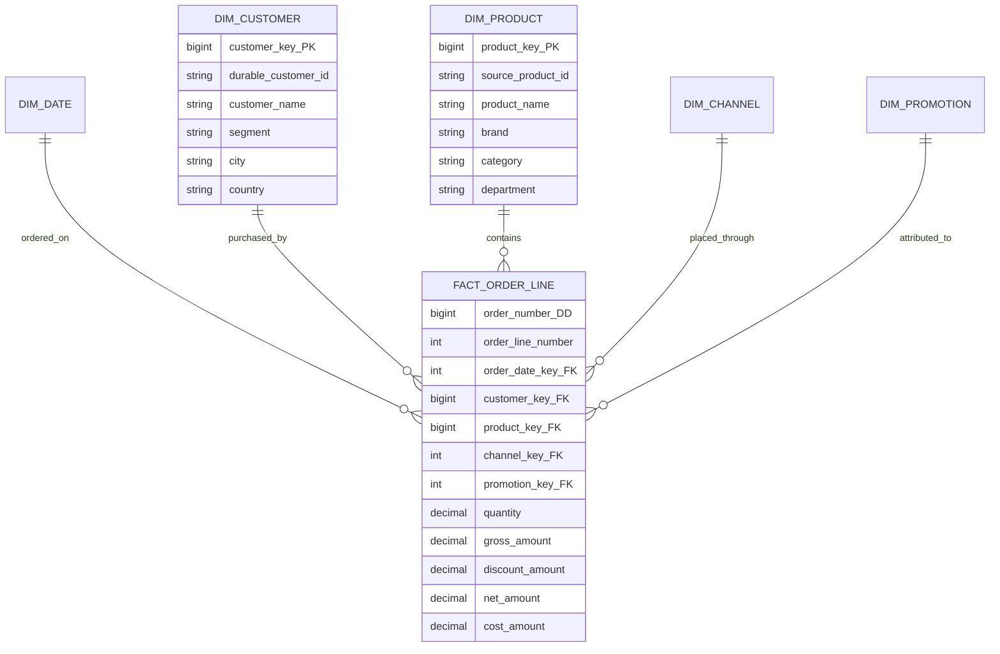
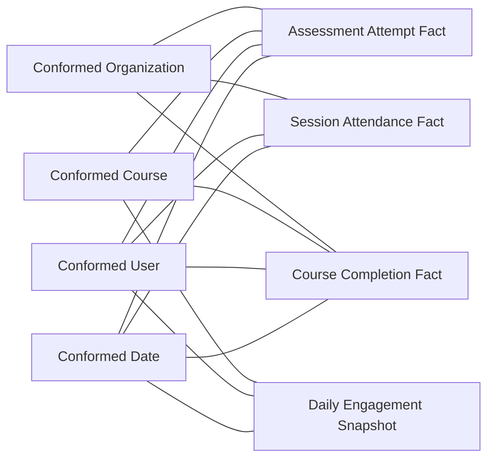

# Dimensional Modeling: Facts, Dimensions, and Stars

Dimensional modeling turns business measurements into a structure that people can query correctly. Its strength is not a particular diagram shape. Its strength is an explicit measurement grain surrounded by descriptive context with predictable join paths.

## The problem

Operational systems are designed to run a business process: place an order, change an address, post a payment, or assign an employee. Their schemas protect transactional integrity and minimize update anomalies. Analytical users ask different questions:

- How did completion rate vary by course, region, and month?
- Which customer segments adopted a feature after a subscription upgrade?
- What were daily balances by banking product?
- How did headcount and salary change by department?

Answering these questions directly from an operational schema often requires long join chains, source-specific rules, and repeated reconstruction of business history. Different analysts can produce different answers while using individually reasonable SQL.

## Mental model

Think in business grammar:

- **Fact table:** the verb or observation — purchased, attended, paid, held a balance.
- **Dimension table:** the descriptive context — who, what, where, when, why, and how.
- **Star schema:** one measurement process connected directly to the dimensions that describe it.

The fact table is not simply “the large table,” and a dimension is not simply “the small table.” Their roles are semantic.

## Grain

Every fact table starts with:

> **One row represents one precisely defined business event, periodic state, or lifecycle instance.**

Every dimension also has a grain:

> **One row represents one entity, profile, date, category, or historical version of one of those things.**

For an e-commerce sales star:

> One fact row represents one product line on one placed order.

For its Type 2 customer dimension:

> One dimension row represents one historically valid version of one customer.

The star therefore does not have one universal table grain. It has a central fact grain and compatible dimension grains. The fact's foreign key selects the single dimension member or historical version valid for that observation.

See [Grain](grain.md) before choosing columns.

## Model

### A simple order-line star



The order number remains in the fact as a degenerate dimension because it identifies the business transaction but has no useful collection of descriptive attributes of its own. The product hierarchy is flattened into `dim_product` so consumers can filter and group without traversing a chain of lookup tables.

### Fact-table anatomy

A fact table normally contains:

- foreign keys to dimensions;
- degenerate business identifiers when useful for filtering or drill-through;
- numeric measurements observed at the declared grain;
- sometimes a warehouse row key used for ETL operations;
- audit metadata when it materially supports lineage or quality analysis.

Facts tend to be **narrow and long**: relatively few columns, many rows. The row count alone is not what makes a table a fact.

### Dimension-table anatomy

A dimension normally contains:

- a warehouse surrogate primary key;
- one or more source or durable business identifiers;
- human-readable labels;
- grouping, filtering, sorting, and hierarchy attributes;
- governance classifications and derived descriptive attributes;
- historical control columns when Type 2 behavior is required.

Dimensions tend to be **wide and descriptive**. Repeating country, category, or department labels is intentional when it makes the analytical interface simpler and semantically stable.

### Foreign keys

Each ordinary dimension role should be single-valued for one fact row. Fact foreign keys should normally be non-null and resolve to a dimension row. Use explicit members such as “Unknown,” “Not applicable,” or “Not yet occurred” instead of a null key whose meaning varies across tools.

If several dimension members legitimately apply to one fact, do not choose one arbitrarily or attach several foreign-key columns with unclear semantics. Reconsider the grain or use a governed [bridge](../04-relationships/bridges-and-many-to-many.md).

## Facts versus dimensions

The data type does not determine the role.

| Candidate | Usually modeled as | Reason |
|---|---|---|
| Sales amount | Fact | Measured at an event grain and aggregated |
| Quantity | Fact | Numeric observation that participates in calculations |
| Account balance | Fact | Numeric state at snapshot grain |
| Product color | Dimension attribute | Describes a product and supports filtering |
| Customer segment | Dimension attribute | Descriptive grouping, potentially historical |
| Assessment score | Fact | Measurement of one attempt |
| Order number | Degenerate dimension in fact | Identifier used to group or trace lines |
| List price | Depends | Attribute if it describes a product version; fact if the actual offered price is observed per line |
| Age | Depends | Often derived at query time; an age band may be a dimension attribute or mini-dimension member |

A useful test:

- If users **sum, average, minimize, maximize, or otherwise calculate** it at the fact grain, it is likely a fact.
- If users **filter, group, label, or navigate** by it, it is likely a dimension attribute.

Some values serve both roles. Store each only when its semantics are explicit. The current product list price is not interchangeable with the transaction's actual unit price.

## Why a star works

### Query paths are predictable

Most questions follow:

```text
filter dimensions -> join to one fact -> aggregate measures -> group by dimension attributes
```

Users do not need to understand the source application's normalized join network.

### Business meaning is reusable

“Product category,” “customer country,” and “fiscal month” are defined in governed dimensions rather than reconstructed in each report. Conformed dimensions can carry those definitions across several fact tables.

### Aggregation is controllable

The central fact declares the measurement grain, and each measure declares its aggregation behavior. The model makes it easier to detect invalid operations such as summing balances across days or averaging row-level percentages.

### History is preserved deliberately

Surrogate dimension keys allow a historical fact to continue pointing to the customer, employee, or product version that applied when the fact occurred. Historical correctness is designed rather than inferred from the source's current state.

### The model can extend gracefully

You can add:

- a new fact valid at the existing grain;
- a new dimension whose member is single-valued for each fact row;
- a new descriptive dimension attribute;
- a new fact table for a separate business process.

These additions need not change the meaning of existing queries.

## Worked examples

### Learning analytics

**Fact grain**

> One row represents one learner's one submitted assessment attempt.

| Dimensions | Facts |
|---|---|
| Learner, assessment, course, completion date, device, organization | score points, possible points, duration seconds, attempt count |

Course completion is a different business event and should not be forced into the same row. Both facts can share Learner, Course, Date, and Organization dimensions.

### SaaS product usage

**Fact grain**

> One row represents one tracked feature-use event by one user within one account.

| Dimensions | Facts |
|---|---|
| User, account, feature, event date/time, client application, plan at event time | event count, duration, bytes processed |

Subscription invoice lines and daily licensed-seat counts belong to different fact tables. Usage, billing, and subscription state can be compared after separate aggregation through conformed Account, Plan, Product, and Date dimensions.

### HR headcount

**Fact grain**

> One row represents one employee assignment at calendar month-end.

| Dimensions | Facts |
|---|---|
| Employee version, position, department, manager, location, month-end date | headcount count, full-time-equivalent, base salary amount |

If an employee can hold two simultaneous assignments, using “employee-month” grain would collapse meaningful detail. Employee-assignment-month is safer.

### Banking balances

**Fact grain**

> One row represents one account in one currency at the close of one business date.

| Dimensions | Facts |
|---|---|
| Account, product, customer relationship, currency, branch, business date | ledger balance, available balance, accrued interest |

Balances can be summed across accounts on the same date but normally not across dates. That is a measure-semantic rule, covered in [Measures](measures.md).

## Dimensional versus normalized models

### What normalization solves

Normalization organizes data to reduce redundancy and update anomalies:

- **First normal form (1NF):** each field holds a single value from its domain; repeating column groups are removed.
- **Second normal form (2NF):** the table is in 1NF and non-key attributes depend on the whole candidate key rather than part of a composite key.
- **Third normal form (3NF):** the table is in 2NF and non-key attributes do not depend transitively on the key through other non-key attributes.

This abbreviated description is enough for the modeling decision here; normalization theory contains finer formal distinctions.

An operational schema might separate order, order line, product, brand, category, customer address, geography, and status into many tables. That design avoids updating the same category description in thousands of operational rows.

### What dimensional modeling solves

An analytical presentation model accepts controlled redundancy to make measurement queries understandable and consistent. A product dimension may repeat brand, category, and department descriptions on every product row. That is deliberate:

- the hierarchy is visible in one place;
- filters require fewer joins;
- business labels can be governed together;
- query tools encounter a predictable star.

| Concern | Normalized operational model | Dimensional analytical model |
|---|---|---|
| Primary workload | Small inserts and updates | Large scans and aggregations |
| Organizing idea | Entities and dependencies | Business processes and measurements |
| Redundancy | Minimized | Controlled for usability |
| History | Often current operational state | Explicit analytical history |
| Join paths | Often numerous and application-oriented | Short and business-oriented |
| Main risk | Update anomalies | Ambiguous grain or incorrect aggregation |

Neither model is universally superior. They solve different problems and often coexist:

```text
operational applications
    -> source-fidelity / integration layers
    -> dimensional presentation models
    -> semantic metrics and analytics
```

Do not rewrite an application's transactional schema into a star and use it as the operational write model. Do not expose a complex normalized integration layer as the only interface for business analytics merely because it is structurally elegant.

## Star versus snowflake

A **star** connects denormalized dimensions directly to the fact. A **snowflake** normalizes some dimension attributes into subsidiary tables.

```text
Star:
fact_order_line -> dim_product
                     brand
                     category
                     department

Snowflake:
fact_order_line -> dim_product -> dim_brand -> dim_category -> dim_department
```

### Prefer a star when

- the hierarchy is fixed-depth and many-to-one;
- users frequently filter or group by its levels;
- repeating descriptions are manageable;
- the model is a business-facing presentation layer.

### Consider limited snowflaking when

- a large subdimension is genuinely shared and independently governed;
- security, localization, or maintenance has a compelling requirement;
- the platform's semantic associations hide complexity without creating ambiguous paths;
- a hierarchy is too complex for simple flattened levels and a specialized pattern is justified.

### Risks of snowflaking

- more joins and more failure points;
- confusing filter propagation and cardinality;
- lower usability for self-service;
- operational normalization leaking into the analytical interface;
- Type 2 changes in an outrigger causing unexpected version proliferation.

Storage savings alone are rarely a strong reason on modern columnar systems. Compression already handles repeated low-cardinality values well.

## Multiple facts and conformance

An enterprise model contains many stars, not one giant star:



The facts are not joined row by row. Each is aggregated independently to matching conformed row headers, such as month, organization, and course, and the aggregate result sets are then aligned. This **drill-across** avoids uncontrolled many-to-many multiplication.

See [Conformance and bus architecture](../05-enterprise-modeling/conformance-and-bus-architecture.md).

## When to use dimensional modeling

- A broad analytical audience needs stable, understandable business data.
- Measures must be sliced consistently across reusable descriptive dimensions.
- Historical analysis and aggregation correctness matter.
- Several sources or business processes need a governed presentation layer.
- BI, semantic models, dashboards, notebooks, or AI consumers need a reliable contract.

## When not to use it as the only model

- A source-fidelity archive must preserve messages exactly as received.
- A highly normalized application must support transactional writes and constraints.
- Data scientists need raw high-dimensional signals before business rules are applied.
- A network, graph, document, or geospatial problem is naturally represented by another model.
- An auditable integration layer such as Data Vault serves requirements different from presentation.

Dimensional marts can sit downstream of these structures. Choosing a star for consumption does not require every upstream layer to be dimensional.

## Common mistakes

| Mistake | Why it fails | Better approach |
|---|---|---|
| One universal fact table | Mixes processes and grains; produces sparse, misleading rows | Build one fact per business process and grain |
| Dimensions designed as source-table copies | Exposes source complexity and conflicting definitions | Design around governed analytical entities and attributes |
| Descriptive text embedded repeatedly in the fact | Increases inconsistency and weakens history control | Place reusable descriptors in dimensions |
| Every lookup snowflaked | Creates long, fragile query paths | Flatten stable many-to-one labels into dimensions |
| Raw fact-to-fact joins | Multiplies rows | Aggregate separately and drill across |
| Null dimension foreign keys | Makes missing meaning ambiguous | Resolve to explicit sentinel members |
| Current dimension joined by natural key to historical facts | Rewrites historical context | Use the resolved historical surrogate key |
| Precomputed report layout used as the model | Encodes one answer rather than a reusable process | Preserve atomic process facts and governed dimensions |

## Tradeoffs

Dimensional models duplicate descriptive values and require deliberate ETL for key resolution, conformance, and history. In return they reduce semantic duplication across consumers and make valid query paths obvious.

A very wide dimension can be easier to query but harder to govern. A highly decomposed model can be easier to maintain internally but harder to use. The architect's job is to place complexity in a governed layer once rather than make every consumer rediscover it.

## Modern implementation notes — later synthesis

The core concepts above are Kimball-derived. The mappings below are modern implementation guidance, not terminology from the 2013 book.

### Physical and logical stars

A star may be:

- physically materialized as dimension and fact tables;
- exposed as views over a lakehouse or integration model;
- represented through semantic-model relationships;
- implemented by platform-specific analytical entities.

Physical shape can vary. Grain, join cardinality, historical keying, and measure behavior cannot remain implicit.

### dbt-style transformations

A common flow is:

```text
source-aligned staging
    -> reusable intermediate transformations
    -> dimensions and facts at explicit grains
    -> semantic metrics
```

Model names and folders do not make a star. Tests should validate the declared key, referential integrity, accepted sentinel members, and measure reconciliation.

### Lakehouse and medallion layers

Bronze, Silver, and Gold describe quality and transformation layers; dimensional modeling describes a business-facing analytical model. A Gold layer may contain stars, but the concepts are not synonyms. See [Layered architectures](../07-modern-architecture/layered-architectures.md).

### SAP HANA Cloud and SAP Datasphere

Calculation Views and Datasphere analytical models can express measures, dimensions, associations, hierarchies, and semantic behavior without requiring every object to be a physically persisted table. Still:

- expose one unambiguous analytical grain;
- validate join cardinality rather than trusting a declared cardinality;
- keep measures on the correct fact source;
- define aggregation and exception aggregation explicitly;
- avoid ambiguous paths that can fan out a measure.

### Semantic layers

The dimensional model supplies reusable entities and measurements. A semantic layer adds governed metric formulas, time behavior, access rules, and business labels. It should not be asked to repair mixed grain or invalid relationships underneath. See [Semantic layer and metrics](../07-modern-architecture/semantic-layer-and-metrics.md).

## Design-review checklist

- [ ] Each fact represents one named business process
- [ ] Every fact and dimension has a written grain
- [ ] Each ordinary fact-to-dimension relationship is many-to-one
- [ ] Descriptive grouping attributes live in dimensions
- [ ] Measures are valid at the fact grain and have defined aggregation behavior
- [ ] Missing dimension references use governed sentinel members
- [ ] Fixed, user-facing hierarchies are easy to navigate
- [ ] Separate facts integrate through conformed dimensions rather than raw fact joins
- [ ] History requirements are implemented with appropriate keys and change strategies
- [ ] Physical optimization has not obscured semantic correctness

## Related patterns

- [Grain](grain.md)
- [Keys](keys.md)
- [Measures](measures.md)
- [Fact table patterns](../02-fact-tables/fact-table-patterns.md)
- [Slowly changing dimensions](../03-dimensions/slowly-changing-dimensions.md)
- [Dimension patterns](../03-dimensions/dimension-patterns.md)
- [Bridges and many-to-many relationships](../04-relationships/bridges-and-many-to-many.md)
- [Conformance and bus architecture](../05-enterprise-modeling/conformance-and-bus-architecture.md)
- [Layered architectures](../07-modern-architecture/layered-architectures.md)

## What I should remember

1. Facts record measurements of a business process; dimensions provide descriptive context.
2. The fact grain comes first, and every dimension and measure must be valid at that grain.
3. A star is a simple business-facing query contract, not merely a visual arrangement of tables.
4. Normalized operational models optimize controlled writes; dimensional models optimize understandable historical analysis.
5. Flatten stable, fixed-depth descriptors when that improves usability; snowflake only for a clear reason.
6. Build multiple process-specific facts and integrate them through conformed dimensions and drill-across.
7. Modern platforms can virtualize or rearrange the physical star, but they do not remove its semantic obligations.

## Source basis

This chapter synthesizes Kimball and Ross, *The Data Warehouse Toolkit*, 3rd ed., especially Chapters 1–3 and recurring case studies in Chapters 4–16. See the [coverage checklist](../COVERAGE.md) and [sources](../SOURCES.md).
