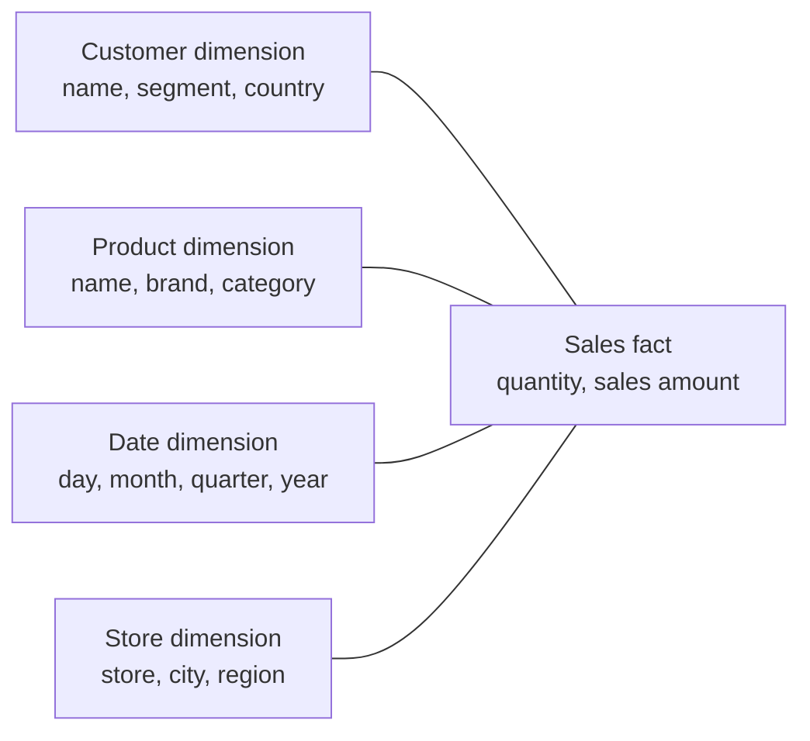
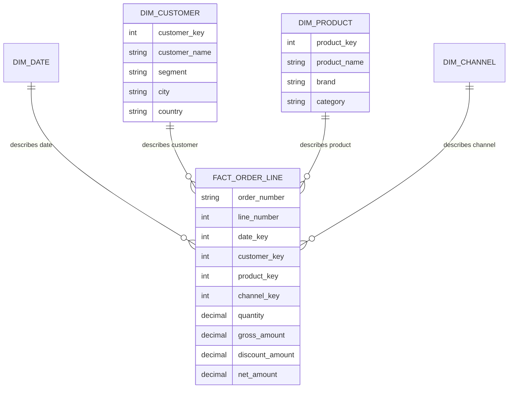
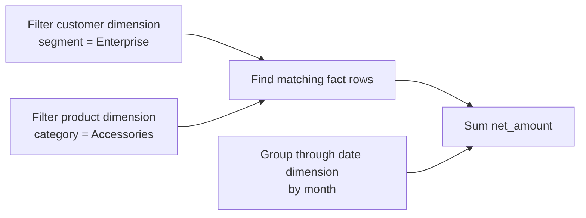
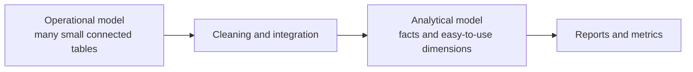
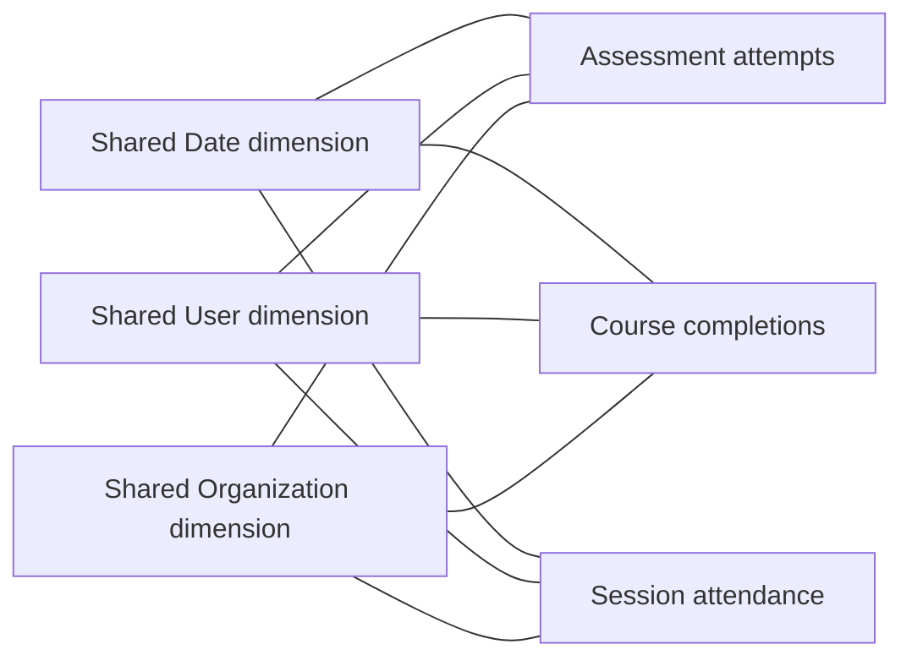

# Dimensional Modeling: Facts, Dimensions, and Stars

Dimensional modeling organizes data so that analytical questions are easier to ask and harder to answer incorrectly.

The basic idea is simple:

- put the **measurements** in a fact table;
- put the **descriptions** around them in dimension tables;
- connect them in a star shape.

Before going deeper, look at one small example.

## Start with a sale

Imagine a customer buys two keyboards for EUR 80.

The sale contains two kinds of information:

| Kind of information | Examples |
|---|---|
| What we want to measure | quantity `2`, sales amount `80` |
| How we want to describe or group it | customer, keyboard, store, date, promotion |

In a dimensional model:

- the quantity and amount go into a **sales fact table**;
- customer details go into a **customer dimension**;
- product details go into a **product dimension**;
- calendar details go into a **date dimension**.



The fact table answers **how much?** or **how many?** The dimensions answer **who?**, **what?**, **where?**, and **when?**

That is the heart of dimensional modeling.

## The problem it solves

Operational systems are built to run day-to-day work:

- place an order;
- change a customer's address;
- post a payment;
- enroll a learner;
- assign an employee to a department.

Their databases are usually good at saving one change safely and quickly. They are not always easy to use for questions such as:

- How did course completion rate change by region and month?
- Which customer segments used a new feature?
- What was the account balance at the end of each day?
- How did headcount change by department?

Answering those questions directly from an application database may require many joins, knowledge of source-specific codes, and repeated logic. Two analysts can write reasonable SQL and still produce different answers.

A dimensional model creates a clearer analytical layer between source systems and reports.

## The three building blocks

### Fact table

A fact table records a business event or state that can be measured.

Examples:

- one product sold;
- one assessment attempt submitted;
- one payment made;
- one account balance at the end of a day.

A fact table usually contains:

- keys that connect to dimensions;
- numeric measurements such as quantity, amount, duration, or count;
- sometimes a business identifier such as an order number.

### Dimension table

A dimension table describes the people, objects, places, dates, or categories involved in the fact.

Examples:

- Customer: name, segment, city, country;
- Product: name, brand, category;
- Course: title, subject, difficulty;
- Date: day, week, month, quarter, fiscal year.

Dimensions contain the labels people use to filter and group a report.

### Star schema

A star schema is one fact table connected directly to its dimensions.

The name comes from the visual shape: the fact is in the center and the dimensions surround it.

> A star schema is not valuable because it looks like a star. It is valuable because the path from a business question to the measurement is clear.

## Grain: what does one row mean?

Before choosing columns, define the **grain**:

> **One row represents ...**

For an order-line fact:

> One row represents one product line on one placed order.

Suppose order `1001` contains two products:

| order_number | line_number | product | quantity | net_amount |
|---|---:|---|---:|---:|
| 1001 | 1 | Keyboard | 2 | 80.00 |
| 1001 | 2 | Mouse | 1 | 25.00 |

The grain is one **order line**, not one order. Order `1001` therefore has two valid rows.

This matters because every dimension and every measurement must make sense for one order line:

- Product makes sense: each line has one product.
- Quantity makes sense: it measures one line.
- Customer makes sense: the order has one customer, so that customer can be repeated on its lines.
- Total order shipping cost does **not** automatically make sense: copying EUR 10 onto both lines would incorrectly produce EUR 20 when summed.

Defining grain first prevents many duplicate and wrong-total problems. Read [Grain](grain.md) for the full treatment.

## A simple order-line star



The fact stores keys such as `product_key`. The product dimension turns that key into useful descriptions such as “Mechanical Keyboard,” “Acme,” and “Accessories.”

### A small data example

`fact_order_line`:

| order_number | date_key | customer_key | product_key | quantity | net_amount |
|---|---:|---:|---:|---:|---:|
| 1001 | 20261001 | 18 | 501 | 2 | 80.00 |
| 1001 | 20261001 | 18 | 734 | 1 | 25.00 |

`dim_product`:

| product_key | product_name | category |
|---:|---|---|
| 501 | Mechanical Keyboard | Accessories |
| 734 | Wireless Mouse | Accessories |

`dim_customer`:

| customer_key | customer_name | segment |
|---:|---|---|
| 18 | Northwind Labs | Enterprise |

To calculate sales by category, join the fact to `dim_product`, group by `category`, and sum `net_amount`.

```sql
select
    p.category,
    sum(f.net_amount) as net_sales
from fact_order_line f
join dim_product p
  on f.product_key = p.product_key
group by p.category;
```

The dimension provides the category. The fact provides the amount.

## What belongs in a fact table?

A fact table normally contains:

- **dimension keys**, such as `customer_key` and `product_key`;
- **measurements**, such as quantity, revenue, cost, or duration;
- **business identifiers** when useful, such as an order or invoice number;
- limited audit information when it helps trace the data load.

Fact tables are often **long and narrow**: many rows, but not necessarily many columns.

The row count is not what makes a table a fact. Its purpose does: it records measurements at a declared grain.

## What belongs in a dimension table?

A dimension normally contains:

- a warehouse key;
- the source's business identifier;
- clear names and descriptions;
- attributes used for filtering and grouping;
- hierarchy columns such as category and department;
- history columns when old versions must be kept.

Dimensions are often **wide and descriptive**. It is normal for many products to repeat the same brand or category label. That controlled repetition makes the model easier to use.

## How the keys connect the tables

A fact row stores a foreign key for each dimension role:

```text
fact_order_line.product_key  -> dim_product.product_key
fact_order_line.customer_key -> dim_customer.customer_key
fact_order_line.date_key     -> dim_date.date_key
```

The dimension key is often a warehouse-generated **surrogate key**. This protects the model from source IDs that change or collide and lets the warehouse keep several historical versions of one customer or product.

For now, remember:

> The fact stores the key. The dimension stores the description.

The [Keys](keys.md) chapter explains business, durable, and surrogate keys in depth.

If a dimension value is missing, use a clear member such as “Unknown” or “Not applicable” rather than a null key with unclear meaning.

If one fact genuinely relates to several dimension members, such as an employee with several skills, the relationship needs special handling. Revisit the grain or use a [bridge table](../04-relationships/bridges-and-many-to-many.md).

## Fact or dimension?

The data type does not decide. A number is not automatically a fact.

| Value | Usually modeled as | Why |
|---|---|---|
| Sales amount | Fact | It is measured and summed |
| Quantity | Fact | It is measured for one event |
| Account balance | Fact | It is a numeric state at a point in time |
| Product color | Dimension attribute | It describes a product |
| Customer segment | Dimension attribute | It groups customers |
| Assessment score | Fact | It measures one attempt |
| Order number | Identifier kept in the fact | It helps trace or group order lines |
| Actual selling price | Fact | It was observed for one sale line |
| Current list price | Often a dimension attribute | It describes the current product offer |

Use this simple test:

- If users **calculate** with it — sum, average, minimum, maximum — it is probably a fact.
- If users **filter, group, or label** with it, it is probably a dimension attribute.

Some values can play both roles. The question is always: what does the value mean at this grain?

## How a star answers a question

Question:

> What were monthly net sales for Enterprise customers buying Accessories?

The model handles it in four steps:



In plain language:

1. find customers in the Enterprise segment;
2. find products in the Accessories category;
3. use their keys to select the relevant sale rows;
4. sum `net_amount` and group it by month.

This predictable pattern is a major reason star schemas are easy for BI tools and analysts to use.

## Why a star works well

### Fewer possible join paths

Dimensions connect directly to the fact. Users do not need to understand the application's full network of tables.

### Shared business descriptions

“Product category,” “customer country,” and “fiscal month” are defined once in dimensions instead of being recreated in every dashboard.

### Safer totals

The fact has one declared grain, and each measure has an aggregation rule. This makes it easier to spot mistakes such as summing account balances across several days.

### Intentional history

If a customer moves to a new segment, the warehouse can either:

- overwrite the old value when only the current segment matters; or
- create a new customer version when historical segment analysis matters.

This choice is covered in [Slowly changing dimensions](../03-dimensions/slowly-changing-dimensions.md).

### Room to grow

A well-designed star can usually accept:

- another measurement that is valid at the same grain;
- another dimension that has one value for each fact row;
- another descriptive dimension attribute.

If a new requirement has a different grain, create another fact table instead of changing the meaning of the existing one.

## Four examples from different domains

### Learning analytics

> One fact row represents one learner's submitted attempt for one assessment.

| Dimensions | Facts |
|---|---|
| Learner, assessment, course, submission date, device | score points, possible points, duration seconds, attempt count |

A course completion is a different event. Keep it in another fact table, even though both facts can share Learner, Course, and Date dimensions.

### SaaS product usage

> One fact row represents one tracked feature-use event by one user in one account.

| Dimensions | Facts |
|---|---|
| User, account, feature, event date/time, plan | event count, duration, bytes processed |

Invoices and daily seat counts have different row meanings, so they belong in separate facts.

### HR headcount

> One fact row represents one employee assignment at the end of one month.

| Dimensions | Facts |
|---|---|
| Employee version, position, department, location, month | headcount count, full-time equivalent, base salary |

If one employee can hold two assignments, “one employee per month” is too broad. Use employee-assignment-month.

### Banking balances

> One fact row represents one account in one currency at the close of one business date.

| Dimensions | Facts |
|---|---|
| Account, product, currency, branch, business date | ledger balance, available balance, accrued interest |

Balances can normally be summed across accounts on the same date. They should not normally be summed across several dates. See [Measures](measures.md).

## Dimensional and normalized models solve different problems

This distinction is easier to understand through an example.

An online shop may store products like this:

```text
product -> subcategory -> category -> department
```

Separating those tables is useful in the operational system. If a category name changes, it can be updated in one place. This is part of **normalization**.

For analytics, repeatedly joining all four tables makes every query harder. A dimensional model may copy the useful descriptions into one product dimension:

```text
dim_product
  product_name
  brand_name
  category_name
  department_name
```

The repeated labels are deliberate. They make filtering and grouping easier.



| Concern | Normalized operational model | Dimensional analytical model |
|---|---|---|
| Main job | Save and update transactions | Analyze many rows |
| Organized around | Business entities and update rules | Business events and measurements |
| Repeated descriptions | Minimized | Allowed when they improve usability |
| Typical history | Often current application state | Deliberately designed analytical history |
| Query paths | Can involve many tables | Short and predictable |

Neither design is “better” in every situation. They are tools for different jobs and commonly exist in different layers of the same platform.

### 1NF, 2NF, and 3NF — recognition level

You do not need a full database-theory course to use this handbook. The short version is:

- **1NF:** each field holds one value; do not create columns such as `phone_1`, `phone_2`, and `phone_3` for a repeating list.
- **2NF:** in a table with a combined key, every non-key value describes the whole key.
- **3NF:** non-key values describe the key rather than depending on other non-key values.

These rules help operational databases avoid inconsistent updates. A dimensional presentation model deliberately flattens some stable descriptions because analytical usability is the goal.

## Star versus snowflake

A **star** keeps useful hierarchy labels in one dimension. A **snowflake** separates them into more tables.

```text
Star:

fact_order_line -> dim_product
                     product
                     brand
                     category
                     department

Snowflake:

fact_order_line -> dim_product -> dim_subcategory -> dim_category -> dim_department
```

### Prefer a star when

- the hierarchy has clear, fixed levels;
- users often filter or group by those levels;
- repeated labels are manageable;
- the model is intended for reports and self-service analysis.

### Consider a snowflake when

- a large subdimension is genuinely shared and managed separately;
- security or localization gives a strong reason;
- the hierarchy is too complex for simple fixed columns;
- the platform hides the extra joins safely.

### Why too much snowflaking hurts

- more joins are required;
- users have more paths to understand;
- BI filter behavior can become confusing;
- application-level complexity leaks into the analytical model.

Modern columnar databases compress repeated values well, so saving a little storage is rarely enough reason to make the model harder to use.

## A warehouse usually contains several stars

One giant fact table should not contain every business process.

For learning analytics, these are separate facts:

- assessment attempt;
- course completion;
- live-session attendance;
- daily engagement snapshot.

They have different grains, but they can reuse dimensions such as Date, User, Course, and Organization.



A shared, consistently defined dimension is called a **conformed dimension**.

To compare completions and attendance by month and organization:

1. aggregate completions by month and organization;
2. aggregate attendance by the same month and organization;
3. align the two result sets.

Do not join every completion row directly to every attendance row. That can multiply rows and totals. The safe process is called **drill-across** and is explained in [Conformance and bus architecture](../05-enterprise-modeling/conformance-and-bus-architecture.md).

## When dimensional modeling is a good fit

Use it when:

- people need stable, understandable data for analysis;
- measurements must be filtered consistently by reusable descriptions;
- historical reporting matters;
- several sources or business processes need a shared analytical language;
- BI tools, dashboards, notebooks, or AI systems need a clear data contract.

## When it should not be the only model

Other structures are still useful:

- a raw layer preserves source records exactly as received;
- a normalized application database supports safe transactional updates;
- a Data Vault can preserve auditable multi-source history;
- graph, document, or geospatial data may need a specialized model;
- data scientists may need detailed raw signals before business rules are applied.

Dimensional models commonly sit downstream of these structures as the easy-to-use analytical layer.

## Common mistakes

| Mistake | What goes wrong | Better choice |
|---|---|---|
| Put every event and snapshot in one fact | Rows mean different things and totals become unreliable | Create one fact per business process and grain |
| Copy source tables directly into dimensions | Source complexity and codes leak into reports | Design clear analytical dimensions |
| Put product or customer descriptions in the fact | Labels repeat without consistent history control | Put reusable descriptions in dimensions |
| Split every dimension into many small tables | Queries become hard to understand | Flatten stable labels into the main dimension |
| Join facts directly to other facts | Rows and totals can multiply | Aggregate each fact first, then align results |
| Leave dimension keys null | Missing values behave differently across tools | Use explicit “Unknown” or “Not applicable” members |
| Join historical facts to the current customer row | Old events receive today's description | Store the correct historical dimension key |
| Design the model from one report layout | The model answers only one question well | Model the underlying business process |

## Tradeoffs

Dimensional models repeat some descriptive values and require careful data pipelines for keys and history. In return, they make business meaning, safe joins, and common calculations much easier to understand.

The architect's goal is not to remove complexity completely. It is to solve the complexity once in a governed model instead of making every dashboard author solve it again.

## Optional: how this maps to modern platforms

The physical implementation can change while the core ideas stay the same.

### SQL and dbt-style projects

A common flow is:

```text
source-aligned staging
    -> cleaned reusable models
    -> facts and dimensions with declared grains
    -> governed metrics
```

Folder names do not guarantee a good model. Tests should confirm unique row identity, dimension relationships, and reconciled totals.

### Lakehouse and medallion architectures

Bronze, Silver, and Gold describe stages of data quality. Dimensional modeling describes the shape and meaning of analytical data. Gold often contains facts and dimensions, but “Gold” and “star schema” are not synonyms.

See [Layered architectures](../07-modern-architecture/layered-architectures.md).

### SAP HANA Cloud and SAP Datasphere

Calculation Views and Datasphere models can express facts, dimensions, associations, hierarchies, and measures without physically storing every object as a star table.

The same questions still apply:

- What does one row represent?
- Is the relationship really many-to-one?
- Which source owns each measure?
- How should the measure aggregate?
- Could a join duplicate the measure?

A logical model can be dimensional even when the physical tables do not visibly form a star.

### Semantic layers

A semantic layer adds shared metric formulas, business labels, time rules, and access rules. It works best on top of data whose grain and relationships are already correct. It cannot reliably repair a mixed-grain fact table.

See [Semantic layers and governed metrics](../07-modern-architecture/semantic-layer-and-metrics.md).

## Beginner review checklist

Before accepting a dimensional model, check:

- [ ] I can finish the sentence “One fact row represents ...”
- [ ] Every measurement is true at that grain
- [ ] Every normal dimension has one matching member for a fact row
- [ ] Descriptive names and categories live in dimensions
- [ ] Missing dimension values have clear meanings
- [ ] Separate business processes use separate fact tables
- [ ] Measures have clear sum/average/time behavior
- [ ] Historical reports point to the correct historical dimension version
- [ ] Shared dimensions have the same meaning across facts
- [ ] Performance choices have not changed the business meaning

## What I should remember

1. **Fact tables hold measurements.**
2. **Dimension tables hold descriptions used to filter and group those measurements.**
3. **Grain tells you exactly what one row means and must be defined first.**
4. **A star gives analysts one clear path from descriptions to measurements.**
5. **Operational and dimensional models solve different problems.**
6. **Different business processes need different facts, even when they share dimensions.**
7. **Modern tools can hide or virtualize the star, but they cannot remove the need for clear grain, joins, history, and aggregation rules.**

## Source basis

This chapter synthesizes Kimball and Ross, *The Data Warehouse Toolkit*, 3rd ed., especially Chapters 1–3 and recurring case studies in Chapters 4–16. See the [coverage checklist](../COVERAGE.md) and [sources](../SOURCES.md).
