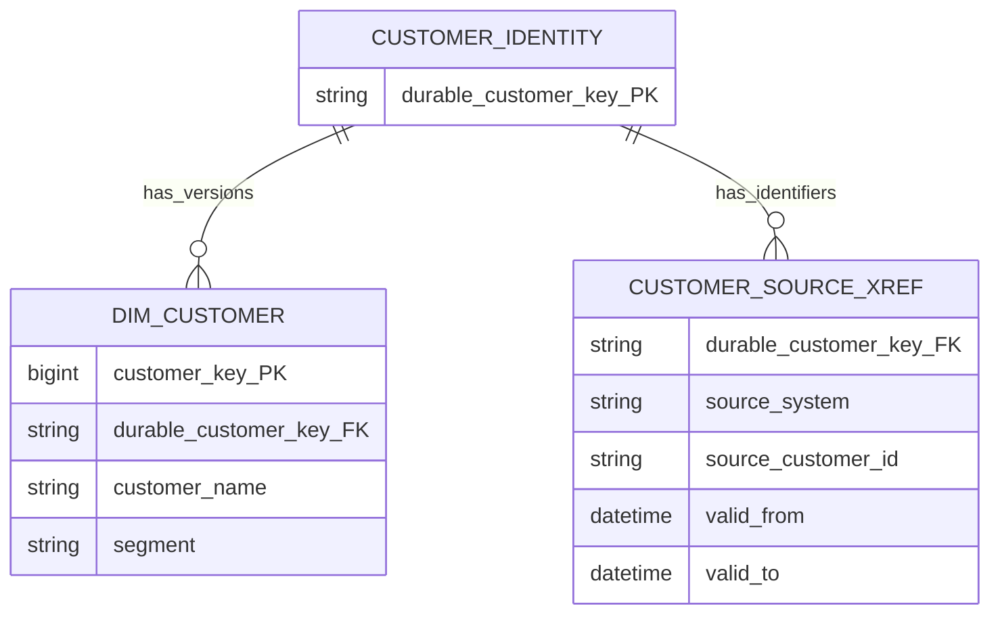

# Keys: Business Identity, Warehouse Identity, and History

Keys help a warehouse remember both **who or what something is** and **which historical version was valid**.

Suppose customer `18429` was in the `Small business` segment in March and moved to `Enterprise` in April. These two facts can both be true:

| order | order date | source customer ID | segment at the time |
|---|---|---|---|
| 9001 | 2026-03-11 | 18429 | Small business |
| 9440 | 2026-06-02 | 18429 | Enterprise |

The source ID identifies the customer record, but it cannot by itself tell us which segment description to use for each order. The warehouse therefore separates two questions:

1. Which real-world entity or event is this?
2. Which warehouse row — including which historical version — represents it?

Treating those questions as identical works only while a source identifier never changes, collides, or gains history. That is often too fragile for a long-lived analytical system.

## Why one key is often not enough

Source identifiers can:

- collide across systems;
- change during migrations;
- be reused after a record is closed;
- identify an account in one source and a customer in another;
- remain stable while descriptive history creates several dimension versions;
- arrive after the fact that refers to them;
- contain composite or mutable business attributes.

If facts use source keys as if they were permanent enterprise keys, source changes leak into every join. If facts join historical observations to the current dimension row, old results are silently restated.

## The three key jobs

The names can feel abstract at first. Start with the job each key performs:

| Question | Key concept | Example |
|---|---|---|
| What identifier did the source provide? | Source natural/business key | CRM customer `18429` |
| Which enduring business entity do these records describe? | Durable warehouse key | Enterprise customer `C-000071` |
| Which historical description of that entity applied? | Dimension surrogate key | Customer version row `customer_key = 981144` |

A compact mnemonic is:

> **Natural key identifies a source record; durable key identifies the entity; surrogate key identifies the dimension row or version.**

The shortcut “business key = entity, surrogate key = version” is useful for learning, but it is not always enough. A source business key may change, collide, or be reused. When those risks matter, the warehouse needs a durable entity identity that it controls.

## Grain

Keys do not define grain on their own; they encode the identity implied by a grain declaration.

For a Type 2 customer dimension:

> **One row represents one historically valid version of one customer.**

For an e-commerce order-line fact:

> **One row represents one line on one placed order.**

The customer foreign key on that fact identifies the customer **version valid when the order occurred**. The order number and line number identify the fact's business observation. Those are separate key responsibilities.

## Key types

### Natural or business key

A natural key comes from the business or source system:

- account number;
- employee ID;
- course code;
- source customer ID;
- `(order_number, line_number)`;
- an immutable application event ID.

It has meaning outside the warehouse. “Natural” does not guarantee immutable, globally unique, non-null, or safe to expose.

### Source-qualified key

When several systems use overlapping identifiers, qualify the key:

```text
(source_system = 'CRM_EU', source_customer_id = '18429')
(source_system = 'CRM_US', source_customer_id = '18429')
```

This prevents collisions but does not determine whether the two source records represent the same real customer. Entity resolution is a separate governed decision.

### Durable warehouse key

A durable key represents the business entity across source migrations and dimension versions. It is sometimes called a durable supernatural key.

For one customer:

```text
durable_customer_key = C-000071
    <- CRM_EU / 18429
    <- COMMERCE / 889104
    <- migrated CRM / 66302
```

The durable key is useful for:

- distinct entity counts across Type 2 versions;
- linking identifiers from several sources;
- retaining identity when a source key changes;
- current-state views across historical versions.

Not every implementation needs a separate physical durable-key column. A genuinely stable governed enterprise identifier may already serve this role. The important point is to distinguish entity identity from version identity.

### Surrogate dimension key

A surrogate key is a warehouse-controlled identifier for one dimension row. It is typically an integer, but its defining property is lack of source-system business meaning.

For a Type 2 dimension, each historical version receives a new surrogate key:

| customer_key | durable_customer_key | source_customer_id | segment | valid_from | valid_to | is_current |
|---:|---|---|---|---|---|---|
| 812044 | C-000071 | 18429 | Small business | 2025-01-01 | 2026-04-10 | false |
| 981144 | C-000071 | 18429 | Enterprise | 2026-04-10 | 9999-12-31 | true |

The durable key remains the same. The surrogate key changes because the dimensional description changed.

### Foreign key

A fact foreign key points to a dimension surrogate key:

| order_number | order_date | customer_key | net_amount |
|---|---|---:|---:|
| 9001 | 2026-03-11 | 812044 | 120.00 |
| 9440 | 2026-06-02 | 981144 | 250.00 |

Both orders belong to the same durable customer, but each preserves the segment version valid on its order date.

### Degenerate dimension key

A transaction identifier such as order number, invoice number, or assessment attempt ID can stay directly in the fact when it has analytical value but no meaningful set of dimension attributes. This is a [degenerate dimension](../03-dimensions/dimension-patterns.md), not a foreign key to an empty dimension.

### Fact-table surrogate key

A warehouse-generated fact row key may help:

- identify one physical fact row;
- resume or restart extract-transform-load (ETL) processing;
- decompose an update into delete-plus-insert;
- attach operational audit records;
- target corrections efficiently.

It does **not** replace the declared business grain. If `fact_row_id` is unique while the same logical event appears twice, the table still contains a duplicate business fact. See [Advanced fact designs](../02-fact-tables/advanced-fact-designs.md).

## Why use surrogate dimension keys?

### Preserve historical versions

Type 2 history requires several dimension rows for one entity. A source customer ID cannot distinguish the versions; a surrogate key can.

### Isolate the warehouse from source changes

If employee `E-1042` becomes `P-7781` after an HR migration, facts need not be rewritten when both source IDs map to one durable employee identity and the correct dimension versions.

### Prevent cross-source collisions

Two applications can both have account `1001`. Warehouse keys remain globally unambiguous.

### Represent missing or special conditions

A warehouse key can point to explicit dimension members such as:

- Unknown;
- Not applicable;
- Not yet occurred;
- Invalid source value;
- Confidential or withheld.

These states are analytically different and should not all collapse into SQL `NULL`.

### Support integration

Several source records can map to one conformed entity while retaining source identifiers for lineage. Facts from each system then join through conformed warehouse keys and attributes.

## Historical fact lookup

### The loading rule

When loading a fact, resolve the dimension version effective at the business event time:

```sql
select customer_key
from dim_customer
where durable_customer_key = :durable_customer_key
  and :event_timestamp >= valid_from
  and :event_timestamp < valid_to;
```

Using half-open intervals — `valid_from <= t < valid_to` — avoids overlap at the exact boundary.

Then store the selected `customer_key` on the fact. Ordinary analytical queries join directly:

```sql
select c.segment, sum(f.net_amount)
from fact_order_line f
join dim_customer c
  on f.customer_key = c.customer_key
group by c.segment;
```

The effective-date range is primarily a key-resolution concern in the loading pipeline. A normal fact query should not join by natural key and repeat the date-range lookup; the stored surrogate key already identifies the historical version.

### Event time, not load time

If an order occurred on March 11 but arrived on March 14, choose the customer version valid on March 11. Processing time explains when the warehouse learned about the fact; it should not rewrite the business context.

Late-arriving facts, inferred members, and retroactive dimension changes need additional rules. See [Late-arriving data](../06-time-and-change/late-arriving-data.md).

## Type 1 and Type 2 key behavior

### Type 1 overwrite

In a Type 1 dimension, an attribute is overwritten on the same row. The surrogate key normally remains unchanged. Historical facts immediately show the new attribute value.

This is correct when history has no analytical value or when the change is a correction. It is dangerous when users expect “as was” reporting.

### Type 2 versioning

In a Type 2 dimension:

1. expire the old row;
2. insert a new row with a new surrogate key;
3. retain the same durable entity key;
4. resolve later facts to the new surrogate key.

Historical facts keep their old foreign keys; they do not need to be updated for an ordinary prospective Type 2 change.

Type 2 control dates are not a substitute for a foreign key. They make validity explicit and support ETL lookup and dimension-as-of analysis. See [Slowly changing dimensions](../03-dimensions/slowly-changing-dimensions.md).

### Counting entities correctly

`COUNT(DISTINCT customer_key)` counts dimension versions. To count customers across time, use `COUNT(DISTINCT durable_customer_key)`, subject to the business definition of “customer.”

## Unknown and inferred members

### Special members for missing conditions

Instead of leaving a fact foreign key null, a warehouse often points it to a dedicated dimension row with an explicit meaning. These rows are sometimes called **sentinel members**. For example:

| Key | Meaning | Use |
|---:|---|---|
| 0 | Unknown | Value genuinely not known |
| -1 | Not applicable | Dimension does not apply to this fact |
| -2 | Not yet occurred | Future milestone in an accumulating snapshot |
| -3 | Invalid source value | Source supplied an unusable reference |

Exact key values are implementation choices. Stable meanings and documentation matter more than whether the keys are negative.

Do not use one generic “Unknown” row for every condition if users must distinguish data-quality failures from legitimate non-applicability.

### Inferred member

Suppose payment event `P-501` references customer `18429` before that customer's descriptive record arrives.

A poor approach maps every such fact to the shared Unknown customer. When the dimension arrives, the pipeline cannot tell which facts belong to which missing customer without revisiting source data.

An inferred-member approach:

1. creates a placeholder dimension row specifically for source customer `18429`;
2. assigns it a unique surrogate key;
3. loads the payment fact with that key;
4. fills the placeholder attributes later, usually with Type 1 updates.

The fact key remains stable and the missing entity retains its identity.

## Multiple source systems

### Cross-reference model



The identity row represents one durable customer. The cross-reference maps source identifiers to that identity, while the Type 2 dimension stores its historical descriptive versions. The identity registry can be a physical table or a governed mapping service. Do not merge records solely because names or email addresses happen to match; entity resolution needs governed confidence, survivorship, and stewardship rules.

### Source key reuse

Some operational systems reuse customer or account numbers after deletion. Qualifying only by source is then insufficient. Add a source lifecycle identifier or effective interval so two real entities do not collapse into one durable key.

## Practical examples

### Learning platform migration

Legacy LMS user `314` and new LMS user `U-9008` are confirmed as the same person.

- source keys retain lineage;
- one durable learner key ties the identities together;
- every Type 2 learner profile version has its own surrogate key;
- assessment facts point to the version valid at attempt time.

If the match is uncertain, do not force it. False identity merges corrupt every historical metric downstream.

### SaaS account and user

An account ID and user ID identify different grains. A user may move between accounts or belong to several accounts. Do not create one generic `party_key` and assume it resolves both business concepts. Facts should carry keys appropriate to their declared grain, and a time-varying account-user relationship may require a bridge or factless relationship table.

### HR employee number reuse

If employee number `E100` is reassigned years later, an employee-number join can attach new-person attributes to old payroll facts. A warehouse-controlled durable employee key separates the people; Type 2 surrogate keys separate each person's historical profiles.

### Banking account number changes

Account numbers may change after a product conversion while the institution treats the contract as one enduring account. Preserve both source account numbers, map them to one durable account identity if governance confirms continuity, and give changed descriptive versions new surrogate keys.

## When to use each key

| Need | Use |
|---|---|
| Trace back to source | Source-qualified natural key |
| Identify one enterprise entity across systems and versions | Durable warehouse key |
| Join a fact to the correct dimension row/version | Surrogate dimension key |
| Identify a business transaction or line | Natural/degenerate transaction identifier |
| Operate on one physical fact row | Optional fact surrogate key |
| Represent a missing but known entity reference | Unique inferred-member surrogate key |

## When not to add key machinery

- Do not create a separate durable key if an existing governed identifier already meets the durable-identity need and no integration ambiguity exists.
- Do not add a meaningless dimension table for a transaction number with no descriptive attributes; keep a degenerate dimension in the fact.
- Do not expose warehouse surrogate keys as business labels or API identifiers.
- Do not assume every relationship can be reduced to one foreign key; legitimate multivalued dimensions need a bridge.
- Do not use a fact surrogate key to claim that an otherwise mixed-grain table is unique.

## Common mistakes

| Mistake | Consequence | Correction |
|---|---|---|
| Joining facts to dimensions by current natural key | Historical context is overwritten or multiplied | Resolve and store the historical surrogate key |
| Treating source key as globally unique | Cross-source collisions | Qualify by source and map to a durable entity |
| Treating surrogate key as entity identity | Type 2 versions are overcounted | Count or group by durable entity key |
| Mapping all early-arriving entities to one Unknown row | Later reconciliation requires fact rekeying | Create a unique inferred member |
| Allowing null foreign keys | Missing conditions become ambiguous | Use governed sentinel members |
| Using mutable email or name as a durable key | Identity changes or false merges | Use a warehouse-controlled identity with cross-reference |
| Hashing fields without a canonicalization contract | Keys change across pipelines or releases | Govern input order, types, nulls, casing, and algorithm |
| Giving facts a generated ID but not testing business identity | Duplicate logical events survive | Test the candidate key implied by grain |

## Tradeoffs

Surrogate and durable keys add lookup logic, mapping tables, and stewardship. They also isolate downstream models from source churn and make historical joins deterministic.

The main architectural choice is where entity resolution is governed. Centralizing it improves cross-domain consistency but requires ownership and exception handling. Leaving it to each mart speeds local delivery but creates incompatible “customer” or “employee” identities.

## Optional: modern implementation notes

The core key roles above are Kimball-derived. This section maps them to current platforms and engineering practice; these are modern implementation recommendations.

### Sequence, identity, and hash keys

- Integer sequence/identity keys are compact and efficient but require coordination when dimensions are built in several environments.
- Deterministic hashes can simplify distributed builds and idempotent loads, but collision risk, canonicalization, algorithm changes, and debugging must be governed.
- A hash of `(source_system, source_id)` is a source-qualified identifier, not proof of an enterprise entity match.
- A hash of Type 2 attributes can detect change; it should not silently define business identity.

Choose key generation for reliability and interoperability, not fashion.

### Idempotent dimension loads

An idempotent rerun should:

- reuse the same dimension row when the business version has not changed;
- create at most one new Type 2 version for a real change;
- keep validity intervals non-overlapping;
- preserve stable sentinel members;
- complete inferred members without duplicating them.

Use uniqueness and overlap tests on natural/durable key plus validity intervals.

### dbt-style snapshots

Snapshot tooling can capture Type 2-like versions, but configuration still needs a stable source identity, dependable change timestamp or comparison strategy, and explicit handling of hard deletes and late corrections. Tool-generated keys do not remove the need to decide what each key and historical change means.

### SAP HANA Cloud and SAP Datasphere

Even when associations and semantic entities hide physical joins:

- expose business identifiers for traceability;
- use stable technical keys for associations;
- validate association cardinality;
- preserve historical-version joins where required;
- avoid assuming a source key is conformed across spaces or applications.

### Privacy

Replacing an email address with a hash may pseudonymize a field; it does not automatically anonymize the person. Keep analytical identity, access control, deletion obligations, and source traceability as separate design concerns.

## Validation checklist

- [ ] Every key's role is named: source, durable entity, dimension row/version, fact observation, or physical row
- [ ] Source identifiers are qualified where collisions are possible
- [ ] Key reuse and source migration behavior are understood
- [ ] Each fact foreign key resolves to exactly one dimension row
- [ ] Historical facts use the version valid at event time
- [ ] Type 2 validity intervals do not overlap for one durable entity
- [ ] Entity counts use a durable key rather than a version key
- [ ] Sentinel members have distinct governed meanings
- [ ] Inferred members are unique to the referenced entity
- [ ] A fact's business-grain key is tested even if a fact surrogate key exists

## Related patterns

- [Grain](grain.md)
- [Dimensional modeling](dimensional-modeling.md)
- [Fact table patterns](../02-fact-tables/fact-table-patterns.md)
- [Advanced fact designs](../02-fact-tables/advanced-fact-designs.md)
- [Slowly changing dimensions](../03-dimensions/slowly-changing-dimensions.md)
- [Dimension patterns](../03-dimensions/dimension-patterns.md)
- [Bridges and many-to-many relationships](../04-relationships/bridges-and-many-to-many.md)
- [Late-arriving data](../06-time-and-change/late-arriving-data.md)
- [Reliable implementation](../07-modern-architecture/reliable-implementation.md)

## What I should remember

1. Source identity, durable entity identity, and historical version identity are different responsibilities.
2. Facts normally join to dimension surrogate keys so historical context remains stable.
3. In Type 2, the durable key stays with the entity while each version receives a new surrogate key.
4. Resolve late facts using business event time, not warehouse load time.
5. Use explicit sentinel members, and create a unique inferred member when the missing entity is known.
6. A generated fact row ID supports operations; it does not define the business grain.
7. Key technology can vary, but identity, history, and reconciliation rules must remain explicit.

## Source basis

This chapter synthesizes Kimball and Ross, *The Data Warehouse Toolkit*, 3rd ed., especially Chapters 2, 3, 5, 8, and the key-management and late-data material in Chapters 19–20. See the [coverage checklist](../COVERAGE.md) and [sources](../SOURCES.md).
