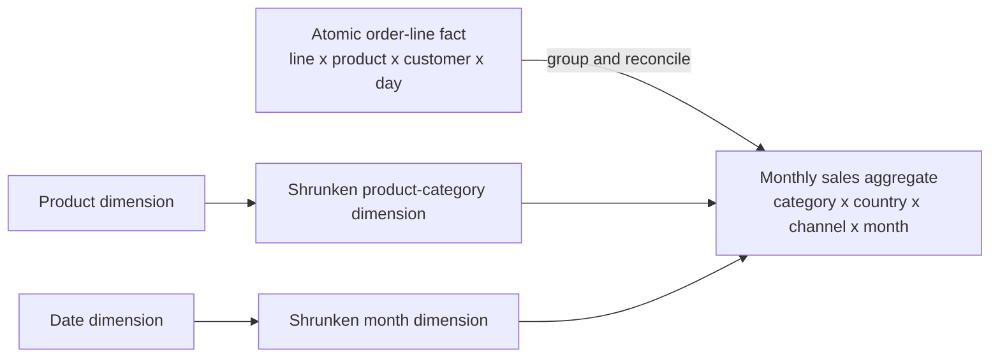

# Advanced Fact Designs

> **Optional chapter:** return here after the basic fact-table patterns are comfortable.

Advanced fact designs solve specific problems that remain after the base business process and grain are correct. For example:

- an order-line table is correct but too slow for a repeated monthly dashboard;
- a shipping charge belongs to an order, while users want to analyze it by product line;
- transactions arrive in several currencies but reports need one standard currency;
- users need to measure how long a case takes between two milestones.

Each problem has a different technique. These techniques refine a sound fact model; they do not repair an unclear one.

> **An optimization, allocation, or consolidation must never conceal a grain mismatch.**

Use this chapter after [Grain](../01-foundations/grain.md), [Measures](../01-foundations/measures.md), and [Fact table patterns](fact-table-patterns.md). You do not need to memorize every technique. Start with the problem in the left column of the chooser and read the matching section when it becomes relevant.

## Fast chooser

| Need | Technique | Grain requirement | Main risk |
|---|---|---|---|
| Faster repeated summaries | Aggregate fact | Explicit rollup of one atomic fact | Treating the aggregate as the only truth |
| One frequent view across processes | Consolidated fact | All measures expressible at exactly the same grain | Combining incompatible processes |
| Analyze header measures by line attributes | Governed allocation | Header amount allocated completely to atomic lines | False precision or unreconciled totals |
| Analyze across currencies or units | Dual measures plus conversion factors | Original and standardized values at the same fact grain | Mixing bases or rates |
| Report ratios, year-to-date (YTD), or rolling values | Derived measure | Derived at the requested query context | Summing precomputed results |
| Analyze process speed | Anchor-based lag/duration facts | Duration belongs to one lifecycle row/event pair | Conflicting clocks and calendars |
| Store changing state without repeated periodic rows | Timespan fact | One row per state version and validity interval | Overlaps and difficult as-of joins |
| Preserve historical accumulating states | Timespan accumulating snapshot or event history | One row per lifecycle-state version | Row explosion and late-event restatement |
| Operate reliably on mutable facts | Fact surrogate key | Still retain the business-grain key | Mistaking physical identity for grain |

## Aggregate fact tables

### The problem

An atomic fact may contain billions of rows while most dashboards repeatedly ask for a stable summary, such as monthly revenue by product category and country. Scanning the atomic table can be unnecessarily expensive.

### A simple way to think about it

**Keep the detailed facts as the source of truth, and add a pre-summarized table for a repeated query.**

It serves a purpose similar to an index: faster access without changing what the underlying data means. Unlike a normal index, however, it stores summarized measurements and needs its own declared grain.

### Grain

Atomic fact:

> One row represents one product line on one placed order.

Monthly aggregate:

> One row represents one product category, customer country, sales channel, and calendar month.

The aggregate grain must be written independently. “A smaller sales table” is not a grain.

### Model



An aggregate uses conformed dimensions or **shrunken conformed dimensions**:

- a row subset, such as only active product members;
- a column subset, such as fewer attributes;
- a level subset, such as one row per category rather than product.

The rollup values must use the same governed definitions as the atomic dimensions.

### Measures

Additive components aggregate naturally:

```sql
select
    month_key,
    product_category_key,
    customer_country_key,
    channel_key,
    sum(quantity) as quantity,
    sum(gross_amount) as gross_amount,
    sum(discount_amount) as discount_amount,
    sum(net_amount) as net_amount,
    sum(cost_amount) as cost_amount,
    count(*) as order_line_count
from fact_order_line
group by 1, 2, 3, 4;
```

Ratios should be recomputed from aggregated components. Distinct counts need special treatment: a monthly distinct-customer count cannot be summed into quarters or across countries when customers overlap.

### Aggregate navigation

Consumers should receive the atomic or aggregate table that can answer their query without changing meaning.

```text
requested dimensions and measures
    -> Is every requested dimension available at aggregate grain?
    -> Are all measure formulas safely derivable there?
    -> Is the requested date range covered and fresh?
       yes -> use aggregate
       no  -> use atomic fact
```

Navigation may be implemented by:

- database query rewrite;
- materialized views;
- a semantic layer that selects the correct source;
- explicit high-level metrics bound to the aggregate;
- a curated view that unions compatible aggregate and atomic periods without overlap.

The consumer should not need to guess whether two summary tables are interchangeable.

### When to use

- A measured workload repeatedly groups by the same levels.
- Atomic correctness is established and reconciliation is automated.
- Response-time or cost benefits are material.
- Freshness requirements can be met.

### When not to use

- The atomic model is still unstable.
- Users require dimensions omitted by the aggregate.
- Distinct or semi-additive measures cannot be rolled up safely.
- The aggregate exists only because the underlying joins are incorrect.

### Common mistakes

- Keeping only summary data and losing atomic auditability.
- Attaching product-level attributes to a category-level fact.
- Summing precomputed ratios or distinct counts.
- Mixing data from an incomplete current month with closed historical months without a freshness indicator.
- Letting aggregate dimension labels drift from their conformed base.
- Double counting when a query unions aggregate and atomic rows for the same period.

### Tradeoffs

Aggregates improve speed but add storage, refresh dependencies, routing metadata, reconciliation, and failure modes. Build them from observed workloads, not as a default modeling ritual.

## Consolidated fact tables

### The problem

Users repeatedly compare measurements from several business processes and want one simple table. For example:

- actual revenue versus plan;
- invoices versus payments;
- learning assignments versus completions;
- inventory receipts versus shipments.

### A simple way to think about it

**Consolidate measures only after every process has been expressed at one identical grain.**

### Grain

A finance consolidation might declare:

> One row represents one legal entity, cost center, account, scenario, currency, and fiscal month.

Actuals may originate as journal-line transactions and budget as monthly department plans. Actuals must first be aggregated to the declared consolidation grain. If the budget exists only by department while actuals exist by cost center, they are not yet compatible; repeating the department budget across cost centers is not consolidation.

### Model

```text
atomic actuals ----aggregate---+
                               +--> fact_finance_monthly
monthly budget ----conform-----+      actual_amount
                                      budget_amount
                                      forecast_amount
```

Amounts with the same names must have identical definitions, units, sign conventions, and calculation rules. Measures that meet this requirement are called **conformed facts**.

### Why this works

A consolidated fact moves a frequently repeated comparison into one controlled pipeline. Reports become simpler because the difficult grain alignment is performed and checked once.

### When to use

- The cross-process comparison is frequent and stable.
- Each source can be transformed to the exact same dimensional grain.
- Measure definitions, currencies, units, and calendars are conformed.
- The atomic source facts remain available for drill-through.

### When not to use

- Processes only appear similar but represent different events.
- One source is at a coarser level that cannot be allocated legitimately.
- Most measure columns would be empty for most rows.
- Users need dimensions available in only one atomic process.

### Common mistakes

- Combining by column name rather than technical definition.
- Joining raw facts many-to-many before aggregation.
- Repeating a coarse plan over detailed actual rows.
- Treating missing process rows as zero without a coverage rule.
- Replacing atomic facts with the consolidated table.

### Tradeoffs

Consolidation adds pipeline work and can discard detail, but it makes an important comparison easier and more consistent. If the comparison is occasional, drill across independently aggregated facts may be more flexible. See [Conformance and bus architecture](../05-enterprise-modeling/conformance-and-bus-architecture.md).

## Header and line-item modeling

### The problem

Transactions often have two natural levels:

- order or invoice header;
- order or invoice lines.

Header attributes such as order date, customer, and channel apply to every line. Header measures such as shipping charge or order discount apply once to the whole order.

### Grain

Line fact:

> One row represents one product line on one order.

Header fact, if retained:

> One row represents one order.

These grains are related but not interchangeable.

### Dimensional context

Copy header-level **dimensional context** down to the line fact when it is single-valued for the order:

- customer;
- order date;
- sales channel;
- promotion;
- order number as a degenerate dimension.

This makes the atomic line fact independently queryable. It does not authorize copying header-level numeric facts to every line.

### Allocation

Suppose a €12 shipping charge belongs to an order with line merchandise values of €20, €30, and €50. A value-weighted allocation produces €2.40, €3.60, and €6.00.

```text
line allocation weight = line merchandise value / order merchandise value
allocated shipping = order shipping x line allocation weight
```

Store or govern:

- the unallocated header amount;
- line allocation weight;
- allocated line amount;
- allocation method/version;
- rounding residual handling.

The allocated values must reconcile:

```text
SUM(line allocated shipping) = order shipping
```

### When to allocate

- Users need profitability sliced by line-level product attributes.
- A defensible business rule exists.
- Reconciliation and method governance are in place.
- Consumers understand that the lower-grain amount is allocated, not observed.

### When not to allocate

- Any allocation would be arbitrary and misleading.
- Only order-level analysis is required.
- The line dimension cannot legitimately explain the header amount.
- The business needs both actual header economics and scenario-specific allocations; retain separate measures or facts.

### Common mistakes

- Repeating the whole header amount on each line.
- Dropping the original header amount after allocation.
- Allowing weights not to total 1.0.
- Ignoring rounding remainders.
- Changing allocation rules without versioning or restating history.

### Tradeoffs

Allocation enables detailed analysis but creates modeled precision. An allocated €2.40 shipping cost is not a source-observed line charge. Name it accordingly and preserve the rule.

## Multiple currencies

### The problem

Financial facts need both local auditability and enterprise comparison. Query-time conversion without a governed rate type and date produces inconsistent results.

### Grain

> One row represents one invoice line in its transaction currency at posting time.

Currency does not change the invoice-line grain, but currency identity and conversion basis are part of the measure contract.

### Model

```text
fact_invoice_line
  transaction_currency_key
  transaction_net_amount
  reporting_currency_key
  reporting_net_amount
  exchange_rate
  exchange_rate_type_key
  exchange_rate_date_key
```

For every important monetary fact, a common design stores:

- amount in transaction currency;
- amount in standardized/reporting currency;
- currency keys;
- governed rate type and effective date;
- optional conversion factor for audit.

The reporting amount is calculated once under a consistent pipeline rule. Retaining the original amount supports reconciliation.

### Decisions to govern

- Which rate: spot, daily close, monthly average, budget, contractual?
- Which date: transaction, posting, settlement, or period end?
- Direct or inverse quotation?
- What precision and rounding?
- Are historical conversions frozen or restated?
- How are triangulated currencies handled?

### Avoid

- summing mixed transaction currencies;
- using today's rate for historical transactions unless the metric explicitly asks for current revaluation;
- storing a converted amount without rate lineage;
- silently mixing actual and budget rate types.

Some finance use cases require several standardized currencies — local, group, and constant currency. Store clearly named measures rather than one ambiguous `converted_amount`.

## Multiple units of measure

### The problem

The same product may be transacted as cases, pieces, kilograms, or liters. Raw quantities are not additive across incompatible units.

### Grain

> One row represents one inventory movement line in its transaction unit.

### Model

```text
transaction_quantity
transaction_unit_key
standard_quantity
standard_unit_key
transaction_to_standard_factor
```

Convert to one governed standard unit at the row grain. Preserve the original quantity and unit for traceability.

### Important nuance

Conversion may depend on:

- product;
- package;
- effective date;
- batch or density;
- source-system convention.

A static “12 pieces per case” assumption fails if packaging changes historically. Resolve the factor valid for the event.

### Avoid

- summing cases and pieces in one quantity;
- attaching a current conversion factor to historical events;
- rounding standardized quantities too early;
- presenting a standard quantity without its unit label.

Constituency-specific views can expose preferred units while one standard measure supports enterprise aggregation.

## Derived, period-to-date, and rolling facts

### The problem

Users want margin percentages, year-to-date revenue, rolling averages, and cumulative completions. These values depend on filter and time context.

### A simple way to think about it

**Store stable components; derive context-dependent answers after aggregation.**

### Grain

An atomic sales row remains:

> One row represents one product line on one placed order.

“Year-to-date revenue” is not a new property of that order line. It is a calculation over a chosen calendar, year, date cutoff, and filter context.

### Prefer derivation

```sql
sum(net_amount) over (
    partition by fiscal_year
    order by fiscal_period
    rows between unbounded preceding and current row
) as fiscal_ytd_net_amount
```

In practice, aggregate to the required period before applying the window. Derive:

- period-to-date totals;
- rolling averages;
- shares of filtered totals;
- ratios and percentages;
- cumulative counts.

### Store only with a clear contract

Stored derived facts can be justified when:

- the source officially publishes the figure;
- a regulated close freezes the value;
- recomputation inputs are unavailable;
- a performance need is demonstrated;
- formula version and restatement behavior are governed.

Do not give YTD values default `SUM` behavior. Summing January YTD and February YTD double counts January.

### Common mistakes

- using calendar year for a fiscal-YTD requirement;
- calculating before applying the intended dimensional filters;
- mixing open and closed periods;
- storing a ratio without components;
- deriving from already rounded summaries.

## Lag and duration facts

### The problem

Pipeline users ask how long work takes between milestones:

- enrollment to first activity;
- order to shipment;
- application to approval;
- ticket opened to resolution.

With `n` milestones, storing every pairwise duration creates roughly `n(n-1)/2` columns and conflicting calculations.

### Grain

For an accumulating snapshot:

> One row represents one complete lifecycle instance, such as one course enrollment attempt.

Milestone dates and lag facts belong to that lifecycle row.

### Anchor-based design

Choose a stable anchor, often lifecycle start:

```text
days_enrolled_to_started
days_enrolled_to_first_activity
days_enrolled_to_completed
```

Then derive:

```text
start_to_completion
= enrolled_to_completed - enrolled_to_started
```

Store another direct lag only when its business calendar or pause rules differ.

### Clock semantics

Define:

- event timestamps and time zones;
- calendar versus business duration;
- holidays and working hours;
- whether paused time is excluded;
- negative values caused by late or corrected events;
- open lifecycle treatment.

A duration of zero can mean “same instant,” “same calendar day,” or “less than one chosen unit.” State which.

### Tradeoffs

Precomputed lags make recurring analysis easy and centralize business-calendar logic. They become stale when milestones are corrected unless recomputed. Raw milestone timestamps remain necessary for audit and new calculations.

## Timespan fact tables

### The problem

A state changes irregularly, and copying unchanged values into every daily or monthly snapshot would be wasteful. Users still need “what state was valid as of time T?”

This technique is sometimes described as a slowly changing fact or timespan-tracking fact. It is an exception, not the default fact design.

### A simple way to think about it

**One row owns a non-overlapping interval during which the measured state was valid.**

### Grain

For a SaaS subscription:

> One row represents one version of one subscription's measurable state during one continuous validity interval.

### Model

| subscription_id | state_version | valid_from | valid_to | is_current | plan_key | licensed_seats | contracted_mrr |
|---|---:|---|---|---|---:|---:|---:|
| S-900 | 1 | 2026-01-01 | 2026-03-15 | false | 10 | 20 | 1,000 |
| S-900 | 2 | 2026-03-15 | 2026-07-01 | false | 12 | 35 | 1,750 |
| S-900 | 3 | 2026-07-01 | 9999-12-31 | true | 12 | 40 | 2,000 |

Use a half-open interval:

```text
valid_from <= as_of_time < valid_to
```

Rows for one lifecycle must not overlap. Decide whether gaps are allowed and what they mean.

### When to use

- State changes are relatively infrequent.
- As-of queries matter.
- Repeated periodic copies would be very large.
- Interval joins are supported and governed.

### When not to use

- Most users need simple regular trends; a periodic snapshot is easier.
- Every change is already a valuable event and state can be derived reliably.
- The business cannot establish unambiguous effective time.
- The state changes so frequently that intervals approach event volume without simplifying queries.

### Common mistakes

- overlapping validity intervals;
- using load time instead of business effective time;
- forgetting how retroactive corrections split intervals;
- summing state values across interval versions;
- joining an as-of population without a calendar spine and accidentally excluding gaps.

### Tradeoffs

Timespan facts store less repeated state but make point-in-time population queries more complex. A periodic snapshot stores more rows but makes trends and dense-population reconciliation simpler.

For a daily view, expand or range-join intervals to a governed date spine in a downstream model rather than forcing every dashboard to implement temporal logic.

## Accumulating snapshot edge cases

A classic accumulating snapshot updates one row as a predictable, finite workflow advances. Three requirements complicate it.

### 1. Unpredictable or looping workflows

If a support case can be reassigned, reopened, paused, and escalated an arbitrary number of times, columns such as `reopened_date_1`, `reopened_date_2` do not scale.

Prefer:

- an event fact for every transition;
- a compact accumulating snapshot with only major stable milestones and current state;
- a periodic snapshot if regular backlog state matters.

### 2. Historical “as-of” pipeline state

Updating one accumulating row erases the prior current state. If users need “what did the pipeline look like at last month's close?”, use:

- a periodic pipeline snapshot;
- a transition event fact and derived state;
- a timespan accumulating snapshot that inserts a new lifecycle-state version on each material change.

#### Timespan accumulating grain

> One row represents one historical version of one lifecycle instance during one validity interval.

This preserves history but combines Type 2-like interval management with fact updates. Use it only when the as-of requirement justifies the complexity.

### 3. Long-running workflows

For insurance claims, legal cases, or long learning programs, a row may remain open for years. Current pipeline analysis can still use an accumulating snapshot, while periodic snapshots preserve workload trends. One table need not answer both questions.

### Design guidance

- Store only analytically important milestones.
- Prefer lags from one anchor milestone rather than every pair.
- Keep transition events for audit and rebuild.
- Define reopening and terminal-state semantics.
- Process out-of-order events idempotently.
- Distinguish “not yet occurred” from “not applicable.”

## Snapshot optimization patterns

### Frequency by decision need

Choose daily, weekly, or monthly frequency from the decisions the snapshot supports. Higher frequency is not automatically better. A monthly regulatory balance and a near-real-time operations backlog solve different problems.

### Closed and open periods

A pipeline may refresh the current day or month and freeze it after close:

```text
open period     -> replace or merge as state evolves
closed period   -> immutable unless governed restatement occurs
```

Expose close status and publication time. Reconcile the expected population before marking a period complete.

### Sparse versus dense population

A dense snapshot includes every in-scope entity even with zero activity. A sparse snapshot includes only meaningful nonzero or changed states. Sparse designs save rows but make absence ambiguous and complicate denominators.

Use sparse snapshots only when:

- the omitted state has one unambiguous meaning;
- a coverage population exists elsewhere;
- users understand that missing is not an ingestion failure.

### Hybrid retention

Some architectures retain daily snapshots for a recent window and month-end snapshots for longer history. This is valid only when:

- period type is explicit;
- no query accidentally sums both;
- retention and rollup logic reconcile;
- users know that older intramonth detail is unavailable.

Separate tables or views are often clearer than mixed-frequency rows.

## Fact-table surrogate keys

### The problem

A fact's natural key may be composite, mutable during correction, or awkward for extract-transform-load (ETL) restart. A single technical row identifier can simplify physical operations.

### Grain

For a payment fact:

> One row represents one posted payment transaction or governed revision according to the correction policy.

`payment_fact_key` identifies the physical warehouse row. `(source_system, payment_event_id)` still expresses the logical event identity.

### When useful

- isolate and replace a bad fact row;
- record an audit trail of ETL actions;
- decompose a database update into delete and insert records;
- attach child operational records to one physical fact row;
- support resumable loads.

### When not useful

- used only because every table template requires an integer key;
- mistaken for the fact's business uniqueness test;
- exposed to users without analytical meaning;
- used to hide duplicate source events.

### Rule

Test both:

1. physical row key uniqueness;
2. business-grain uniqueness under the correction/version policy.

See [Keys](../01-foundations/keys.md).

## Architecture and governance consequences

Advanced facts introduce decisions that must be owned:

| Technique | Governance obligation |
|---|---|
| Aggregate | Grain, freshness, reconciliation, routing |
| Consolidation | Conformed dimensions and fact definitions |
| Allocation | Weight rule, version, residual, original total |
| Currency conversion | Rate type, date, precision, restatement |
| Unit conversion | Standard unit and effective conversion |
| Derived fact | Formula, context, calendar, refresh behavior |
| Lag | Clock, time zone, business calendar, pause treatment |
| Timespan | Effective-time source, overlap/gap policy |
| Mutable snapshot | Correction, reopening, audit, rebuild |
| Fact surrogate key | Physical versus business identity |

Without these contracts, advanced tables create easier access to less trustworthy numbers.

## Optional: modern implementation notes

The dimensional techniques above are grounded in Kimball. The implementation mappings below are modern synthesis.

### Materialized views and lakehouse tables

Materialized views, incremental aggregate tables, and caching can all implement aggregate navigation. Whatever the technology:

- build from one authoritative grain;
- track the maximum included event or load time;
- prevent overlap between aggregate and atomic slices;
- reconcile additive components;
- invalidate or rebuild affected summaries after corrections.

### Incremental and idempotent processing

- Use the business-grain key to make retries safe.
- Recompute all dependent allocations when a header total or line set changes.
- Restate aggregates affected by late facts or Type 1 dimension changes.
- Split and repair timespan intervals deterministically for retroactive changes.
- Retain raw events or source snapshots so mutable facts can be rebuilt.

See [Reliable implementation](../07-modern-architecture/reliable-implementation.md).

### Semantic layers

A semantic layer can:

- route queries to safe aggregates;
- recompute ratios from components;
- apply period-end exception aggregation;
- expose transaction and reporting currencies separately;
- hide allocation mechanics while labeling allocated measures;
- prevent unsupported dimensions on summary facts.

It cannot make an incompatible consolidation additive. Semantic metadata must reflect the physical grain and provenance.

### SAP HANA Cloud and SAP Datasphere

- Use analytical privileges and semantic entities without changing measure grain.
- Configure currency/unit conversion with explicit reference dates and rate types.
- Use exception aggregation for period-end snapshot measures.
- Validate star-join cardinalities before enabling performance optimizations based on them.
- Treat calculated measures such as margin percentage as post-aggregation formulas.
- For pre-aggregated sources, declare supported dimensions and prevent drilldown to unavailable detail.

### Streaming

Streaming can continuously update aggregates and accumulating snapshots, but event-time ordering, duplicates, corrections, and watermark cutoffs still affect completeness. Publish freshness and finalization status; do not present a provisional aggregate as a closed period.

## Review checklist

- [ ] Every advanced table has its own grain statement
- [ ] Atomic facts remain available where audit or new questions require them
- [ ] Aggregates use conformed or shrunken conformed dimensions
- [ ] Aggregate routing checks dimensions, measures, coverage, and freshness
- [ ] Consolidated measures share exactly the same grain and definitions
- [ ] Allocations reconcile to original header totals and preserve method/version
- [ ] Currency and unit conversions retain original values and conversion basis
- [ ] YTD, ratios, averages, and distinct counts are not summed
- [ ] Lag clocks and business calendars are explicit
- [ ] Timespan intervals do not overlap and use business effective time
- [ ] Snapshot history requirements are not delegated to a mutable current-state row
- [ ] Fact surrogate keys do not replace business-grain tests

## Related patterns

- [Grain](../01-foundations/grain.md)
- [Dimensional modeling](../01-foundations/dimensional-modeling.md)
- [Keys](../01-foundations/keys.md)
- [Measures](../01-foundations/measures.md)
- [Fact table patterns](fact-table-patterns.md)
- [Date, time, and calendars](../03-dimensions/date-time-calendars.md)
- [Conformance and bus architecture](../05-enterprise-modeling/conformance-and-bus-architecture.md)
- [Multi-process and heterogeneous models](../05-enterprise-modeling/multi-process-and-heterogeneous-models.md)
- [Event, state, and temporal modeling](../06-time-and-change/event-state-and-temporal-modeling.md)
- [Semantic layer and metrics](../07-modern-architecture/semantic-layer-and-metrics.md)
- [Reliable implementation](../07-modern-architecture/reliable-implementation.md)

## What I should remember

1. Aggregate facts accelerate atomic truth; they do not replace it.
2. Consolidate processes only after dimensions, measures, units, and grain match exactly.
3. Header measures must stay at header grain or be allocated by a governed, reconcilable rule.
4. Preserve original currency/unit values and make the standardized conversion basis explicit.
5. Derive YTD values, ratios, and averages from components at the requested query context.
6. Timespan facts trade repeated snapshots for interval-management and as-of-query complexity.
7. A fact surrogate key helps ETL operations, but the declared business grain still defines correctness.

## Source basis

This chapter synthesizes Kimball and Ross, *The Data Warehouse Toolkit*, 3rd ed., especially the advanced fact techniques in Chapter 2 and case studies in Chapters 4, 6–7, 12, and 16, plus ETL considerations in Chapters 19–20. See the [coverage checklist](../COVERAGE.md) and [sources](../SOURCES.md).
