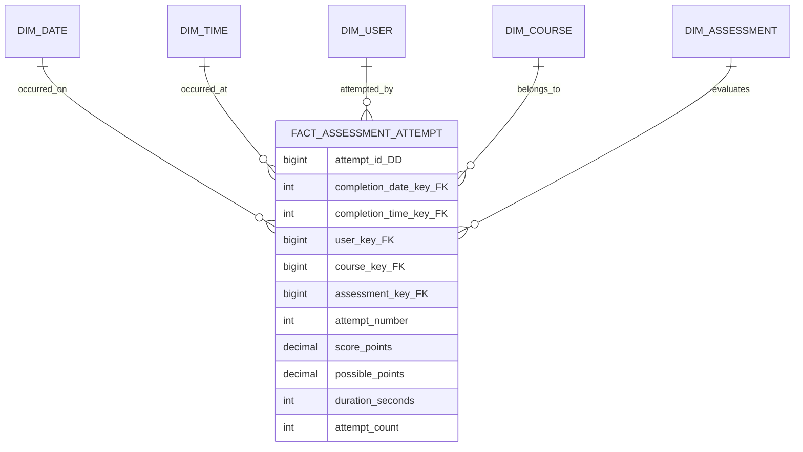
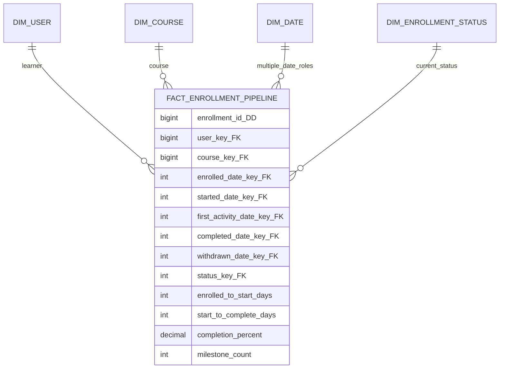
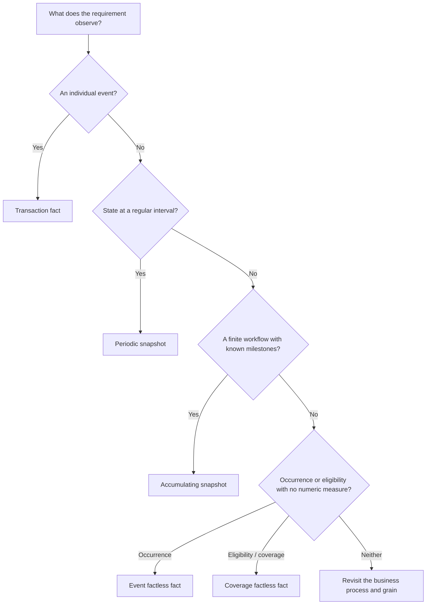

# Fact Table Patterns: Events, State, and Lifecycles

A fact table records something measurable about a business process. The right pattern depends on the question the table must answer.

Take an order as an example. We might want to know:

- **What was sold?** Store one row for each order line. This is a **transaction fact**.
- **What remained open at each day end?** Store one row for each open order on each day. This is a **periodic snapshot**.
- **How long did the order take to move from placement to delivery?** Keep one row for the order and update its milestone dates. This is an **accumulating snapshot**.
- **Which customers were eligible for an offer, even if they bought nothing?** Store the eligible combinations without requiring a numeric amount. This is a **factless fact**.

The same business domain or value chain can use several patterns because its individual processes answer different questions. The source table or dashboard layout should not decide the pattern for us.

Start with one sentence:

> **One row represents...**

Then decide whether that row is an individual event, a regular picture of state, a lifecycle moving through milestones, or simply proof that something happened or was possible.

## Fast chooser

| Requirement | Pattern | Typical grain | Write behavior | Main caution |
|---|---|---|---|---|
| Preserve each event | Transaction fact | One row per event or event line | Insert; correct deliberately | Do not mix event types or header and line grains |
| Analyze state at regular intervals | Periodic snapshot | One row per entity per period | Insert each period; sometimes refresh the open period | Do not sum balances across time |
| Monitor a finite workflow | Accumulating snapshot | One row per lifecycle instance | Insert, then update as milestones occur | It shows the latest pipeline state, not every prior state |
| Record occurrence without a numeric measure | Event factless fact | One row per event combination | Insert | The row count is the measure |
| Record what was possible or required | Coverage factless fact | One row per eligible combination and period | Insert or regenerate the coverage window | Compare it with activity; coverage alone does not prove action |

These patterns are complementary. An order process can have line-item transactions, a daily open-order snapshot, and an accumulating fulfillment pipeline. Each table answers a different question and therefore has a different grain.

## Transaction fact table

### The problem

You need to preserve individual business events so analysts can reconstruct activity, count occurrences, sum measures, and slice the events by any descriptive context known when they happened.

Examples include:

- a learner completing an assessment attempt;
- a user invoking a SaaS feature;
- an e-commerce order line being sold;
- an employee receiving a salary payment;
- a bank account posting a transaction.

### A simple way to think about it

**An event happened once; store one row for that event at its most useful atomic grain.**

### Grain

For a learning platform:

> **One row represents one learner's completed attempt at one assessment.**

That is not the same as one learner, one course, one day, or one assessment. If the same learner attempts the assessment three times, the table has three rows.

### Model



`attempt_id` is a degenerate dimension: a business identifier retained in the fact because it has analytical value but no separate descriptive attributes. `attempt_count` is normally the constant `1`, which makes counting additive and explicit.

### Typical columns

- foreign keys to the dimensions whose values are single-valued at the event grain;
- one or more date/time roles;
- a transaction or event identifier;
- additive components such as `score_points` and `possible_points`;
- quantities, amounts, durations, or event counters;
- operational metadata only when it has analytical or audit value.

Every fact must be true of one assessment attempt. A learner's lifetime completed-course count is not valid here because it describes a broader and changing scope.

### Lifecycle and loading

The normal behavior is **insert one row when the event becomes available**. An immutable source event stream maps naturally to this pattern, but immutability is not a requirement of dimensional modeling. Corrections, reversals, cancellations, and late events still need explicit business rules:

- append a reversing event when the business treats corrections as new events;
- update the original fact when the source officially restates it and auditability permits that;
- rebuild an affected partition from a replayable source when that is the platform's reliable correction mechanism.

Whichever strategy is chosen, make the event's business identity and deduplication rule testable. A retry must not silently create a second copy of the same attempt.

### Why this works

Atomic events retain the richest dimensional context. They can be rolled up later by day, course, customer segment, product, geography, or another conformed dimension without predicting every future question. A summary-only table cannot recover detail that was discarded.

### When to use it

- Individual events matter for audit, behavior analysis, or detailed drill-through.
- Events arrive irregularly rather than on a fixed schedule.
- Measures are naturally observed at the moment of the event.
- Analysts need funnels, cohorts, sequences, or rates derived from event components.

### When not to use it

- The requirement is specifically state as of every month end; use a periodic snapshot.
- The requirement is elapsed progress through a predictable workflow; consider an accumulating snapshot.
- There is no meaningful individual event and only a periodic source balance exists.
- Several event types have incompatible grains or measures. Separate them instead of creating a sparse, ambiguous super-table.

### Common mistakes

- Calling a table “transactions” while combining order headers, lines, payments, and shipments.
- Loading one row per source record without checking whether source records share the analytical grain.
- Joining a line fact to a header fact and multiplying both sides.
- Storing a precomputed percentage while omitting its numerator and denominator.
- Using `SELECT DISTINCT` to hide duplicated events rather than fixing identity and joins.
- Attaching a dimension that can have several values for one event without resolving the many-to-many relationship.

### Tradeoffs

Transaction facts can be very large, and sequence or point-in-time state queries may require more work than they do against snapshots. The benefit is retained detail: atomic data supports questions that were not known when the model was designed.

### Optional: modern implementation notes

- In SQL or dbt-style workflows, test the declared business key for uniqueness at the declared grain, not merely the warehouse row ID.
- Incremental filters should account for late events and source updates; “load where timestamp is greater than the last timestamp” is often insufficient.
- In a lakehouse, partitioning by a commonly filtered event date can improve operations, but partition layout does not define grain.
- In SAP HANA or Datasphere, expose measures with aggregation behavior that matches their semantics; a calculation view cannot rescue mixed-grain source rows.

### What to remember

- One row represents one measurement event at one declared grain.
- Atomic transaction facts are normally sparse and insert-oriented.
- Preserve additive components and event identity.
- Different business processes or grains belong in different fact tables.
- Design retries, late events, and corrections without creating duplicates.

## Periodic snapshot fact table

### The problem

Events tell you what changed, but many business questions ask what the state was at a regular boundary:

- What was each account's closing balance each day?
- How many active employees did each department have each month?
- How many active subscriptions and seats existed at week end?
- What inventory was on hand at the end of each day?

Reconstructing every historical state from a long event history can be expensive, fragile, or impossible when the source does not provide all changes.

### A simple way to think about it

**Take a repeatable photograph of each in-scope entity at a standard interval.**

### Grain

For banking:

> **One row represents one account at the close of one calendar day.**

For HR, a different table might declare:

> **One row represents one employee assignment at the close of one month.**

The date is part of the grain. “One row per account” is incomplete.

### Model

```text
dim_date -----------+
dim_account --------+-- fact_account_daily_snapshot
dim_customer_tier --+     one row per account per day
dim_product --------+     ending_balance
                           available_balance
                           debit_amount_during_day
                           credit_amount_during_day
                           transaction_count_during_day
```

The balance columns describe the boundary state. Flow columns such as debit amount describe activity during the interval. Both are allowed when their time semantics are named clearly.

### Lifecycle and loading

Periodic snapshots are normally **inserted once per period** for every in-scope combination. Unlike sparse transaction facts, they tend to be dense: an active account may receive a row even when no transaction occurred.

Some teams refresh the current, still-open day or month and make it immutable after close. That is an implementation choice that must be visible to consumers. A `snapshot_status` or publication timestamp can prevent analysts from comparing provisional and closed periods unknowingly.

### Why this works

The regular interval makes trend analysis and period-over-period comparison straightforward. It also preserves a historical state even when the operational system retains only the present balance.

### Measure behavior

Balances are usually **semi-additive**:

- summing account balances across accounts for the same day is meaningful;
- summing the same account's daily balances across days is normally meaningless.

For a monthly average balance, store or derive components whose semantics are clear. Do not label `SUM(ending_balance)` across twelve months as an annual balance.

### When to use it

- The question is repeatedly “what was the state at each period?”
- The source emits scheduled balance or status extracts.
- Users need fast trending of inventory, headcount, backlog, subscription state, or balances.
- A row should exist for inactive-in-the-period but still in-scope entities.

### When not to use it

- Users need each event's detailed context.
- The interval is so frequent that unchanged copies dominate and a timespan pattern would be more efficient.
- The population cannot be defined consistently for each period.
- The requirement is a short, milestone-driven pipeline rather than regular state.

### Common mistakes

- Omitting the snapshot date from the grain statement.
- Summing balances across time.
- Mixing daily and monthly snapshots in one table.
- Treating missing rows as zero without knowing whether they mean closed, excluded, late, or failed load.
- Storing only the current snapshot and calling the table historical.
- Combining state-at-end facts and during-period flows without names that distinguish them.

### Tradeoffs

Snapshots make trend queries simple but deliberately repeat dimensional keys and sometimes unchanged values. Frequency is an architectural decision: daily gives more temporal precision and more data; monthly is smaller but cannot answer intra-month state questions.

### Optional: modern implementation notes

- Generate the expected entity-period population and reconcile it with loaded rows; density makes missing-row tests valuable.
- Partitioning by snapshot date makes period replacement and retention manageable.
- Rebuilding only an open period can be safe when closed periods are protected and late corrections have a defined restatement policy.
- A semantic layer should prevent invalid default aggregation of semi-additive balances across date.

### What to remember

- One row represents one entity or dimensional combination per standard period.
- The pattern is intentionally dense.
- State measures often cannot be summed over time.
- Define the population, interval, close rule, and restatement policy.
- Keep event facts when event-level analysis still matters.

## Accumulating snapshot fact table

### The problem

A business process has a recognizable beginning, a set of important milestones, and an end. Users care about current progress and elapsed time:

- order created -> paid -> shipped -> delivered;
- application submitted -> reviewed -> accepted or rejected;
- support case opened -> assigned -> resolved -> closed;
- learning enrollment started -> first activity -> completed or withdrawn.

An event table records every transition, but answering “where is each case now and how long has it taken?” repeatedly from events can be cumbersome.

### A simple way to think about it

**One row travels through the pipeline and accumulates milestone dates and measures.**

### Grain

For learning analytics:

> **One row represents one user's one enrollment attempt in one course.**

If a learner reenrolls, that is a new lifecycle instance and a new row. “One row per user-course” would wrongly merge separate attempts.

### Model



The date dimension plays several roles. Unknown future milestones point to a designated “not yet occurred” member rather than a null foreign key.

### Lifecycle and loading

1. Insert the row when the lifecycle begins.
2. Update that same row when each important milestone occurs.
3. Update current status and any governed lag/duration facts.
4. Stop routine updates when the process reaches a terminal state, unless reopening is a supported business event.

This repeated update behavior distinguishes the accumulating snapshot from transaction and periodic facts.

### Why this works

The row places all critical milestones for one lifecycle instance side by side. Open cases, bottlenecks, completion rates, and durations become simple to query. Storing anchor-based lags can encode business calendars once instead of forcing every dashboard to reproduce the calculation.

### When to use it

- The workflow has a definite start and end.
- Important milestones are predictable and relatively stable.
- Most analysis needs the latest state of each lifecycle instance.
- Updates to a fact row are operationally acceptable.

### When not to use it

- Events are unbounded, highly variable, or loop unpredictably.
- Auditors need every state transition exactly as it occurred; retain a transaction/event history.
- The process lasts for years and regular state history matters more; a periodic snapshot may be clearer.
- Milestones differ radically across product types; separate processes or subtype designs may be safer.

### Common mistakes

- Using customer or order header as the grain when each order line progresses independently.
- Overwriting milestones without retaining the underlying event history needed for audit.
- Creating hundreds of date columns for rare, unstable events.
- Calculating durations from wall-clock dates when the business definition uses working hours or excludes holidays.
- Treating a missing milestone as zero days rather than “not yet occurred” or “not applicable.”
- Assuming the table can answer “what did this pipeline look like three months ago?” after intermediate states were overwritten.

### Tradeoffs

The accumulating snapshot is especially useful for pipeline analysis, but its rows change. If an input event is retried, processing it again must not alter an already correct result; this property is called **idempotency**. The load must also cope with events arriving out of order. A classic accumulating row represents the latest known pipeline state; it does not preserve every prior state.

### Optional: modern implementation notes

- A `MERGE` can implement the lifecycle update, but correctness depends on a stable lifecycle key and monotonic milestone rules, not on the command itself.
- Keep raw events so the snapshot can be rebuilt and disputed milestone dates can be traced.
- Test impossible sequences, such as completion before enrollment, while allowing legitimate late arrival where processing order differs from event order.
- For historical as-of pipeline state, use an event history, a periodic snapshot, or the timespan extension in [Advanced fact designs](advanced-fact-designs.md).

### What to remember

- One row represents one complete lifecycle instance.
- Insert once, then update as milestones occur.
- It is best for predictable, finite workflows.
- Role-playing dates and governed lag facts are central to the design.
- Preserve events separately when audit or historical state reconstruction matters.

## Factless fact tables

“Factless” means there is no naturally measured numeric amount. The row still records a business fact: either an event occurred or a relationship was in force.

### Event tracking

#### Grain

> **One row represents one learner attending one live session on one date.**

```text
fact_session_attendance
  attendance_date_key  FK
  session_key          FK
  user_key             FK
  instructor_key       FK
  attendance_status_key FK
```

The row count is the basic measure. An explicit `attendance_count = 1` may be added for tools that handle measures more predictably than row counts, but it does not change the grain.

Use an event factless fact for attendance, eligibility checks performed, employee-training assignments, user-role assignments observed at a time, or promotion exposures with no associated amount.

### Coverage and eligibility

#### Grain

> **One row represents one customer eligible for one promotion on one date.**

```text
fact_promotion_eligibility             fact_promotion_response
  date_key                               response_date_key
  customer_key                           customer_key
  promotion_key                          promotion_key
  channel_key                            channel_key
```

Coverage defines the set of opportunities. Activity defines what actually happened. An anti-join from coverage to activity answers “which eligible customers did not respond?”

```sql
select e.date_key, e.customer_key, e.promotion_key
from fact_promotion_eligibility e
join dim_date eligible_date
  on eligible_date.date_key = e.date_key
where not exists (
    select 1
    from fact_promotion_response r
    join dim_date response_date
      on response_date.date_key = r.response_date_key
    where r.customer_key = e.customer_key
      and r.promotion_key = e.promotion_key
      and response_date.full_date >= eligible_date.full_date
      and response_date.full_date < eligible_date.full_date + interval '7 day'
);
```

Date-addition syntax varies by database. The important point is to compare real dates rather than add `7` to a numeric date key such as `20260130`.

The response window is a business rule, not a property of factless tables. It must be governed and named.

### When to use them

- The dimensional intersection itself is meaningful.
- Counting events or relationships answers the question.
- You need a denominator population such as eligible, scheduled, assigned, or covered entities.

### When not to use them

- A numeric measurement exists and is useful; do not discard it merely to call the table factless.
- The relationship is only a descriptive property of one dimension and has no event or time semantics.
- A bridge table is required to resolve a multivalued dimension; a bridge and a factless fact have different purposes.

### Common mistakes

- Calling a coverage table “activity.”
- Omitting the effective date or period from a time-varying relationship.
- Counting joined coverage and activity rows without controlling many-to-many matches.
- Generating an enormous Cartesian coverage set with combinations that were never genuinely possible.

### What to remember

- A row can be a fact even without a numeric measure.
- Event factless facts record what happened; coverage facts record what could or should happen.
- Counts and anti-joins turn factless rows into useful analysis.
- State the time scope and dimensional combination precisely.

## Choosing several patterns for one domain

A mature model often uses multiple fact tables without mixing their grains:

| Learning business process | Fact table | Grain |
|---|---|---|
| Assessment attempts | Transaction | One learner-assessment attempt |
| Daily engagement | Periodic snapshot | One active learner-course-day |
| Course enrollment | Accumulating snapshot | One enrollment attempt |
| Live-session attendance | Event factless | One learner-session attendance event |
| Required training | Coverage factless | One employee-course eligibility period |

Shared conformed dimensions such as Date, User, Course, Organization, and Geography make these tables analytically compatible. Compatibility does not mean joining raw fact rows to one another. Aggregate each fact independently to common conformed attributes, then combine the result sets. See [Conformance and bus architecture](../05-enterprise-modeling/conformance-and-bus-architecture.md).

## Decision tree



## Cross-pattern failure modes

| Symptom | Likely cause | Correction |
|---|---|---|
| Totals double after joining orders and payments | Raw facts were joined at different grains | Aggregate separately and drill across conformed dimensions |
| `DISTINCT` appears in every metric | Duplicate or mixed-grain rows | Restate the grain and enforce its business key |
| Annual balance is the sum of monthly balances | Semi-additive state treated as a flow | Use period-end, average, minimum, or maximum with explicit time semantics |
| Pipeline history cannot be reconstructed | Accumulating row overwrote intermediate state | Retain events or add an appropriate historical snapshot pattern |
| “No activity” disappears | Sparse events were used without a coverage population | Add a coverage fact or another governed denominator |
| One fact table has mostly null measure columns | Incompatible processes were consolidated | Split by business process and grain |

## Related chapters

- [Grain](../01-foundations/grain.md)
- [Dimensional modeling](../01-foundations/dimensional-modeling.md)
- [Keys](../01-foundations/keys.md)
- [Measures and additivity](../01-foundations/measures.md)
- [Advanced fact designs](advanced-fact-designs.md)
- [Late-arriving data](../06-time-and-change/late-arriving-data.md)
- [Event, state, and temporal modeling](../06-time-and-change/event-state-and-temporal-modeling.md)
- [Modeling workflow and decision trees](../09-decision-guides/modeling-workflow-and-decision-trees.md)

## Final takeaways

1. Choose a fact pattern from the row's business meaning, not from a source table or report.
2. Transaction facts preserve events; periodic snapshots preserve regular state; accumulating snapshots summarize a finite lifecycle.
3. Factless facts model meaningful occurrences or coverage even without numeric measures.
4. Several patterns may describe one domain, but every table keeps one grain.
5. Load behavior follows the pattern: event inserts, period inserts, lifecycle updates.
6. Atomic facts and conformed dimensions preserve future analytical flexibility.

## Source basis

This chapter synthesizes Kimball and Ross, *The Data Warehouse Toolkit*, 3rd ed., especially the fact-table technique catalog in Chapter 2, the three inventory models in Chapter 4, order-fulfillment pipelines in Chapter 6, and the education and insurance examples in Chapters 13 and 16. Modern pipeline notes are later implementation guidance, not terminology attributed to the book. See [Sources](../SOURCES.md).
