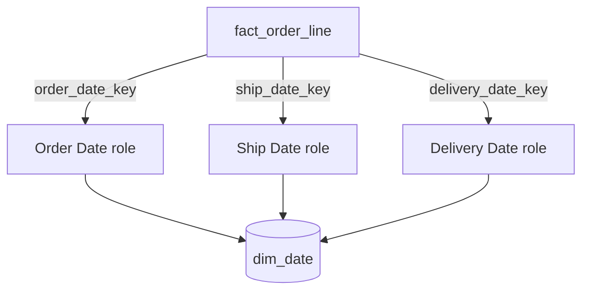

# Dates, Times, and Reporting Calendars

Time is present in almost every analytical process, but a raw timestamp is not a business calendar. Users ask about fiscal periods, teaching weeks, holidays, month ends, work shifts, local trading days, and comparable prior periods. These meanings belong in governed dimensions rather than being reinvented in every query.

## The problem

SQL can extract a month number from a timestamp. It cannot infer that:

- the fiscal year starts in April;
- week 1 follows an ISO, retail 4-4-5, or company-specific rule;
- a date is a public holiday in Portugal but not Germany;
- the latest loaded business date is the reporting “current day”;
- an event at 23:30 UTC belongs to the next local business day;
- one date on an order means “placed” while another means “delivered.”

If each dashboard implements these rules independently, period totals will disagree even when every fact row is correct.

## Mental model

**A timestamp says when; a calendar dimension says what that time means to the business.**

## Grain

For a standard date dimension:

> One row represents one calendar day.

For a reusable time-of-day dimension:

> One row represents one recurring wall-clock interval within a 24-hour day, such as one minute.

For a month dimension used by a monthly-grained fact:

> One row represents one governed reporting month.

Do not join a monthly fact to a daily date dimension and hope aggregation will repair the mismatch. The dimension grain must match the foreign key's meaning.

## The date dimension

### Model

    dim_date
    ├── date_key                    PK, often YYYYMMDD integer
    ├── calendar_date               native DATE, unique
    ├── full_date_label
    ├── day_of_week_name
    ├── day_of_week_number
    ├── day_of_month
    ├── day_of_year
    ├── iso_week_number
    ├── iso_week_year
    ├── calendar_month_number
    ├── calendar_month_name
    ├── calendar_year_month
    ├── calendar_quarter
    ├── calendar_year
    ├── fiscal_period
    ├── fiscal_quarter
    ├── fiscal_year
    ├── is_weekday
    ├── is_month_end
    └── reporting attributes ...

The key may be a meaningful integer such as `20260930`, but it is still a warehouse key. Retain the native date as a separate unique column. Include a special unknown or not-yet-known row whose key cannot be confused with a real date.

### Why this works

The dimension materializes shared calendar logic once. Every fact using the same calendar can filter and group with identical labels and boundaries. It is small enough to generate in advance for the complete retained history plus a future horizon.

### Useful attributes

Include attributes users actually group or filter by:

- full and abbreviated day and month labels;
- stable sorting numbers alongside text labels;
- ISO week and **week-year** as a pair;
- unambiguous labels such as `2026-09`, not `September` alone;
- calendar and fiscal period identifiers;
- first/last day and period-end indicators;
- weekday/weekend classifications;
- seasons, academic terms, payroll periods, trading periods, or campaign windows when governed centrally.

Avoid dozens of speculative flags. A date dimension should encode shared calendar semantics, not every temporary dashboard filter.

## Role-playing dates

### The problem

A lifecycle often has several dates at the same fact grain.

> One order-line row may have an order date, requested delivery date, ship date, actual delivery date, and invoice date.

### Model

Expose separate views or semantic roles with prefixed columns. Filters on order month and delivery month must remain independent.

### Use / avoid

Use one governed physical calendar when all roles share calendar definitions. Use separate calendar structures only when the business definitions genuinely differ, not merely because the dates have different meanings.

Do not collapse several milestones into one generic `date_key` plus `date_type` rows unless the business process truly has an open-ended set of milestones and users accept the row multiplication. For well-known milestones, role-playing foreign keys are simpler and make accumulating snapshots easier to use.

## Time of day and timestamps

### Choose based on the question

| Requirement | Recommended representation |
|---|---|
| Exact event ordering, latency, or audit | Native timestamp on the fact |
| Filter by hour, shift, day part, or service window | Time-of-day dimension key plus timestamp |
| Only daily reporting | Date key; retain timestamp upstream if future detail may matter |
| Duration | Store start/end timestamps and, when governed or costly, a duration fact |

Do not combine date and minute into one giant reusable dimension. A 20-year daily dimension has only thousands of rows; a date-by-second dimension would have hundreds of millions. Separate date and time-of-day keeps both understandable.

### Time-of-day model

    dim_time_of_day
    ├── time_key                 PK, e.g. HHMMSS or minute sequence
    ├── clock_time
    ├── hour_24
    ├── minute_of_hour
    ├── day_part
    ├── business_shift
    └── service_window

The dimension's recurring 24-hour grain means it does not identify a moment by itself. The date key and timestamp provide the complete instant.

## Fiscal, retail, and academic calendars

### The problem

Organizations often report on calendars that do not align with Gregorian months. A 4-4-5 retail calendar, April-to-March fiscal year, 13-period accounting calendar, and academic term can all assign different period meanings to the same day.

### Modeling choices

1. **Parallel attributes in one date dimension.** Best when the calendars are enterprise-wide and every day has one unambiguous assignment under each calendar.
2. **Separate role-playing calendar views.** Useful for presentation when the same physical rows need distinct labels.
3. **A calendar membership bridge.** Useful when calendar variants are numerous or tenant-specific and one date can participate in several named calendars.

For a membership bridge:

> One row represents one date's membership in one governed calendar version and reporting period.

    bridge_date_calendar
    ├── date_key               FK
    ├── calendar_key           FK
    ├── reporting_period_key   FK
    └── membership attributes

This is more flexible but more complex than columns on `dim_date`. Do not use it for one standard fiscal calendar.

### Week definitions require special care

“Week 1” is incomplete without a rule and a week-year. The first days of January can belong to the prior ISO week-year, and a 4-4-5 calendar may insert a 53rd week. Store stable period keys and labels determined by an approved calendar, not ad hoc week arithmetic.

## Holidays and location-specific calendars

A single global `is_holiday` column is wrong when holiday status varies by country, region, exchange, school, or facility.

Use one of these designs:

- separate country-specific holiday attributes when the supported set is small and fixed;
- an outrigger or bridge between date and governed calendar/location when variants are numerous;
- facility-specific open/closed facts when operating status is an observed state rather than a universal calendar rule.

For a date-to-calendar bridge:

> One row represents one date under one regional or operational calendar.

Include holiday name, holiday class, working-day flag, and any half-day indicator at that grain. A calendar membership does not prove that a specific store actually opened; that belongs in an operating event or snapshot.

## Multiple time zones

### Mental model

**Store the instant once; derive and govern the business-local interpretation.**

For globally distributed events, retain:

- an unambiguous UTC timestamp;
- the source time-zone identifier, preferably an IANA zone rather than only an offset;
- the local timestamp used by the business process;
- UTC and local date keys when both analyses matter;
- time-of-day role keys when users filter on local or UTC day parts.

An offset such as `+01:00` is not a time-zone rule; daylight-saving transitions and historical changes require a zone identifier. Ambiguous or nonexistent wall-clock times around daylight-saving changes need an explicit ingestion policy.

Example fact grain:

> One row represents one application event emitted by one user at one UTC instant.

The fact can carry `utc_date_key`, `local_date_key`, `utc_timestamp`, `local_timestamp`, and `source_time_zone`. A “daily active user” metric must say which date role defines a day.

## Period dimensions and higher-grain facts

Forecasts, budgets, and monthly account balances often arrive by period rather than day. Use a month or fiscal-period dimension at that natural grain. It should be a [shrunken conformed dimension](dimension-patterns.md#shrunken-conformed-dimensions): shared rollup attributes have the same definitions and values as the daily date dimension, while day-specific columns are absent.

Do not assign an arbitrary first or last day key to a monthly fact without making that convention explicit. Such shortcuts invite a daily join that implies false precision.

## Current and relative period attributes

Flags such as `is_current_month`, `is_latest_loaded_date`, or `relative_month_offset` can simplify recurring reports. They differ from stable calendar attributes because they change on a schedule.

Use them when:

- the reference point is centrally defined;
- refresh timing is reliable;
- labels make the reference explicit, such as latest loaded date rather than today.

Avoid them when each consumer needs a different as-of date. A parameterized semantic calculation is then safer. Never silently equate wall-clock today with the most recent complete reporting date.

## Loading and validation

A date dimension is deterministic enough to generate ahead of time, but business-calendar attributes still require ownership and tests.

Minimum checks:

- exactly one row per native date in the supported range;
- unique date key and native date;
- no gaps in the expected sequence;
- one and only one fiscal period assignment per date for each single-valued calendar;
- stable month, quarter, and year labels with numeric sort columns;
- explicit unknown/not-applicable keys;
- validated leap days, 53-week years, daylight-saving boundaries, and fiscal year transitions;
- future horizon sufficient for promised, planned, and forecast dates.

## When to use it

Use date dimensions for virtually every fact table whose measures are analyzed over time. Use time-of-day dimensions only when users need reusable clock classifications. Add specialized calendar structures when business rules cannot be represented safely as a few shared columns.

## When not to use it

- Do not replace precise timestamps needed for sequencing or latency.
- Do not attach a daily date key to a fact whose true grain is month merely for convenience.
- Do not model every possible timezone-date combination as one enormous dimension.
- Do not use calendar attributes as a substitute for actual entity state, such as store open/closed status.

## Common mistakes

- Deriving fiscal periods separately in SQL, dashboards, and semantic tools.
- Grouping by month name without year.
- Treating calendar year plus week number as an ISO week identifier without week-year.
- Using one physical date alias for several roles.
- Leaving future milestone keys null instead of using a governed not-yet-known member where the platform requires referential integrity.
- Mixing UTC date and local date in the same metric definition.
- Assuming all holidays or working days are global.
- Joining monthly facts to daily dimensions and duplicating rows.
- Making relative-date flags current to wall-clock time while facts lag behind.

## Tradeoffs

Precomputed attributes make queries simpler, faster, and consistent, but they turn calendar logic into governed reference data that must be maintained. More calendar variants increase flexibility and join complexity. A small number of parallel columns is easier than a bridge; a bridge is safer than hundreds of tenant-specific columns.

## Modern implementation notes

- Generate stable calendars as code or seed data, but source organization-specific fiscal and holiday assignments from accountable owners.
- In dbt-style projects, test continuity, uniqueness, fiscal membership, and role-view column prefixes.
- In lakehouses, derive local date keys during the curated transformation using a versioned time-zone database; preserve the original UTC timestamp for reproducibility.
- In SAP HANA or Datasphere, define date roles and fiscal hierarchies in the reusable semantic model where possible. Ensure each association's cardinality matches the date grain and that local versus UTC measures are labeled.
- A semantic layer should define time grains and the date role used by every time-based metric. “Monthly revenue” is incomplete without both calendar and date-role semantics.

## What to remember

1. One date row represents one day; one time-of-day row represents a recurring clock interval.
2. Store business calendar meaning in governed dimensions, not repeated query logic.
3. Use clearly named roles for order, ship, delivery, invoice, and other dates.
4. Keep exact timestamps for ordering and latency; add time dimensions only for grouping.
5. Model fiscal weeks, holidays, and local days according to explicit business rules.
6. Match period-dimension grain to fact grain.
7. In global systems, distinguish the UTC instant from its local business-date interpretation.

## Related patterns

- [Dimension patterns](dimension-patterns.md)
- [Accumulating snapshots](../02-fact-tables/fact-table-patterns.md#accumulating-snapshot-fact-table)
- [Measures and additivity](../01-foundations/measures.md)
- [Conformance and bus architecture](../05-enterprise-modeling/conformance-and-bus-architecture.md)
- [Event, state, and temporal modeling](../06-time-and-change/event-state-and-temporal-modeling.md)
