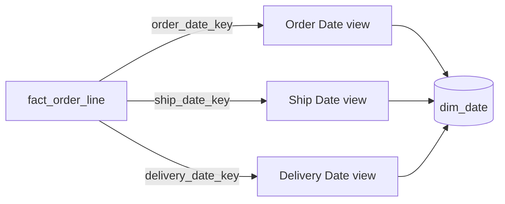
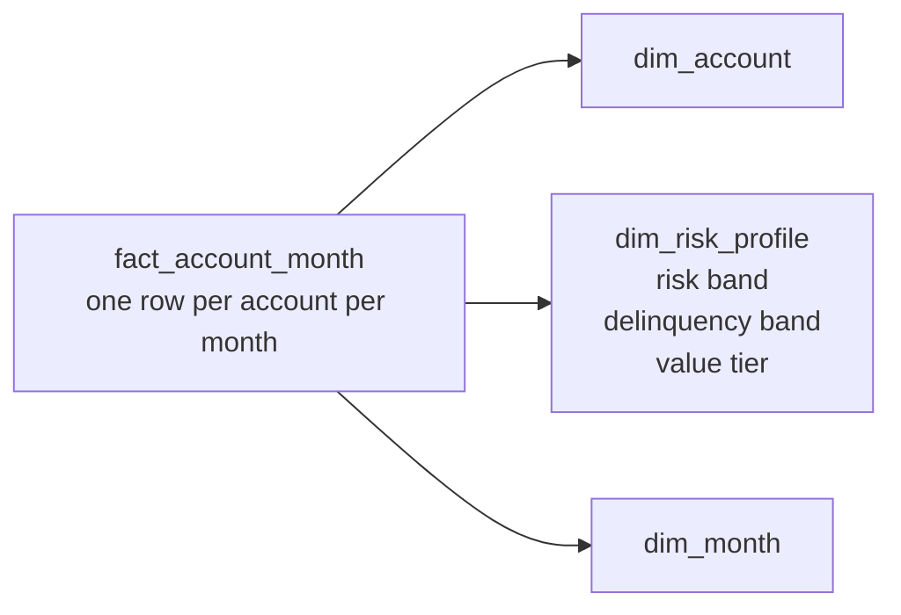

# Reusable Dimension Patterns

Most dimensions are wide, descriptive tables with one surrogate-keyed row per member or historical member version. The patterns here solve recurring exceptions: one dimension used in several roles, identifiers with no descriptive table, clusters of flags, fast-changing profiles, selective dimension-to-dimension relationships, alternative classifications, and load lineage.

The first question remains the same:

> What exactly does one dimension row represent, and is that description true for every fact row that references it?

## Pattern selection at a glance

| Requirement | Pattern |
|---|---|
| The same date or entity plays several meanings in one fact | Role-playing dimension |
| A transaction identifier is analytically useful but has no attributes | Degenerate dimension |
| Many low-cardinality flags travel together | Junk dimension |
| A large dimension contains a volatile group of profile attributes | Mini-dimension |
| A dimension needs a controlled reference to another dimension | Outrigger |
| A fact is recorded above an atomic dimension's grain | Shrunken conformed dimension |
| Different users need private classifications over the same facts | Hot-swappable dimension |
| Users need load, lineage, or quality context | Audit dimension |

## Role-playing dimensions

### The problem

An order has an order date, promised date, ship date, and delivery date. Creating four separately maintained calendar tables would duplicate logic and invite inconsistent fiscal definitions.

### Mental model

**One physical dimension, several named jobs.**

### Grain

> One row in the physical date dimension represents one calendar day. Each role-specific view still has that same one-day grain.

### Model

The role views rename every exposed attribute: `order_fiscal_period`, `ship_fiscal_period`, and `delivery_fiscal_period`. This prevents an ambiguous filter named simply `month`.

### Why this works

Calendar logic is governed once while each foreign key remains independently filterable. The same technique applies to employee and manager, origin and destination geography, payer and beneficiary, or requester and approver.

### Use / avoid

Use roles when the underlying members and attributes genuinely share one definition. Do not force two concepts into roles merely because both are people or locations. Customer and employee usually have different populations, governance, and descriptive attributes.

### Common mistakes and tradeoffs

- Joining one date alias once and expecting it to represent several foreign keys.
- Leaving role attributes unprefixed, causing filters to hit the wrong date.
- Treating a missing milestone as null rather than an explicit unknown or not-yet-happened member.

Roles simplify governance but add semantic aliases. Hide physical implementation details behind views or semantic-layer roles.

## Degenerate dimensions

### The problem

An order number or invoice number is valuable for grouping, search, and drill-through, yet after header attributes are placed on the line-level fact there may be no descriptive columns left to justify a separate dimension table.

### Mental model

**A dimension identifier without a dimension table.**

### Grain

For an order-line fact:

> One fact row represents one order line; the repeated order number identifies the parent transaction across its lines.

### Model and example

    fact_order_line
    ├── order_date_key        FK
    ├── customer_key          FK
    ├── product_key           FK
    ├── order_number          degenerate dimension
    ├── order_line_number     degenerate dimension
    ├── quantity
    └── net_amount

### Why this works

The identifier behaves like a dimension for filtering and grouping, but a one-column dimension would add a join with no descriptive benefit.

### Use / avoid

Use for operational transaction identifiers such as invoice, ticket, claim, session, or order number. Create a real dimension if stable descriptive attributes exist at that identifier's grain. Do not confuse a degenerate dimension with a fact-table surrogate key; the former has business meaning, while the latter is a technical row identifier.

### Common mistakes and tradeoffs

- Treating the number as a measure and summing it.
- Building a header fact solely to hold the identifier, then joining header fact to line fact.
- Assuming the identifier is globally unique without including source or tenant context.

Degenerate identifiers can be high-cardinality and affect compression, but their drill-through value usually justifies storing them.

## Junk dimensions

### The problem

Transactions often carry several small flags and indicators: payment retry status, fraud-review flag, delivery exception type, coupon-used indicator, and acquisition channel. Separate one-column dimensions clutter the fact, while raw codes are poor report labels.

### Mental model

**A tidy profile for miscellaneous low-cardinality context.**

### Grain

> One row represents one observed or valid combination of the grouped flags and indicators.

### Model

    dim_transaction_profile
    ├── transaction_profile_key   PK
    ├── payment_status
    ├── fraud_review_status
    ├── coupon_usage
    └── delivery_exception_type

    fact_payment
    └── transaction_profile_key   FK

Populate meaningful text such as `Coupon used`, not cryptic `Y`. The dimension need not contain the full Cartesian product; it can hold only combinations that occur, provided key assignment is deterministic.

### Use / avoid

Use when several low-cardinality attributes occur at the same fact grain and change as part of that event. Avoid a junk dimension that mixes unrelated attributes from different grains, high-cardinality free text, or measures. If a status has a rich lifecycle or many attributes, give it a dedicated dimension or event model.

### Common mistakes and tradeoffs

- Calling any leftover column “junk” without checking meaning and grain.
- Generating every theoretical combination and producing an enormous sparse table.
- Moving important business concepts into an opaque profile that users cannot browse.

A junk dimension reduces foreign keys and centralizes decoding, but combinations can proliferate and be less intuitive than a few direct dimensions.

## Mini-dimensions

### The problem

A dimension with millions of members contains a volatile cluster such as risk band, usage band, engagement tier, income band, or propensity score. Tracking every profile change as Type 2 can cause excessive version growth.

### Mental model

**Separate the fast-changing profile from the stable identity.**

### Grain

> One mini-dimension row represents one reusable combination of banded profile attributes.

The base dimension remains one row per entity version according to its own SCD policy. A fact or time-spanning relationship records which mini-profile applied.

### Model

### Why this works

The periodic fact captures the profile key at each month without spawning a new account row for every score update. Banded attributes also offer a smaller query entry point than a huge customer or account dimension.

### Use / avoid

Use when the volatile attributes are queried together, can be discretized into stable bands, and a fact or relationship exists at every required observation point. Avoid it when exact continuous values must be preserved, when profile changes occur without any fact row and point-in-time reconstruction is required, or when only a few low-volatility attributes are involved.

In the change-without-fact case, add an effective-dated entity-to-profile factless relationship. A Type 5 variant may place the current mini-profile key on the base dimension for current-only browsing, but label current attributes distinctly.

### Common mistakes and tradeoffs

- Creating the full Cartesian product of too many attributes.
- Losing exact source values after banding.
- Joining the current mini-profile to historical facts and calling the result as-was.
- Proliferating many mini-dimensions until the star becomes hard to use.

Mini-dimensions control Type 2 growth but add foreign keys, band governance, and another history mechanism. See [slowly changing dimensions](slowly-changing-dimensions.md).

## Outrigger dimensions

### The problem

Occasionally a coherent attribute set has a genuinely different grain or lifecycle from the base dimension. Repeating a large, low-cardinality set on every base row may be wasteful or difficult to maintain.

### Mental model

**A dimension referenced by another dimension - an exception, not the default.**

### Grain

Example:

> One county-demographics row represents one county for one published demographic edition.

Customer rows may reference that county-demographics row.

### Use / avoid

Use sparingly when the outrigger has a clearly different grain, is sourced and refreshed independently, and flattening would repeat a substantial attribute block. A date role such as account-open date can also be a small, understandable outrigger.

Prefer flattening ordinary fixed hierarchies. Prefer putting both dimension keys on a fact when the relationship is true at the fact event grain. Avoid a Type 2 outrigger that triggers cascading Type 2 changes in the base dimension.

### Common mistakes and tradeoffs

- Snowflaking every low-cardinality hierarchy level.
- Creating long dimension-to-dimension join chains.
- Hiding a many-to-many relationship behind a single outrigger key.
- Ignoring the historical interaction between two independently changing dimensions.

Outriggers can reduce repetition, but they complicate navigation and can create historical ambiguity. A presentation view may flatten the relationship for consumers.

## Shrunken conformed dimensions

### The problem

An atomic sales fact uses day and product, while a forecast fact is recorded by month and brand. The forecast cannot reference atomic day and SKU rows, but it still needs to align with sales on shared rollups.

### Mental model

**A governed subset or rollup of a base conformed dimension.**

### Grain

- Atomic product dimension: one row per SKU.
- Shrunken brand dimension: one row per brand.
- Atomic date dimension: one row per day.
- Shrunken month dimension: one row per reporting month.

### Why this works

The shrunken dimension contains a strict, identically defined subset of the base dimension's rollup attributes. This permits drill-across at the common brand-month grain without pretending the forecast exists by SKU-day.

### Use / avoid

Use for aggregate facts or processes naturally captured above atomic grain. A row-subset dimension is also possible when a business line needs only its governed subset of a corporate population. Do not call a separately defined brand table conformed merely because labels look similar; domains and definitions must agree.

### Common mistakes and tradeoffs

- Reusing the atomic dimension key at a different grain.
- Dropping rows while leaving a fact table that still references the full population.
- Inventing alternate rollup labels in the shrunken copy.

Shrunken dimensions make higher-grain facts honest, but require synchronized governance. See [conformance and bus architecture](../05-enterprise-modeling/conformance-and-bus-architecture.md).

## Hot-swappable dimensions

### The problem

Several constituencies analyze the same immutable facts but apply different, possibly proprietary classifications. For example, investment teams may assign their own sectors and risk tags to the same securities.

### Mental model

**Same fact contract, replaceable classification lens.**

### Grain

> Each alternative dimension has one row per member at exactly the key grain expected by the fact table.

### Model

    fact_security_quote(security_classification_key, date_key, close_price)
                              |
             +----------------+----------------+
             |                                 |
    dim_security_team_a                 dim_security_team_b
    same key domain and grain           same key domain and grain
    team A classifications              team B classifications

### Use / avoid

Use when each alternative dimension fully honors the same key contract and row population while intentionally supplying different attributes. Avoid it when the classifications must be compared side by side, are effective-dated independently, or do not cover the same members; a bridge or classification fact may then be safer.

### Common mistakes and tradeoffs

- Calling two partially overlapping dimensions swappable.
- Letting key assignments drift between copies.
- Exposing private classifications to unauthorized users.

This pattern offers strong isolation and reuse of facts, but multiplies governance, refresh, security, and testing work.

## Audit dimensions

### The problem

Analysts and operators may need to know which pipeline run created a row, which rule set was used, and whether a quality exception occurred.

### Mental model

**Describe the production context of a fact row.**

### Grain

> One audit-dimension row represents one reusable combination of load and data-quality conditions.

### Model

    dim_audit
    ├── audit_key                 PK
    ├── pipeline_name
    ├── pipeline_version
    ├── load_batch_id
    ├── quality_status
    ├── source_extract_type
    └── reconciliation_status

Do not put unique per-row metadata into a “dimension” and accidentally create a dimension as large as the fact. A unique source offset or ingestion timestamp can remain a technical fact column if it is not useful for grouping.

### Use / avoid

Use when lineage, reconciliation, release status, or quality categories are analytically useful. Avoid exposing operational secrets or replacing full observability logs with a dimension. Error-event facts are better when users need one row per validation failure.

### Common mistakes and tradeoffs

- Treating the audit dimension as proof that the business data is correct.
- Mixing batch-level and row-level metadata without declaring grain.
- Using audit attributes as ordinary business filters without explaining incomplete batches.

Audit dimensions improve traceability and compliance, but add storage and governance. Keep them understandable and low-cardinality.

## Additional patterns to recognize

### Very large dimensions

High row count does not change the semantic rules: the dimension still needs a declared member/version grain, unique surrogate keys, and descriptive attributes. It does change implementation choices. Avoid volatile Type 2 attributes that create explosive version growth; consider mini-dimensions for frequently analyzed profiles, current-row projections for common access, and physical clustering or partitioning only where the engine benefits. Do not split one coherent dimension into arbitrary fragments merely because it is large.

### Internationalized descriptions

If users need several languages, keep stable identifiers and non-language attributes in the base dimension. A translation table can use this grain:

> One row represents one dimension member version and one supported locale.

    dim_product_translation
    ├── product_key              FK
    ├── locale_key               FK
    ├── localized_product_name
    └── localized_category_name

The semantic layer selects a locale and falls back to a governed default. Do not join all locales at once or facts will multiply. Translations solve labels, not currency conversion, units of measure, local calendars, or timezone semantics; govern those separately.

### Heterogeneous dimensions

Avoid one generic person, location, or product dimension when subtype populations have little analytical meaning in common. A small shared supertype plus business-specific subtype dimensions may be appropriate; otherwise keep distinct dimensions. The corresponding fact patterns are covered in [multi-process and heterogeneous models](../05-enterprise-modeling/multi-process-and-heterogeneous-models.md).

### Measure-type dimensions

A narrow fact with `measure_type_key` and one generic `measure_value` can represent an extreme, sparse, open-ended measure set. Recognize it as a specialized pattern, not a default. For a stable set of revenue, quantity, cost, and duration measures, named columns are easier to type, validate, calculate, and aggregate. Never assume all measure types share the same unit or additivity rule.

### Step dimensions

A step dimension describes an event's position inside a sequence or session: current step number, previous step, expected next step, and whether the sequence completed. Its grain is one governed step definition, while the event fact remains one row per observed event. Use it for clickstreams, learning paths, and funnels when sequence position is analytically important. Do not use it as a substitute for retaining the actual event history.

### Behavior cohorts and time-series tags

A behavior cohort is a governed, reusable population definition such as “users who completed onboarding within seven days.” Store cohort membership as a factless relationship with a membership/run date when analysts must reproduce the population. A time-series tag records a categorical assessment — risk band, engagement segment, anomaly status — at periodic points. Do not overwrite these tags in a current user dimension if their historical movement is the analytical subject.

### Dynamic value bands

When users frequently redefine ranges such as low/medium/high balance, a static band attribute can become obsolete. A dynamic band table stores governed range boundaries and labels so measures can be classified at query or transformation time. Ranges must be non-overlapping, complete for the supported domain, and versioned when historical reports must reproduce old definitions.

### Text comments

Long freeform comments do not belong among numeric fact measures. When comments are analytically needed, store a comment key on the fact and place the text, language, category, and redaction state in a dedicated high-cardinality dimension or secure companion table. Avoid joining the text into every aggregate query, and apply privacy/retention controls.

### Error-event schemas

When one validation failure is itself the analyzable event, use an error-event fact rather than stretching an audit dimension:

> One row represents one rule failure for one source record during one pipeline run.

Dimensions can include source, pipeline, rule, field, severity, and date; facts can include failed-row count or numeric discrepancy. This supports quality trends while detailed stack traces remain in operational logs.

### Causal and promotion context

A causal dimension records the conditions believed to influence an event: campaign, offer, experiment treatment, price rule, or promotion. Its grain is one governed causal condition or combination, and the fact key records the condition active at the event. This supports correlation and attribution analysis; it does not by itself prove causation. Keep exposure/eligibility in factless facts when the condition can exist without a resulting transaction.

## Modern implementation notes

- Semantic layers should expose roles and friendly labels while hiding surrogate keys and bridge mechanics.
- dbt-style projects can generate role-playing views from one dimension model and test junk or mini-dimension combination keys for uniqueness.
- Columnar storage reduces the physical penalty of wide flattened dimensions; it does not make ambiguous roles or grains safe.
- In SAP HANA calculation views and SAP Datasphere, associations can express dimensional relationships, but cardinality declarations must match reality. Declaring a many-to-many relationship as many-to-one can produce wrong pruning or aggregation behavior.
- Keep audit metadata in the curated model only when it supports analysis. Retain detailed pipeline telemetry in operational observability systems.

## What to remember

1. Role-playing means one governed dimension in several clearly named roles.
2. A degenerate dimension is a useful business identifier with no separate attribute table.
3. A junk dimension groups low-cardinality event context, not arbitrary leftovers.
4. A mini-dimension separates volatile profiles from a large stable identity.
5. Outriggers are controlled exceptions; flatten normal hierarchies by default.
6. Shrunken dimensions preserve conformance at a higher or subset grain.
7. Hot-swappable and audit dimensions solve specialized classification and lineage needs; use them deliberately.
8. Step, cohort, tag, band, comment, and error-event patterns are specialized tools; choose them only when their own grain is explicit.

## Related patterns

- [Slowly changing dimensions](slowly-changing-dimensions.md)
- [Dates, times, and calendars](date-time-calendars.md)
- [Bridges and many-to-many relationships](../04-relationships/bridges-and-many-to-many.md)
- [Hierarchies](../04-relationships/hierarchies.md)
- [Conformance and bus architecture](../05-enterprise-modeling/conformance-and-bus-architecture.md)
- [Advanced fact designs](../02-fact-tables/advanced-fact-designs.md)
