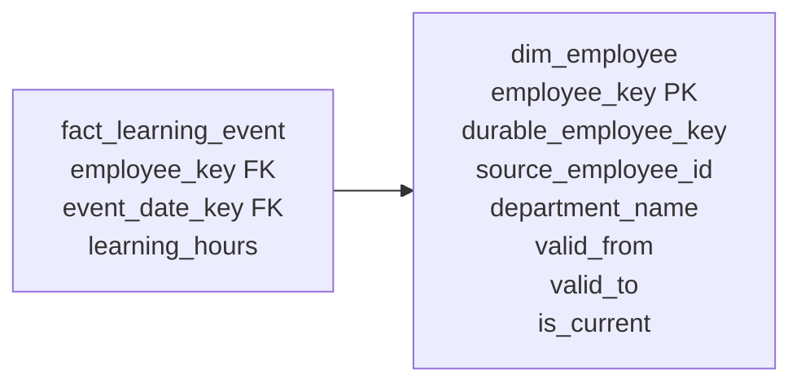

# Slowly Changing Dimensions

Dimension attributes change. A customer moves, an employee changes department, a course is reclassified, and a product receives a new brand assignment. The modeling decision is not whether change happens, but which historical question the model must answer after it happens.

This is an attribute-level decision. One dimension can legitimately contain Type 0, Type 1, and Type 2 attributes at the same time. Data owners, not the pipeline team alone, should decide which changes have analytical value.

## The problem

Suppose an employee moves from Consulting to Data & AI. Should last year's learning hours remain under Consulting, or should every year be restated under Data & AI?

Both answers can be useful:

- **As-was reporting:** use the department that was valid when the learning event happened.
- **As-is reporting:** roll all history under the employee's current department.

An implementation that silently chooses one interpretation creates plausible but disputed reports. Slowly changing dimension techniques make the chosen interpretation explicit.

## Mental model

- **Business or natural key:** which source record or business identifier?
- **Durable key:** which real-world entity across source-key changes and Type 2 versions?
- **Surrogate key:** which version of that entity?

For Type 2, remember: **same entity, new version, new surrogate key**.

## Grain

For a Type 1 dimension:

> One row represents the latest known descriptive profile of one entity.

For a Type 2 dimension:

> One row represents one version of one entity during one non-overlapping validity period.

The fact table keeps its own declared grain. Its dimension foreign key selects the version that was valid at the fact event time.

## The key roles

| Key | Example | Stable across versions? | Primary purpose |
|---|---|---:|---|
| Source natural key | `EMP-0042` in HR system A | Usually, but not guaranteed | Match incoming source records |
| Durable key | `900017` | Yes | Count or identify the same person across source-key and Type 2 changes |
| Surrogate key | `employee_key = 18431` | No | Identify one historical dimension version and serve as the fact foreign key |

A trustworthy source key may also serve as the durable key. Keep the concepts separate anyway: source systems can recycle identifiers, mergers can introduce collisions, and a rehire can receive a new employee number. In multi-source environments, source system plus source key is often the minimum matching identity until an enterprise durable key is assigned.

## Type 1: overwrite

### Model

    dim_employee
    ├── employee_key          PK
    ├── durable_employee_key
    ├── source_employee_id
    ├── employee_name
    └── department_name       overwritten in place

No new dimension row is created. Existing facts still point to the same surrogate key, so all history appears under the new attribute value.

### Example

Correcting `Dat & AI` to `Data & AI` is a strong Type 1 candidate. A report rerun after the correction changes its label, but no meaningful historical state is lost.

### Why this works

The old value has no analytical value, so preserving it would create noise. Type 1 is simple and keeps one current row per entity.

### When to use it

- spelling, formatting, or data-quality corrections;
- attributes explicitly defined as current-only;
- values whose prior state would never change the interpretation of historical facts.

### When not to use it

Do not use Type 1 merely because it is easy. Avoid it when users need to reproduce prior reports or analyze performance under the organization, segment, geography, or product classification that existed at the time.

### Common mistakes

- Treating every change as a correction.
- Forgetting that aggregate tables, cached semantic models, or cubes grouped by the overwritten value may need rebuilding.
- Assuming a rerun of an old report will return the same result. Type 1 deliberately restates history.

## Type 2: add a historical version

### Model



Use one interval convention consistently. The examples here use half-open periods: **valid from is inclusive; valid to is exclusive**. This makes adjacent versions meet at the same instant without overlapping.

| employee_key | durable_employee_key | source_employee_id | department_name | valid_from | valid_to | is_current |
|---:|---:|---|---|---|---|---:|
| 18431 | 900017 | EMP-0042 | Consulting | 2025-01-01 | 2026-04-01 | 0 |
| 29107 | 900017 | EMP-0042 | Data & AI | 2026-04-01 | 9999-12-31 | 1 |

Required invariants:

1. Every row has one surrogate key.
2. All versions of the entity share one durable key.
3. Validity periods for an entity do not overlap.
4. Exactly one row is current for an active entity.
5. The current row uses the agreed open-ended valid-to value.

### Event-time fact lookup

Facts must be keyed using the business event timestamp, not the pipeline run timestamp:

```sql
select d.employee_key
from dim_employee d
where d.source_system = :source_system
  and d.source_employee_id = :source_employee_id
  and :event_ts >= d.valid_from
  and :event_ts <  d.valid_to;
```

A learning completion on 2026-03-20 receives employee key `18431`; one on 2026-04-12 receives `29107`. Once stored, the surrogate foreign key is sufficient for normal fact-to-dimension queries. Analysts should not repeat the date-range join every time.

### Change processing

For an on-time Type 2 change effective at timestamp T:

1. Find the current row by stable source identity or durable key.
2. Compare only attributes governed as Type 2.
3. If none changed, keep the current row.
4. If one changed, expire the old row at T and set its current flag to false.
5. Insert a new row with a new surrogate key, valid from T, open-ended valid to, and current flag true.
6. Key new facts to the version valid at their event time.

The expire and insert operations should succeed atomically. Enforce or test the invariants rather than relying on load order.

### Late-arriving correction

Assume the warehouse first learned on 2026-05-10 that the move to Data & AI actually became valid on 2026-04-01. Facts from April were initially linked to the Consulting version.

The repair is not to overwrite the old row. Instead:

1. Insert or correct the Data & AI version so it begins at 2026-04-01.
2. End the Consulting version at 2026-04-01.
3. Verify there is no overlap or gap in the employee's version timeline.
4. Re-resolve affected facts whose event timestamps fall on or after 2026-04-01 and before the next version boundary.
5. Rebuild affected aggregates or semantic caches.
6. Record the correction batch and reconcile row counts and measures before and after rekeying.

If a late change splits an already closed period, preserve both surrounding periods. For example, a newly discovered version from April through May may require ending the earlier row at April, inserting the missing row, and retaining the later June version. Never change history broadly when only one interval is affected.

See [late-arriving data](../06-time-and-change/late-arriving-data.md) for unknown and inferred members, backfills, and reconciliation patterns.

### Counting entities correctly

Type 2 row count is **version count**, not entity count.

| Question | Safe approach |
|---|---|
| How many current employee profiles? | Filter `is_current = 1`, then count durable keys |
| How many distinct employees appear anywhere in history? | Count distinct durable keys |
| How many profiles were valid at timestamp T? | Filter `valid_from <= T AND T < valid_to`, then count durable keys |
| How many active employees at month end? | Prefer a headcount snapshot or explicit employment-status history; SCD validity alone does not prove employment |

Counting surrogate keys without a current or as-of filter overcounts any entity with more than one version.

### Why Type 2 works

The version surrogate key partitions facts into historically correct descriptive contexts. Facts before and after the change point to different rows, while the durable key ties those versions back to the same entity.

### When to use it

- organizational assignments whose historical context matters;
- customer segment or geography used for as-was analysis;
- product classification or ownership changes;
- regulated or reproducible historical reporting;
- attributes that explain why metrics changed.

### When not to use it

- trivial corrections with no historical meaning;
- highly volatile attributes that would explode a large dimension;
- history already modeled more naturally as events or periodic facts;
- attributes for which the business only authorizes a current-state view.

## Other SCD responses to recognize

| Type | Action | Useful when | Main caution |
|---|---|---|---|
| 0 | Retain the original value | Original acquisition source, birth date, durable identity | Corrections need a separate governance rule |
| 1 | Overwrite | Correction or current-only view | Destroys prior descriptive context |
| 2 | Add a version row | As-was history | More rows and more demanding load tests |
| 3 | Add a previous/alternate-value column | A limited transition or alternate organization view | Handles only a small, known number of alternatives |
| 4 | Move fast-changing attributes to a mini-dimension | Large customer/account dimensions with volatile profiles | The fact or relationship history must provide a home for the mini-dimension key |
| 5 | Type 4 plus a current-profile outrigger | Both event-time and current mini-dimension analysis | Two routes to similar attributes can confuse users |
| 6 | Type 2 history plus Type 1 current attributes on all versions | Historic and current rollups from one wide dimension | Repeated current columns and larger update scope |
| 7 | Historic surrogate key plus durable-key/current view | Broad current and historic perspectives | Additional join path and semantic complexity |

Types 5 through 7 are not maturity levels. Use them only when users genuinely need both as-was and as-is analysis and the semantic layer can label those perspectives unambiguously. Mini-dimensions are developed further in [dimension patterns](dimension-patterns.md).

## Tradeoffs

| Concern | Type 1 | Type 2 |
|---|---|---|
| Historical correctness | Restates history | Preserves as-was context |
| Storage | One row per entity | One row per version |
| Load complexity | Low | Moderate to high |
| Reproducibility | Old reports may change | Old results remain stable if late corrections are governed |
| Current reporting | Direct | Filter current row or provide a current view |
| Entity counts | Straightforward | Must count durable keys with an appropriate filter |

Type 2 storage growth is usually a secondary concern. Incorrect history and ambiguous counts cost more than dimension rows. The real tradeoff is semantic and operational complexity.

## Modern implementation notes

- **SQL and ELT:** calculate a deterministic change hash over governed Type 2 attributes, but retain column-level comparisons for auditability. Do not include technical load timestamps in the hash.
- **dbt-style workflows:** snapshots can capture source-observed history, but a snapshot timestamp is system time unless it represents a governed business effective time. Add stable version keys and explicit tests for one current row and non-overlap.
- **MERGE:** many platforms cannot safely expire one row and insert another in a single matched clause. Stage the changes, then perform the close-and-insert transaction idempotently.
- **Lakehouses:** partitioning and cheap storage do not remove the need for one deterministic current version and correct event-time lookup.
- **SAP HANA / Datasphere:** expose separate, clearly named current and historical perspectives when useful. Facts should normally associate to the resolved surrogate version key; an association on business key alone can multiply facts across every historical version.
- **Testing:** assert surrogate-key uniqueness, not-null foreign keys, no overlapping intervals, one current row per active durable key, and exactly one dimension match for every staged fact event.

## Common mistakes

- Applying one SCD type to every attribute in the table.
- Treating ingestion time as business effective time without saying so.
- Joining facts to a Type 2 dimension only on the business key.
- Updating historical fact keys after an ordinary on-time Type 2 change. Existing facts should remain attached to their original version.
- Allowing two current rows or overlapping periods after retries.
- Using inclusive end dates with timestamp facts and creating boundary ambiguity.
- Counting dimension rows as people, customers, or products.
- Using Type 2 for frequently changing scores when a mini-dimension or snapshot fact better represents the requirement.
- Exposing historic and current attributes with indistinguishable names.

## What to remember

1. Decide change behavior per attribute with business owners.
2. Type 1 restates history; Type 2 preserves the context valid when the fact occurred.
3. A durable key identifies the entity; a surrogate key identifies its version.
4. Type 2 periods must be complete, non-overlapping, and tested.
5. Resolve facts by event time, then store the version surrogate key.
6. Late corrections require interval repair, selective fact rekeying, and reconciliation.
7. Count durable entities, not Type 2 rows.

## Related patterns

- [Keys](../01-foundations/keys.md)
- [Dimension patterns](dimension-patterns.md)
- [Bridges and many-to-many relationships](../04-relationships/bridges-and-many-to-many.md)
- [Hierarchies](../04-relationships/hierarchies.md)
- [Late-arriving data](../06-time-and-change/late-arriving-data.md)
- [Reliable implementation](../07-modern-architecture/reliable-implementation.md)
