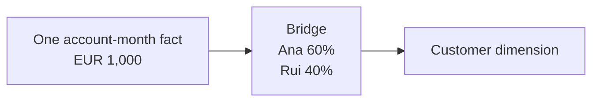
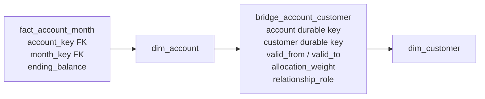

# Bridges and Many-to-Many Relationships

Sometimes one fact row belongs to more than one member of the same dimension. A joint bank account has two holders. An employee can have several skills. A medical encounter can have several diagnoses.

A **bridge table** represents those multiple relationships without changing what the original fact row means.

## Start with a joint account

Imagine that account `7008` has a month-end balance of EUR 1,000 and two holders:

| Account | Holder | Ownership share |
|---|---|---:|
| 7008 | Ana | 60% |
| 7008 | Rui | 40% |

The account snapshot should still contain only one balance row:

| Account | Month | Ending balance |
|---|---|---:|
| 7008 | 2026-06 | EUR 1,000 |

Putting one holder on that row would lose the other holder. Copying the EUR 1,000 row once for Ana and once for Rui would produce EUR 2,000 when somebody summed it.

The safe design keeps the balance once and stores the two holder relationships separately:



This is the central idea:

> **The fact stores the measurement once. The bridge lists all members related to that measurement.**

## The problem it solves

For the monthly account snapshot, the grain is:

> One fact row represents one account at one month end.

An account may have several holders, and one customer may hold several accounts. This is a **many-to-many relationship**.

A bridge preserves the fact's grain while making the relationship visible. It also forces an important reporting choice: should the balance be split among the holders, or should the full balance be associated with every holder?

## Grain

Write down what one row means in each table:

1. **Fact grain:** one row per account per month end.
2. **Bridge grain:** one row per durable account, durable customer, relationship role, and non-overlapping effective period.
3. **Dimension grain:** one row per customer version.

If a reusable group bridge is used instead:

> One bridge row represents one member in one exact member group.

Calling a bridge only “a mapping table” is too vague. Its row meaning tells users whether the relationship allocates a measure, repeats it for impact analysis, or applies only during a particular period.

## Core model: effective-dated account holders



The diagram uses a direct account-to-customer bridge. Another design gives each exact combination of holders a group key and stores that key on the fact. Group keys work well when the same combinations repeat. The direct design is often easier to understand when holders change independently over time.

Example bridge rows:

| durable_account_key | durable_customer_key | role | valid_from | valid_to | allocation_weight |
|---:|---:|---|---|---|---:|
| 7008 | 101 | Primary | 2025-01-01 | 9999-12-31 | 0.60 |
| 7008 | 205 | Joint | 2025-01-01 | 2026-07-01 | 0.40 |
| 7008 | 309 | Joint | 2026-07-01 | 9999-12-31 | 0.40 |

The `valid_from` and `valid_to` columns say when each relationship applies. The end is excluded, so a relationship ending on July 1 and one starting on July 1 do not overlap. At any chosen time, the active weights for account `7008` must add up to `1.00` if the report allocates the balance.

## Two valid ways to report the balance

### Weighted allocation report

Question: “How much of the portfolio balance should be assigned to each account holder without changing the bank total?”

For each fact/bridge result row:

    allocated_balance = ending_balance * allocation_weight

If a EUR 1,000 balance has weights 0.60 and 0.40, the holders receive EUR 600 and EUR 400. Summing across customers returns EUR 1,000.

**Required rule:** for each account and point in time, the active weights must add up to `1.00`, allowing only an agreed rounding tolerance.

### Unweighted impact report

Question: “What balance is connected to customers in this segment, even when they share an account?”

The full EUR 1,000 is associated with each holder. The query deliberately does not apply the allocation weight. The result can total EUR 2,000 across holders.

That result is useful for impact analysis, but it cannot be summed across holders. Label it **impact** or **association**, not allocated revenue, balance, or headcount.

### Make the choice visible

Good semantic names include:

- `allocated_ending_balance` for weighted analysis;
- `associated_ending_balance` for impact analysis;
- `distinct_account_count` for entity coverage;
- `customer_relationship_count` for bridge-row counts.

Two governed semantic views can expose the same bridge safely: one weighted and one impact-oriented. Do not rely on every analyst remembering when to multiply by the weight.

## Query pattern

The query below does three things:

1. selects the holder relationships that were active at month end;
2. selects the matching historical customer version;
3. multiplies each balance by its allocation weight.

```text
EUR 1,000 fact × 60% Ana weight = EUR 600 allocated to Ana
EUR 1,000 fact × 40% Rui weight = EUR 400 allocated to Rui
```

In SQL:

```sql
select
    c.customer_segment,
    sum(f.ending_balance * b.allocation_weight) as allocated_balance
from fact_account_month f
join dim_account a
  on a.account_key = f.account_key
join dim_month m
  on m.month_key = f.month_key
join bridge_account_customer b
  on b.durable_account_key = a.durable_account_key
 and m.month_end_date >= b.valid_from
 and m.month_end_date <  b.valid_to
join dim_customer c
  on c.durable_customer_key = b.durable_customer_key
 and m.month_end_date >= c.valid_from
 and m.month_end_date <  c.valid_to
where m.month_end_date = :selected_month_end
group by c.customer_segment;
```

In a curated presentation model, the transformation can resolve the correct customer version in advance so ordinary reports do not need both date-range joins. Either way, the query must choose one point in time. Without those time conditions, it can combine holder relationships that were never active together.

Allocation prevents double counting across holders. It does not make balances safe to add across months; a balance is still a point-in-time value.

## Group bridges

Sometimes the same combination of members appears repeatedly. For example, many employees may share the skill set `{Python, SQL}`. The fact or dimension can point to a reusable group:

    dim_employee
    └── skill_group_key             FK

    bridge_skill_group
    ├── skill_group_key             FK
    ├── skill_key                   FK
    ├── proficiency_level
    └── allocation_weight           optional

    dim_skill
    └── skill_key                   PK

Bridge grain:

> One row represents one skill membership in one exact skill group.

Allocation usually makes no sense for skills. The bridge instead answers questions such as “which employees have Python?” Count distinct employees, not bridge rows, when the requirement is a number of people.

### AND versus OR filters

“Python **or** SQL” matches either skill row. “Python **and** SQL” must find employees whose group contains both rows. This condition cannot work:

```sql
where skill = 'Python' and skill = 'SQL'
```

One row cannot contain both values. Use grouped conditional counts or intersect the two sets of employees instead.

Complex membership logic is a good candidate for a semantic model or governed reusable query.

## Bridge or relationship fact?

Not every many-to-many relationship needs a bridge. Start by asking what the relationship means:

| Situation | Usually model it as |
|---|---|
| The relationship is itself the event | A factless relationship fact |
| One existing fact row has several simultaneous dimension members | A bridge |
| One member identifies the event at its natural grain | A normal fact foreign key |

### Use a factless relationship fact when the relationship is itself the business event

For student enrollments:

> One row represents one student's enrollment in one course offering.

That row can carry enrollment date, status, source, and completion eligibility dimensions. It is a factless fact table, even if no numeric measure exists. The natural grain already contains both student and course, so a bridge is unnecessary.

### Use a bridge when a dimension is multivalued at an existing fact grain

For a learning session attendance fact:

> One row represents one user's attendance at one session.

If the session has several instructors and attendance measures must remain at attendee-session grain, an instructor group bridge preserves that grain.

### Change the fact grain when the member truly identifies the event

If the source records one feature-use event by one user, `user_key` is simply a normal foreign key. Do not introduce a bridge because users can have many events and events belong to many users over time; many-to-many across the whole table is not the issue. The question is whether one fact row relates to multiple simultaneous members of the same dimension.

## Allocation factors

Weights are business rules, not technical conveniences. Common bases include:

- contractual ownership percentage;
- attributed revenue share;
- instructor contribution percentage;
- equal split when the business explicitly approves it;
- modeled attribution weights with a method/version dimension.

Document:

- which measures the weight applies to;
- whether weights are fixed or effective-dated;
- how residual rounding is assigned;
- whether negative or greater-than-one weights are valid;
- what happens when no member is known;
- who owns the allocation rule.

Do not use the same weight automatically for revenue, cost, quantity, and count. A relationship may have contractual ownership weights while event counts remain impact-only.

## Advanced: effective-dated bridges

### The problem

Customer segments, account holders, roles, and organizational memberships change. A bridge with no time range describes only the latest relationship and will reinterpret historical facts.

### Model

Add `valid_from`, `valid_to`, and optionally `is_current` to the relationship. For each logical relationship, periods must be non-overlapping. If the full member set changes as a unit, a Type 2-style group version can be used instead.

### Keys: durable or version surrogate?

- **Durable keys** keep the bridge stable when unrelated descriptive attributes change. Resolve the dimension version appropriate for the fact's as-of time.
- **Surrogate version keys** can simplify direct joins but may cause bridge churn whenever any Type 2 attribute changes, even if the relationship did not.

Use durable keys when relationship history and descriptive history change independently. Use version keys only when the relationship is explicitly to that exact historical profile.

### Late corrections

If a relationship is learned late, repair only the affected periods, re-evaluate impacted fact-to-member results, and reconcile both allocated and impact metrics. An effective-dated bridge needs the same interval discipline as a Type 2 dimension: no accidental overlaps, clear boundary semantics, and an audit trail.

## Other practical examples

### Customers and segments

A customer can belong to “High value,” “Churn risk,” and “Early adopter” simultaneously. If segments are rule outputs, store rule version and effective period. Counts should usually be distinct customers; measures may be impact-only unless the business defines attribution weights.

### Users and roles

Application roles often change independently of usage events. A user-role factless table is appropriate for assignment history. A bridge is useful when an event must be analyzed against the complete role set valid at event time. Security authorization should still be enforced by the source security system; an analytical bridge is not an access-control engine.

### Diagnoses and encounters

One encounter can have several diagnoses. Measures can be allocated using approved clinical or financial weights, or repeated for diagnosis impact analysis. Label the semantics because unweighted cost by diagnosis will overcount across diagnoses.

## When to use a bridge

- A single fact row legitimately relates to multiple simultaneous members of one dimension.
- The fact's declared grain must not be multiplied.
- Membership is open-ended or changes often enough that positional columns do not scale.
- Consumers need filtering, grouping, allocation, or impact analysis by the multivalued dimension.

## When not to use a bridge

- There is only one dimension member per fact row.
- The relationship itself is the event and should be a factless fact table.
- A small, fixed set of meaningful roles is clearer as role-playing foreign keys, such as primary and secondary approver.
- The source cannot support a defensible membership or allocation rule.
- The only requirement is a text display; a governed list attribute may be simpler if no member-level filtering is required.

## Common mistakes

- Joining a bridge without constraining its effective period.
- Summing the original fact after bridge expansion and calling the result additive.
- Applying weights that do not sum to one for an allocation report.
- Using equal weights without business approval.
- Counting bridge rows when the requirement is distinct entities.
- Physically exploding the base fact and losing the original unallocated measure.
- Attaching multiple members as `member_1`, `member_2`, and so on when cardinality is open-ended.
- Using a bridge to conceal mixed fact grain.
- Joining Type 2 dimensions on business key without an as-of condition.
- Assuming one allocation factor is valid for every measure.

## Tradeoffs

| Benefit | Cost |
|---|---|
| Preserves the natural fact grain | More complex joins and semantic definitions |
| Supports open-ended membership | More rows and more load logic |
| Enables allocation and impact views | High risk of double counting if semantics are hidden |
| Can preserve relationship history | Effective dating and late corrections are demanding |
| Avoids sparse positional columns | AND-style membership filters are harder |

## Optional: modern implementation notes

- Materialize a consumer-safe weighted view and a separately named impact view. Metric definitions should choose one explicitly.
- In dbt-style pipelines, test uniqueness at the declared bridge grain, non-overlap of effective periods, and weight sums per parent/group/as-of period.
- On lakehouses and column stores, row expansion may perform well but remains semantically dangerous. Fast wrong totals are still wrong.
- In SAP HANA calculation views or Datasphere, model many-to-many cardinality honestly. Use calculated allocated measures only where the weight's measure scope is explicit; do not rely on generic aggregation over an expanded association.
- Consider pre-aggregating the bridge only after correctness at atomic grain is proven. Preserve the unweighted atomic fact for reconciliation.

## Beginner review checklist

- [ ] Can I explain what one row means in the fact, bridge, and dimension?
- [ ] Has the business owner chosen allocation, impact, or both?
- [ ] Do weights have a documented basis and measure scope?
- [ ] Do allocation weights add up to one for every applicable group and time period?
- [ ] Do effective periods avoid overlaps?
- [ ] Does every fact lookup return the expected members at the chosen time?
- [ ] Do weighted totals match the original fact total?
- [ ] Are impact metrics clearly labeled as unsafe to sum across members?
- [ ] Do entity counts use distinct durable keys where needed?
- [ ] Can late relationship corrections be replayed and audited?

## What to remember

1. A bridge handles multiple simultaneous dimension members without changing fact grain.
2. Declare the bridge grain as precisely as the fact grain.
3. Weighted reports allocate and preserve totals; impact reports intentionally repeat facts and may overcount.
4. Effective-dated bridges must be frozen to one as-of instant.
5. Durable keys reduce churn when relationship and descriptive histories change independently.
6. Use a factless relationship fact when the relationship itself is the event.
7. Hide bridge complexity behind governed semantic models, but never hide its aggregation semantics.

## Related patterns

- [Grain](../01-foundations/grain.md)
- [Measures and additivity](../01-foundations/measures.md)
- [Slowly changing dimensions](../03-dimensions/slowly-changing-dimensions.md)
- [Hierarchies](hierarchies.md)
- [Conformance and bus architecture](../05-enterprise-modeling/conformance-and-bus-architecture.md)
