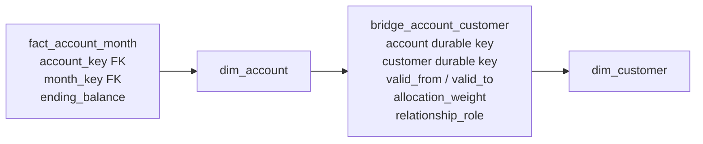

# Bridges and Many-to-Many Relationships

A classic star assumes one fact row points to one member of each dimension. Real relationships are not always single-valued: an account has several holders, an employee has several skills, a customer belongs to several segments, and a learning session may have several instructors.

A bridge preserves the fact's natural grain while making the multivalued relationship explicit. It also makes the most dangerous question unavoidable: should a measure be allocated across members or repeated for impact analysis?

## The problem

Consider a monthly account snapshot.

> One fact row represents one account at one month end.

An account can have two or more holders. Adding `customer_key` directly to the fact would imply one holder. Duplicating the fact once per holder would silently change the grain and double the account balance unless every measure were allocated.

The relationship is genuinely many-to-many over the complete model:

- one account can have many customers;
- one customer can hold many accounts.

## Mental model

**The fact keeps one row for the measurement. The bridge enumerates who or what participates in that row.**

## Grain

Always declare three grains:

1. **Fact grain:** one row per account per month end.
2. **Bridge grain:** one row per durable account, durable customer, relationship role, and non-overlapping effective period.
3. **Dimension grain:** one row per customer version.

If a reusable group bridge is used instead:

> One bridge row represents one member in one exact member group.

Never describe a bridge merely as “a mapping table.” Its grain determines whether it duplicates, allocates, or time-slices facts.

## Core model: effective-dated account holders



An alternative is for the fact to carry an `account_holder_group_key`, which joins to a bridge containing one row per customer in that exact group. Group keys work well when the same combinations repeat. A direct effective-dated account-to-customer bridge is often clearer when membership changes independently and consumers query an as-of relationship.

Example bridge rows:

| durable_account_key | durable_customer_key | role | valid_from | valid_to | allocation_weight |
|---:|---:|---|---|---|---:|
| 7008 | 101 | Primary | 2025-01-01 | 9999-12-31 | 0.60 |
| 7008 | 205 | Joint | 2025-01-01 | 2026-07-01 | 0.40 |
| 7008 | 309 | Joint | 2026-07-01 | 9999-12-31 | 0.40 |

These rows use half-open validity periods. At any requested instant, the active weights for account 7008 must sum to 1.00 if the relationship supports allocation.

## Two valid report semantics

### Weighted allocation report

Question: “Allocate portfolio balance across account holders without changing the bank total.”

For each fact/bridge result row:

    allocated_balance = ending_balance * allocation_weight

If a EUR 1,000 balance has weights 0.60 and 0.40, the holders receive EUR 600 and EUR 400. Summing across customers returns EUR 1,000.

**Required rule:** active allocation weights for each bridged fact entity and as-of time must sum to exactly 1.00 within an agreed tolerance.

### Unweighted impact report

Question: “What total balance is associated with customers in this segment, regardless of shared ownership?”

The full EUR 1,000 is associated with each holder. The query deliberately does not apply the allocation weight. The result can total EUR 2,000 across holders.

That is not a bug if the report is labeled **impact** or **association** and users understand that totals are non-additive across bridge members. Never present an unweighted impact report as allocated revenue, balance, or headcount.

### Make the choice visible

Good semantic names include:

- `allocated_ending_balance` for weighted analysis;
- `associated_ending_balance` for impact analysis;
- `distinct_account_count` for entity coverage;
- `customer_relationship_count` for bridge-row counts.

Two governed semantic views can expose the same bridge safely: one weighted and one impact-oriented. Do not rely on every analyst remembering when to multiply by the weight.

## Query pattern

For a month-end snapshot with a direct effective-dated bridge:

```sql
select
    c.customer_segment,
    sum(f.ending_balance * b.allocation_weight) as allocated_balance
from fact_account_month f
join dim_account a
  on a.account_key = f.account_key
join dim_month m
  on m.month_key = f.month_key
join bridge_account_customer b
  on b.durable_account_key = a.durable_account_key
 and m.month_end_date >= b.valid_from
 and m.month_end_date <  b.valid_to
join dim_customer c
  on c.durable_customer_key = b.durable_customer_key
 and m.month_end_date >= c.valid_from
 and m.month_end_date <  c.valid_to
group by c.customer_segment;
```

In a curated presentation model, resolve the appropriate customer surrogate key during transformation so ordinary reports do not need two temporal joins. Whichever form is used, constrain the bridge to exactly one as-of instant. Omitting the time predicate combines relationships that never coexisted.

Account balances remain semi-additive across time even after correct bridge allocation. Weighting solves allocation across holders, not summation across months.

## Group bridges

For an employee skill set, many employees may share the same combination of skills. A reusable group design is compact:

    dim_employee
    └── skill_group_key             FK

    bridge_skill_group
    ├── skill_group_key             FK
    ├── skill_key                   FK
    ├── proficiency_level
    └── allocation_weight           optional

    dim_skill
    └── skill_key                   PK

Bridge grain:

> One row represents one skill membership in one exact skill group.

Allocation usually makes no sense for skills. The bridge supports filtering and impact questions such as “employees associated with Python,” with distinct employee counts where required.

### AND versus OR filters

“Python or SQL” is a membership filter over either skill. “Python and SQL” requires employees whose group contains both memberships, commonly implemented with grouped conditional counts or intersected member sets. A simple row predicate with `skill = 'Python' AND skill = 'SQL'` can never match because the values occur on separate rows.

Complex membership logic is a good candidate for a semantic model or governed reusable query.

## Bridge or relationship fact?

Not every many-to-many relationship should be hidden behind a bridge.

### Use a factless relationship fact when the relationship is itself the business event

For student enrollments:

> One row represents one student's enrollment in one course offering.

That row can carry enrollment date, status, source, and completion eligibility dimensions. It is a factless fact table, even if no numeric measure exists. The natural grain already contains both student and course, so a bridge is unnecessary.

### Use a bridge when a dimension is multivalued at an existing fact grain

For a learning session attendance fact:

> One row represents one user's attendance at one session.

If the session has several instructors and attendance measures must remain at attendee-session grain, an instructor group bridge preserves that grain.

### Change the fact grain when the member truly identifies the event

If the source records one feature-use event by one user, `user_key` is simply a normal foreign key. Do not introduce a bridge because users can have many events and events belong to many users over time; many-to-many across the whole table is not the issue. The question is whether one fact row relates to multiple simultaneous members of the same dimension.

## Allocation factors

Weights are business rules, not technical conveniences. Common bases include:

- contractual ownership percentage;
- attributed revenue share;
- instructor contribution percentage;
- equal split when the business explicitly approves it;
- modeled attribution weights with a method/version dimension.

Document:

- which measures the weight applies to;
- whether weights are fixed or effective-dated;
- how residual rounding is assigned;
- whether negative or greater-than-one weights are valid;
- what happens when no member is known;
- who owns the allocation rule.

Do not use the same weight automatically for revenue, cost, quantity, and count. A relationship may have contractual ownership weights while event counts remain impact-only.

## Effective-dated bridges

### The problem

Customer segments, account holders, roles, and organizational memberships change. A bridge with no time range describes only the latest relationship and will reinterpret historical facts.

### Model

Add `valid_from`, `valid_to`, and optionally `is_current` to the relationship. For each logical relationship, periods must be non-overlapping. If the full member set changes as a unit, a Type 2-style group version can be used instead.

### Keys: durable or version surrogate?

- **Durable keys** keep the bridge stable when unrelated descriptive attributes change. Resolve the dimension version appropriate for the fact's as-of time.
- **Surrogate version keys** can simplify direct joins but may cause bridge churn whenever any Type 2 attribute changes, even if the relationship did not.

Use durable keys when relationship history and descriptive history change independently. Use version keys only when the relationship is explicitly to that exact historical profile.

### Late corrections

If a relationship is learned late, repair only the affected periods, re-evaluate impacted fact-to-member results, and reconcile both allocated and impact metrics. An effective-dated bridge needs the same interval discipline as a Type 2 dimension: no accidental overlaps, clear boundary semantics, and an audit trail.

## Other practical examples

### Customers and segments

A customer can belong to “High value,” “Churn risk,” and “Early adopter” simultaneously. If segments are rule outputs, store rule version and effective period. Counts should usually be distinct customers; measures may be impact-only unless the business defines attribution weights.

### Users and roles

Application roles often change independently of usage events. A user-role factless table is appropriate for assignment history. A bridge is useful when an event must be analyzed against the complete role set valid at event time. Security authorization should still be enforced by the source security system; an analytical bridge is not an access-control engine.

### Diagnoses and encounters

One encounter can have several diagnoses. Measures can be allocated using approved clinical or financial weights, or repeated for diagnosis impact analysis. Label the semantics because unweighted cost by diagnosis will overcount across diagnoses.

## When to use a bridge

- A single fact row legitimately relates to multiple simultaneous members of one dimension.
- The fact's declared grain must not be multiplied.
- Membership is open-ended or changes often enough that positional columns do not scale.
- Consumers need filtering, grouping, allocation, or impact analysis by the multivalued dimension.

## When not to use a bridge

- There is only one dimension member per fact row.
- The relationship itself is the event and should be a factless fact table.
- A small, fixed set of meaningful roles is clearer as role-playing foreign keys, such as primary and secondary approver.
- The source cannot support a defensible membership or allocation rule.
- The only requirement is a text display; a governed list attribute may be simpler if no member-level filtering is required.

## Common mistakes

- Joining a bridge without constraining its effective period.
- Summing the original fact after bridge expansion and calling the result additive.
- Applying weights that do not sum to one for an allocation report.
- Using equal weights without business approval.
- Counting bridge rows when the requirement is distinct entities.
- Physically exploding the base fact and losing the original unallocated measure.
- Attaching multiple members as `member_1`, `member_2`, and so on when cardinality is open-ended.
- Using a bridge to conceal mixed fact grain.
- Joining Type 2 dimensions on business key without an as-of condition.
- Assuming one allocation factor is valid for every measure.

## Tradeoffs

| Benefit | Cost |
|---|---|
| Preserves the natural fact grain | More complex joins and semantic definitions |
| Supports open-ended membership | More rows and more load logic |
| Enables allocation and impact views | High risk of double counting if semantics are hidden |
| Can preserve relationship history | Effective dating and late corrections are demanding |
| Avoids sparse positional columns | AND-style membership filters are harder |

## Modern implementation notes

- Materialize a consumer-safe weighted view and a separately named impact view. Metric definitions should choose one explicitly.
- In dbt-style pipelines, test uniqueness at the declared bridge grain, non-overlap of effective periods, and weight sums per parent/group/as-of period.
- On lakehouses and column stores, row expansion may perform well but remains semantically dangerous. Fast wrong totals are still wrong.
- In SAP HANA calculation views or Datasphere, model many-to-many cardinality honestly. Use calculated allocated measures only where the weight's measure scope is explicit; do not rely on generic aggregation over an expanded association.
- Consider pre-aggregating the bridge only after correctness at atomic grain is proven. Preserve the unweighted atomic fact for reconciliation.

## Verification checklist

- [ ] Fact, bridge, and dimension grains are written down.
- [ ] The business owner has chosen allocation, impact, or both.
- [ ] Weights have a documented basis and measure scope.
- [ ] Allocation weights sum to one for every applicable group and as-of period.
- [ ] Effective periods do not overlap.
- [ ] Every fact/as-of lookup returns the expected member set.
- [ ] Weighted totals reconcile to the unbridged fact total.
- [ ] Impact metrics are visibly labeled non-additive across members.
- [ ] Entity counts use distinct durable keys where required.
- [ ] Late relationship corrections are replayable and audited.

## What to remember

1. A bridge handles multiple simultaneous dimension members without changing fact grain.
2. Declare the bridge grain as precisely as the fact grain.
3. Weighted reports allocate and preserve totals; impact reports intentionally repeat facts and may overcount.
4. Effective-dated bridges must be frozen to one as-of instant.
5. Durable keys reduce churn when relationship and descriptive histories change independently.
6. Use a factless relationship fact when the relationship itself is the event.
7. Hide bridge complexity behind governed semantic models, but never hide its aggregation semantics.

## Related patterns

- [Grain](../01-foundations/grain.md)
- [Measures and additivity](../01-foundations/measures.md)
- [Slowly changing dimensions](../03-dimensions/slowly-changing-dimensions.md)
- [Hierarchies](hierarchies.md)
- [Conformance and bus architecture](../05-enterprise-modeling/conformance-and-bus-architecture.md)
