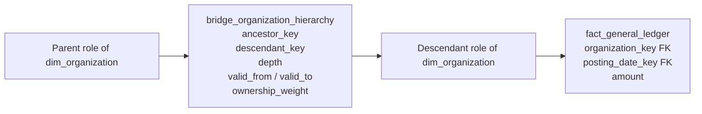

# Hierarchies

Hierarchies describe how detailed members roll up: product to category, city to region, employee to manager, account to parent account, or component to assembly. The right physical pattern depends on whether levels are fixed and meaningful, depth varies, parents can be shared, and historical structures must be preserved.

## The problem

Users want to move between detail and summary without learning recursive SQL or interpreting generic `level_1` columns. Meanwhile, organizations reorganize, product taxonomies change, and charts of accounts are restated.

A hierarchy model must answer four questions:

1. What does the base dimension row represent?
2. Are level names fixed and meaningful?
3. Can one child have more than one parent?
4. Which version of the hierarchy applies to historical facts?

## Mental model

- **Fixed and named levels:** flatten them into the dimension.
- **Slightly ragged but bounded:** flatten with an explicit padding rule.
- **Deep, recursive, shared, or changeable:** use a parent-child representation for maintenance and often a hierarchy bridge for analytics.

## Simple fixed-depth hierarchies

### Grain

For a product dimension:

> One row represents one SKU version.

Each row carries its complete, many-to-one rollup path:

    dim_product
    ├── product_key            PK
    ├── sku_id
    ├── product_name
    ├── brand_name
    ├── subcategory_name
    ├── category_name
    └── department_name

### Why flattening works

Brand, subcategory, category, and department are all true for the SKU row. Repeating their labels costs little compared with a large fact table and gives users one join, meaningful filters, and simple `GROUP BY` expressions. Modern column stores compress repeated low-cardinality values well.

### When flattening is better than normalization

Flatten when:

- depth is fixed or narrowly bounded;
- levels have stable business names;
- relationships are many-to-one at the dimension grain;
- users frequently group and filter by the levels;
- one governed hierarchy version applies to the row's validity period.

Do not snowflake department, category, and brand merely to remove repeated text. Normalization may simplify operational updates, but the presentation model's job is understandable, reliable analytics.

### Multiple hierarchies

One dimension can carry several independent rollups. A date dimension may contain calendar and fiscal hierarchies; a store can contain geographic and operating hierarchies. Prefix attributes so paths are unmistakable:

- `geography_country` → `geography_region` → `geography_city`;
- `operations_division` → `operations_area` → `operations_store`.

Avoid assuming that similarly named levels form a hierarchy. City alone does not uniquely determine state or country in many datasets; use complete, governed attributes.

## Slightly ragged hierarchies

### The problem

Some geographies have city → state → country, while others add district or province. The depth varies only within a narrow, known range.

### Grain

> One row still represents one lowest-level location; every flattened hierarchy column describes its rollup position.

### Padding choices

Business owners must decide how missing levels appear in reports:

- repeat the nearest lower-level member upward;
- repeat a higher-level member downward;
- use a clear `Not Applicable` label.

Choose by visualizing totals at each report level. The rule must preserve complete rollups and produce labels users understand.

### When not to flatten

Do not hide a wildly variable hierarchy behind `level_1` through `level_12`. Generic levels have no stable meaning, and adding depth becomes a schema change. If level names cannot be explained, use a recursive or bridge-based pattern.

## Parent-child hierarchies

### The problem

Organization charts, charts of accounts, customer ownership trees, and bills of materials can have unpredictable depth.

### Adjacency-list grain

> One row represents one node, with a pointer to its immediate parent in one hierarchy version.

    dim_organization_node
    ├── organization_key          PK
    ├── durable_organization_key
    ├── organization_name
    ├── parent_organization_key   immediate parent
    ├── node_type
    └── SCD metadata ...

This adjacency-list form is compact and easy to maintain. Recursive common table expressions can traverse it. It is often suitable for controlled applications and modest trees.

### Limitations

- Ad hoc users and some BI tools struggle with recursion.
- A query repeatedly traverses the tree.
- Alternative hierarchies require another parent relationship or version.
- Shared parentage turns a tree into a graph.
- A Type 2 key change high in the tree can create cascading maintenance if parent pointers reference version keys carelessly.

Use durable node keys for structural relationships when descriptive Type 2 changes should not alter the hierarchy.

## Hierarchy bridges (closure tables)

### The problem

Users need fast ancestor-to-descendant analysis across a ragged hierarchy without recursive query logic.

### Grain

> One bridge row represents one ancestor-to-descendant path within one hierarchy version and effective period.

In a strict tree there is only one path between an ancestor and descendant, so hierarchy version plus ancestor plus descendant can be unique. In a graph with shared parents, retain a path identifier or pre-aggregate all valid paths to one ancestor-descendant row with a governed combined weight.

Include a self-path for every node at depth zero. A 13-node tree therefore has more than 13 bridge rows because every ancestor is paired with every reachable descendant.

### Model



Example:

| ancestor_key | descendant_key | depth | is_leaf | ownership_weight |
|---:|---:|---:|---:|---:|
| 10 | 10 | 0 | 0 | 1.00 |
| 10 | 21 | 1 | 0 | 1.00 |
| 10 | 45 | 2 | 1 | 1.00 |
| 21 | 21 | 0 | 0 | 1.00 |
| 21 | 45 | 1 | 1 | 1.00 |
| 45 | 45 | 0 | 1 | 1.00 |

### Why this works

The bridge expands the recursive structure during data processing. A query constrains one ancestor and directly reaches all descendant fact rows. Depth supports immediate-child versus all-descendant analysis; flags can identify roots and leaves.

### Query discipline

Constrain the ancestor role to the intended member before aggregating. An unconstrained closure bridge associates one fact with every ancestor in its path, so totals across ancestors will repeat descendants by design.

For a selected organization:

```sql
select
    parent.organization_name,
    sum(f.amount) as descendant_amount
from dim_organization parent
join bridge_organization_hierarchy h
  on h.ancestor_key = parent.organization_key
join fact_general_ledger f
  on f.organization_key = h.descendant_key
where parent.durable_organization_key = :selected_org
group by parent.organization_name;
```

If a filter can select several overlapping ancestors, first derive the distinct descendant set or define explicit impact semantics. Otherwise a descendant reachable through two selected parents may be counted twice.

## Shared ownership and graph structures

A bill of materials can use one component in several assemblies. A legal entity may be 60% owned by one parent and 40% by another. This is no longer a strict tree.

Add an ownership or path weight when measures must be allocated. The product of edge weights along a path determines the ancestor-to-descendant path weight; if several independent paths connect the same pair, the business rule must specify whether to sum, choose, or report them separately.

Weighted rollup:

    allocated_amount = fact_amount * hierarchy_path_weight

Unweighted rollup is an **impact view** and may associate the full amount with several parents. As with other [bridges](bridges-and-many-to-many.md), label allocation and impact semantics explicitly.

Do not invent ownership weights for convenience. Bills of materials may need quantities rather than percentages, and organizational accountability may be non-allocatable.

## Time-varying hierarchies

### The problem

An employee moves to a new manager, a cost center is reorganized, or an account rolls into a different reporting group. Users may need both:

- results under the structure valid when the fact occurred;
- historical facts restated under today's structure.

### Model

Add `valid_from` and `valid_to` to the hierarchy relationship or to closure paths. Use half-open, non-overlapping periods. Every historical query must freeze the hierarchy at one explicit instant.

Two common presentations are useful:

- **As-was hierarchy:** choose the path valid at the fact event or snapshot date.
- **As-is hierarchy:** choose the current path and intentionally restate all history.

Name these perspectives. A generic “organization hierarchy” that silently changes interpretation is unsafe.

### Interaction with Type 2 dimensions

Separate descriptive history from structural history:

- An employee address change should not rebuild the management tree.
- A manager reassignment should change hierarchy relationships even if no descriptive attribute changes.

Durable entity keys in the bridge usually prevent unrelated Type 2 changes from multiplying closure paths. Resolve descriptive dimension versions independently for the requested as-of time. If exact surrogate version keys are used, document why structure is tied to that profile and expect more bridge churn.

### Late corrections

A retroactive reorganization can require closing old paths, inserting corrected paths, and rebuilding the transitive closure for only affected subtrees and periods. Reconcile ancestor totals before and after the repair, and retain the processing audit. Never leave overlapping active hierarchy versions.

## Alternative implementations

### Recursive CTE over parent pointers

Use when the database and semantic tool handle recursion, trees are modest, and structures change frequently. It minimizes stored paths but shifts work and complexity to query time.

### Materialized path

A path string or array stores the lineage of each node. Prefix or array-containment queries can be convenient, especially in document or lakehouse engines. Moving a high-level node may require rewriting every descendant path, and delimiter or identifier rules require care.

### Nested sets / preorder numbering

Left/right interval labels make subtree reads fast but make structural changes expensive because many nodes may need relabeling. This is better for read-mostly static trees than frequently reorganized structures.

### Native graph or semantic hierarchy

Graph engines and semantic platforms can navigate complex structures elegantly. They do not remove the need to define version, allocation, and counting semantics. Persisting a curated relational bridge may still improve reproducibility and portability.

## Pattern choice

| Situation | Default pattern |
|---|---|
| Stable, named, fixed levels | Flattened columns in the base dimension |
| Two or three optional levels with clear meaning | Flatten with a governed padding rule |
| Variable depth; one parent; technical users | Parent pointer plus recursive query |
| Variable depth; broad BI use | Hierarchy bridge / closure table |
| Shared parents or ownership | Weighted hierarchy bridge or graph model |
| Several alternative stable taxonomies | Separate named hierarchy attributes or versioned bridge |
| Frequent structural changes | Parent relationship as system of record, selectively materialized closure |

## Domain examples

### Geography

Country → region → city is often flattened when levels are stable. Global structures with province, state, district, and municipality variants may be slightly ragged. Keep each level semantically named.

### Product category

SKU → subcategory → category → department is usually a fixed hierarchy inside `dim_product`. Alternate merchandising and financial taxonomies can coexist as separately prefixed attribute paths.

### Organization and management

Direct employee → manager can be a role-playing manager key. Full chain-of-command analysis favors a hierarchy bridge. Use durable employee keys so an address change does not rebuild reporting relationships.

### Chart of accounts

Fixed reporting levels can be flattened. Complex, versioned statutory and management rollups may need separate hierarchy versions. Consolidation weights and eliminations require finance-owned rules beyond a simple parent pointer.

### Bill of materials

Assemblies and components form a recursive, often shared graph. The bridge may store required quantity along each path. Prevent cycles; otherwise closure generation and rolled quantities can be infinite or nonsensical.

## When to use hierarchy bridges

- Depth is variable or unknown.
- Users need all descendants or all ancestors without recursive SQL.
- Alternative, shared, weighted, or time-varying structures matter.
- The semantic layer can shield users from join complexity.

## When not to use them

- Levels are fixed, named, and easily flattened.
- Only immediate parent analysis is required.
- The hierarchy is small, volatile, and queried only by an application with reliable recursion.
- Consumers cannot safely constrain version and ancestor semantics.

## Common mistakes

- Splitting every fixed hierarchy level into a separate dimension.
- Naming columns `level_1`, `level_2`, and `level_3` when levels have no stable meaning.
- Treating a ragged hierarchy as fixed by stuffing nodes into arbitrary positions.
- Forgetting self-path rows in a closure table.
- Aggregating through an unconstrained hierarchy bridge and double counting descendants.
- Omitting an as-of filter on a time-varying bridge.
- Rebuilding structure after any Type 2 descriptive change because version keys were used indiscriminately.
- Assuming a tree when nodes have shared parents.
- Ignoring cycles and orphan nodes.
- Exposing as-was and as-is rollups under the same labels.

## Tradeoffs

Flattened dimensions offer the simplest queries and best usability but handle only known, meaningful levels. Parent pointers are compact and easy to update but harder to query. Closure bridges make arbitrary rollups fast and flexible at the cost of more rows, more load logic, and overcounting risk. Native graphs improve traversal but do not solve business semantics automatically.

## Modern implementation notes

- Generate closure tables incrementally only after cycle and orphan checks; a periodic full reconciliation can detect missed paths.
- In dbt-style transformations, test self-path existence, unique ancestor/descendant/version grain, valid depth, no cycles, and non-overlapping effective periods.
- Columnar warehouses compress integer closure paths well, but very broad/deep graphs can still be large. Materialize only hierarchies used for analytics.
- SAP HANA and Datasphere can expose hierarchies semantically. Keep the underlying grain and version rules explicit, and validate aggregate behavior when nodes have multiple parents.
- In the semantic layer, publish named hierarchies with ordered levels for fixed paths and governed ancestor parameters for bridges. Hide raw bridge fields from casual users.

## What to remember

1. Flatten stable, named, many-to-one hierarchies into the dimension.
2. Slight raggedness can be padded only when every level remains meaningful.
3. A parent pointer stores immediate structure; a hierarchy bridge stores all ancestor-to-descendant paths.
4. The bridge grain is one path in one hierarchy version and effective period.
5. Constrain one ancestor and one as-of structure before aggregating.
6. Use durable keys to separate structural changes from descriptive Type 2 changes.
7. Shared ownership requires explicit weighting or clearly labeled impact reporting.

## Related patterns

- [Dimension patterns](../03-dimensions/dimension-patterns.md)
- [Slowly changing dimensions](../03-dimensions/slowly-changing-dimensions.md)
- [Bridges and many-to-many relationships](bridges-and-many-to-many.md)
- [Conformance and bus architecture](../05-enterprise-modeling/conformance-and-bus-architecture.md)
