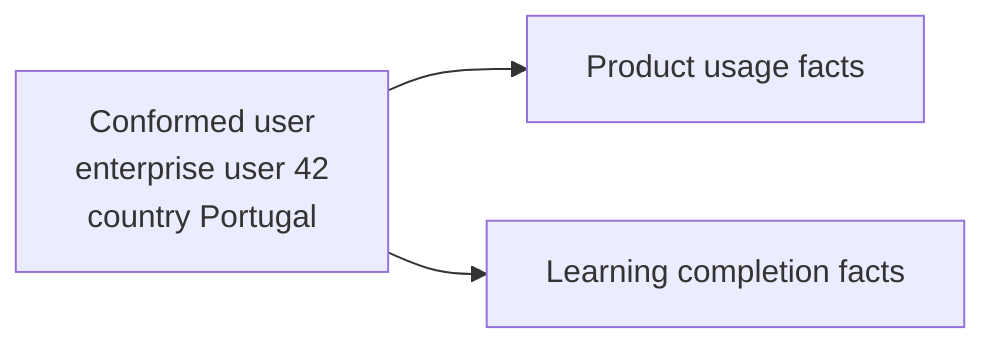

# Conformance and the Enterprise Bus Architecture

Separate star schemas are useful, but they need shared definitions to work together. If sales, subscriptions, learning, support, and finance each define customer, product, date, and revenue differently, every individual report may look reasonable while cross-process reports disagree.

The **Kimball bus architecture** solves this by delivering one business process at a time while reusing agreed dimensions and measures. Those shared definitions are called **conformed dimensions** and **conformed facts**.

## Start with two reports

Suppose a company wants to compare product usage with course completions:

- the product team identifies Ana as user `APP-184` and labels her country `PT`;
- the learning team identifies the same Ana as learner `LMS-992` and labels her country `Portugal`.

Joining on either source ID fails. Grouping by the two country labels creates two rows. The teams need one enterprise user identity and one agreed country definition:

The two fact tables still have different grains. They can nevertheless align results by the shared user and country definitions.

## The problem

Teams often begin with local requirements:

- Sales needs an account and product model.
- Learning needs user, course, and completion data.
- Finance needs legal entity, cost center, and fiscal period.
- Product analytics needs account, user, feature, and event.

Without a shared contract, each team invents keys, labels, hierarchies, and metric equations. Cross-process reports then depend on manual mappings and arguments about whose number is correct.

## The basic idea

**The bus matrix is the plan. Conformed dimensions are the shared connectors. Each fact table remains focused on one business process.**

A bus matrix is a planning grid with business processes as rows and reusable dimensions as columns. It receives a fuller treatment later in this chapter.

A new process can connect without redesigning the existing ones as long as it follows the shared contracts.

## Grain

Shared definitions do not make every table's rows identical. Write down each grain:

- Each fact row has one process-specific measurement grain.
- Each conformed dimension has one atomic member grain or a smaller, higher-level version with its own clear grain.
- Each bus-matrix row represents one business process, not one department or report.
- Each bus-matrix column represents one reusable business dimension at its governed base meaning.

## Conformed dimensions

### Definition

A dimension is **conformed** when different processes use the same meaning for its shared identity and attributes. That includes compatible keys, names, definitions, allowed values, hierarchies, and history rules.

The clearest design reuses one physical dimension across several stars. This is not mandatory: synchronized copies on different platforms can also conform if they follow the same contract.

### Example: conformed user

    dim_user
    ├── user_key                  surrogate version key
    ├── durable_user_key          stable enterprise identity
    ├── source_user_id
    ├── user_type
    ├── country_code
    ├── organization_unit
    ├── employment_status
    └── SCD metadata ...

The same governed user row can describe the user in several processes:

- `fact_learning_event` at one row per user learning event;
- `fact_feature_usage` at one row per user feature event;
- `fact_user_month` at one row per user per month;
- `fact_support_case` at one row per case.

The fact rows still mean different things. One row might be a feature click and another a completed course. Only the user identity and shared attributes are shared.

### What must conform

- member identity and key mapping;
- shared attribute names and business definitions;
- data types and permitted domain values;
- hierarchy and SCD rules for shared attributes;
- unknown, not-applicable, and error members;
- security classification and stewardship;
- refresh expectations where synchronized copies exist.

Matching column names are not enough. Two `customer_segment` columns do not conform if one shows today's CRM segment and the other shows the segment at event time. Dimensions may also contain extra process-specific attributes; only the agreed common attributes are safe for cross-process alignment.

## Conformed facts

A **conformed fact** is a measure that means the same thing everywhere it appears. The equation, dimensions, unit, positive/negative sign, and timing rule all need to match.

For example, `net_revenue` is not conformed unless teams agree on:

- inclusion or exclusion of tax, discounts, credits, and refunds;
- transaction, recognition, or settlement date;
- transaction versus reporting currency;
- gross versus net sign handling;
- treatment of cancelled or test transactions.

If two measures differ, give them different names. Visible differences are safer than a shared label that hides incompatible calculations.

The measures do not need to live in the same table. They need an agreed definition at the grain where users compare or add them.

## Conformance when processes use different detail

Sometimes one process has more detail than another. They can still share higher-level rollups through a **shrunken conformed dimension**.

Example:

- actual learning events: user-course-day;
- workforce plan: organization-course-category-month.

The plan contains no individual user or day, so it cannot honestly use those detailed dimensions. It can use smaller, higher-level dimensions:

> One month row represents one reporting month, containing a strict subset of the daily date dimension's rollup attributes.

> One course-category row represents one governed course category, containing shared category attributes from the atomic course dimension.

The shared attributes must keep the same definitions and values. The shrunken dimension receives its own key because one of its rows represents something different.

Two common forms are:

- **Attribute/rollup subset:** brand from product, month from date.
- **Row subset:** one business line's rows from a corporate dimension at the same grain.

For a row subset, the fact must cover the same population. Otherwise some foreign keys will not resolve and reports may silently lose data.

## The bus architecture

### Why this works

Break the enterprise into observable business processes: an order is placed, a shipment is delivered, a course is completed, a subscription is invoiced, or a support case is resolved. Build each process as one or more fact tables and reuse dimensions that the enterprise has already agreed.

This balances two needs:

- **Local delivery:** a team can ship a valuable process slice without waiting for an enterprise-wide “perfect model.”
- **Global integration:** future slices can align because common dimensions and facts are deliberate contracts.

This approach does not depend on one database product. Facts can live in different schemas or platforms; shared definitions are what make them work together.

## The bus matrix

A **bus matrix** is a simple planning table:

- each row is a business process;
- each column is a reusable dimension;
- `X` means the process uses that dimension;
- a marker such as `M` can mean a higher-level month dimension.

Read across a row to understand one process. Read down a column to see where a shared dimension needs governance.

### Example: learning and SaaS business

| Business process | Date | User | Account | Course | Learning object | Session | Product | Subscription | Employee | Geography |
|---|:---:|:---:|:---:|:---:|:---:|:---:|:---:|:---:|:---:|:---:|
| Learning object activity | X | X | X | X | X |  |  |  |  | X |
| Course enrollment | X | X | X | X |  |  |  |  |  | X |
| Course completion | X | X | X | X |  |  |  |  |  | X |
| Live session attendance | X | X | X | X |  | X |  |  | X | X |
| Assessment attempt | X | X | X | X | X |  |  |  |  | X |
| Product feature usage | X | X | X |  |  |  | X |  |  | X |
| Subscription lifecycle | X |  | X |  |  |  | X | X |  | X |
| Subscription month snapshot | M |  | X |  |  |  | X | X |  | X |
| Payment transaction | X |  | X |  |  |  | X | X |  | X |
| Support case | X | X | X |  |  |  | X |  | X | X |

The matrix makes useful questions visible:

- Does `User` mean the same learner and application user across both domains?
- Does `Account` include internal tenants, prospects, and paying customers?
- Which date roles exist in each process?
- Can Course and Product share a broader offering hierarchy, or are they genuinely separate dimensions?
- At which common grain can learning, usage, subscription, and payment metrics be compared?

Sometimes the honest answer is to share only a few attributes. Do not force unrelated concepts into one universal dimension.

### From enterprise matrix to implementation detail

Keep the main matrix readable. A separate implementation matrix can expand one process into its exact fact tables, fact types, grains, measures, date roles, and sources.

| Fact table | Type | Grain | Main measures |
|---|---|---|---|
| `fact_learning_event` | Transaction | One user interaction with one learning object at one event timestamp | seconds spent, completion increment |
| `fact_course_enrollment` | Accumulating snapshot | One user enrollment in one course offering | days to start, days to complete |
| `fact_user_learning_month` | Periodic snapshot | One user-course per reporting month | month-end progress, cumulative hours |

Do not pack every fact and attribute into the high-level matrix. Keep a simple architecture view and a detailed implementation view for their different audiences.

## How to build a bus matrix, step by step

1. Identify the organization's value chain and observable business processes.
2. Name process rows with verbs and business objects, not department names.
3. Declare a candidate grain for each process.
4. List reusable dimensions at their most atomic governed meaning.
5. Mark process-dimension intersections.
6. Annotate roles or shrunken grains where necessary.
7. Scan each row: are all descriptive contexts for that process present?
8. Scan each column: where must the dimension be shared and governed?
9. Identify conformed facts and unit conversions needed for cross-process analysis.
10. Prioritize process rows by value, feasibility, reuse, and source readiness.

## Data governance and ownership

Conformance is a business agreement expressed in data. Renaming columns does not create that agreement.

For each shared dimension, establish:

- an accountable business owner;
- definitions for member identity and merge/split rules;
- attribute stewards and SCD behavior;
- accepted source precedence;
- domain values and hierarchies;
- data-quality thresholds;
- schema and semantic versioning rules;
- consumer notification and migration policy.

Technical teams can guide and implement the decision. Business owners still need to decide whether two customer definitions are equivalent and which revenue equation is correct.

If full agreement is impossible, start with a valuable common subset. One governed product category or enterprise account identifier can enable real integration. Small, honest conformance is better than pretending the entire enterprise already agrees.

## Using the matrix as an architecture tool

The bus matrix supports more than schema design:

- **Roadmap:** each process row is a manageable delivery candidate.
- **Reuse plan:** heavily used columns deserve early governance and robust pipelines.
- **Impact analysis:** a dimension contract change reveals affected processes.
- **Data quality:** shared dimensions expose conflicting source identities and labels.
- **Security:** sensitive dimensions show where access policies propagate.
- **Team coordination:** independent teams can work asynchronously against stable contracts.
- **Semantic governance:** common facts and attributes become reusable metric inputs.

## When to use it

- Several business processes must support cross-process analysis.
- Teams need incremental delivery without creating isolated marts.
- Shared entities such as customer, product, employee, user, date, or geography recur.
- A platform spans several warehouses, lakehouses, semantic models, or SAP analytical spaces.

## When not to force it

Do not force a single enterprise dimension when populations and meanings truly do not overlap and there is no cross-domain analytical need. A conglomerate may have unrelated product or customer worlds. Preserve separate domains and conform only a small corporate rollup if that is the real requirement.

Do not wait for every attribute across the enterprise to be standardized before delivering the first process. Govern the smallest useful common contract, then extend it gracefully.

## Common mistakes

- Using departments such as Finance or Marketing as matrix rows instead of business processes.
- Using individual reports as rows.
- Creating a generic `Person` or `Location` column that hides incompatible populations and attributes.
- Making each hierarchy level a separate matrix column.
- Marking two dimensions conformed because their column names match.
- Sharing natural keys without reconciling source collisions or key reuse.
- Allowing local teams to extend shared attributes with conflicting semantics.
- Forcing a fact table to combine several processes just because they share dimensions.
- Treating the bus matrix as a one-time presentation rather than a living architecture artifact.
- Defining dimensions centrally but allowing every dashboard to redefine the facts.

## Tradeoffs

| Benefit | Cost |
|---|---|
| Cross-process consistency | Governance and negotiation effort |
| Faster later delivery through reuse | More discipline in early projects |
| Independent, incremental process teams | Contract versioning and coordination |
| Simpler drill-across analysis | Shared identity resolution and data quality work |
| Source-system independence | Mapping and stewardship pipelines |

Agreeing shared definitions can feel slower at first because disagreements become visible. Those disagreements already existed; resolving them now is safer than discovering them in production reports.

## Optional: modern implementation notes

- **Data contracts:** publish dimension grain, keys, shared attributes, SCD behavior, freshness, and quality tests as a versioned contract.
- **dbt-style projects:** build shared dimensions once or from one governed package; use relationship and accepted-value tests in every consuming mart.
- **Lakehouses:** a conformed Gold layer can expose shared dimensions over cleaned Silver entities. Medallion layer names alone do not create conformance.
- **Semantic layers:** centrally govern conformed facts as metrics, including date role, unit, filters, and valid dimensionality. A semantic metric cannot repair incompatible physical grains.
- **SAP Datasphere:** shared dimensions and analytical datasets can be reused across spaces through governed models. Ensure associations, hierarchy definitions, and analytical semantics remain consistent when replicated or exposed remotely.
- **SAP HANA:** calculation views can implement shared dimensions and star joins, but identical view names are not enough; key mapping, cardinality, and attribute semantics must conform.
- **Master data management:** MDM can improve source identity and reference data, but a dimensional conformed dimension still needs analytical SCD and unknown-member rules.

## What this changes at architecture level

- **Scalability:** atomic process facts can scale independently while dimensions provide common access paths.
- **Maintainability:** one governed definition reduces repeated transformation logic.
- **Historical correctness:** shared SCD rules prevent one process from reporting as-was while another silently reports as-is.
- **Interoperability:** common keys and attributes make data products composable across tools.
- **Governance:** ownership moves from dashboard-level reconciliation to explicit enterprise contracts.
- **Query simplicity:** consumers align separately aggregated results on shared attributes rather than engineering bespoke source-to-source joins.

## Beginner review checklist

- [ ] Does every matrix row name a business process rather than a department or report?
- [ ] Can I explain what one row means in every fact and shared dimension?
- [ ] Do shared dimensions use the same identities, labels, values, and history rules?
- [ ] Do measures with the same name use the same equation, unit, sign, and date rule?
- [ ] Are higher-level processes using an honest shrunken dimension rather than invented detail?
- [ ] Is there a named business owner for each shared contract?
- [ ] Can every cross-process comparison state its common result grain?

## What to remember

1. Bus-matrix rows are business processes; columns are conformed dimensions.
2. Conformed dimensions share keys or compatible attributes, definitions, domain values, and history rules.
3. Conformed facts share equations, dimensional context, timing, units, and names.
4. Shrunken dimensions preserve conformance when a process operates at a higher or subset grain.
5. Build one process at a time, but make every process honor shared contracts.
6. Conformance requires business governance; technology only implements the agreement.
7. The payoff is safe cross-process analysis and faster reuse, not one giant enterprise fact table.

## Related patterns

- [Grain](../01-foundations/grain.md)
- [Keys](../01-foundations/keys.md)
- [Dimension patterns](../03-dimensions/dimension-patterns.md)
- [Dates, times, and calendars](../03-dimensions/date-time-calendars.md)
- [Multi-process and heterogeneous models](multi-process-and-heterogeneous-models.md)
- [Semantic layers and governed metrics](../07-modern-architecture/semantic-layer-and-metrics.md)
