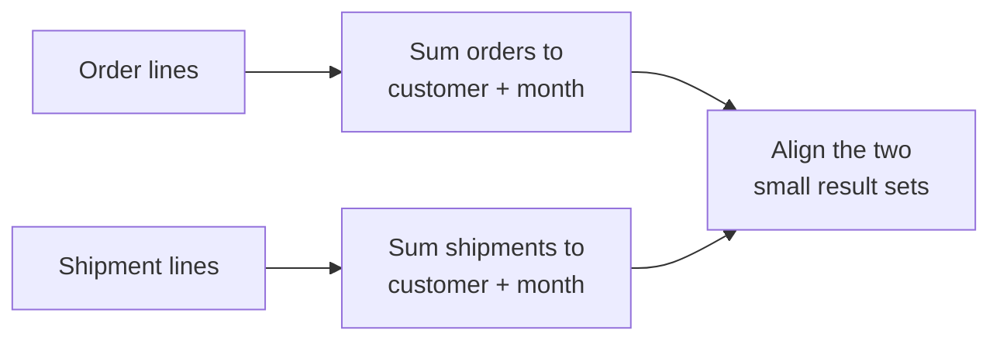
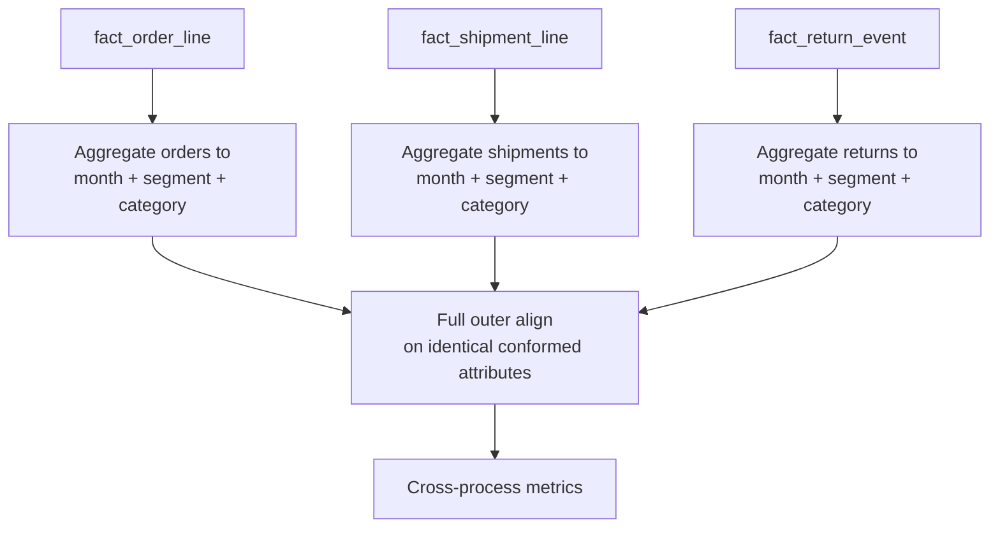
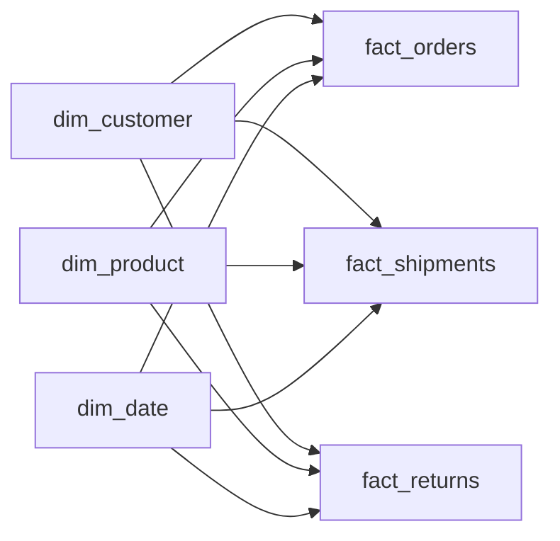
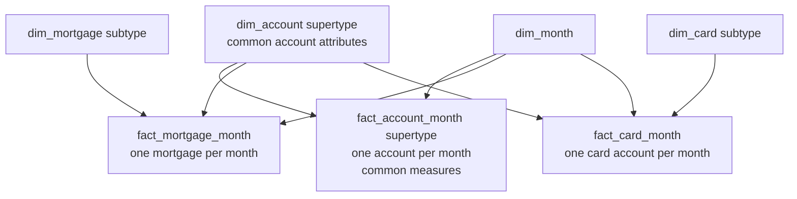

# Multi-Process and Heterogeneous Models

Orders, shipments, payments, returns, inventory balances, and forecasts are different business processes. Their rows occur at different times and represent different things. A good enterprise model lets users compare them without pretending that they share one universal grain.

This chapter covers two related situations:

1. combining metrics from several fact tables safely; and
2. modeling product families whose facts and attributes are very different. This second situation is often called **heterogeneous modeling**.

## Start with orders and shipments

Suppose one customer bought a keyboard in two order lines:

| Order line | Ordered amount |
|---|---:|
| 1 | EUR 60 |
| 2 | EUR 40 |

The warehouse shipped the order in three separate shipment lines:

| Shipment line | Shipped amount |
|---|---:|
| A | EUR 30 |
| B | EUR 30 |
| C | EUR 40 |

The correct total is EUR 100 ordered and EUR 100 shipped. If the two order rows are joined directly to the three shipment rows, SQL produces `2 × 3 = 6` combinations. Each amount repeats, and both totals become wrong.

The safe approach is:



This pattern is called **multipass drill-across**: calculate each process separately, then combine the results at one shared report grain.

## The problem

A team wants one report containing orders, shipments, returns, and payments by customer and month. Joining the atomic fact tables on customer and date is tempting, but each table contains several rows for the same customer-month. The join multiplies rows and inflates every measure.

In a second example, a bank tries to place mortgages, checking accounts, credit cards, and investments in one “universal account” table. Hundreds of columns are empty or mean different things for different products.

Both failures come from ignoring business-process and grain boundaries.

## The basic rules

**Keep one process and one grain in each atomic fact table. Combine processes only after summarizing each one to the same agreed report grain.**

For different product types: **share only what is genuinely common, and model the rest separately.**

## Grain

Example grains:

- Order fact: one row per order line.
- Shipment fact: one row per shipment line.
- Return fact: one row per returned item event.
- Payment fact: one row per payment transaction.
- Monthly account snapshot: one row per account per month end.
- Mortgage subtype snapshot: one row per mortgage account per month end.

These tables do not become safe to join merely because they all contain customer, product, and date keys. Their rows still mean different things.

## Why direct fact-to-fact joins fail

The row multiplication grows quickly. Suppose one customer-product-month has:

- 3 order lines;
- 2 shipment lines;
- 2 return events.

Joining the facts on customer, product, and month produces up to `3 × 2 × 2 = 12` rows before aggregation. Every order repeats for each shipment and return. Every shipment repeats for each order and return.

This direct fact-to-fact join is unsafe:

```sql
-- Wrong: many-to-many multiplication between facts
select ...
from fact_order_line o
join fact_shipment_line s
  on o.customer_key = s.customer_key
 and o.product_key = s.product_key
join fact_return_event r
  on o.customer_key = r.customer_key
 and o.product_key = r.product_key;
```

Declaring a relationship between the tables does not fix the row multiplication. A fast query can still return wrong totals.

## Multipass drill-across: aggregate first, align second

### The problem it solves

Users need measures from different processes in one report, but the atomic rows cannot be joined safely.

### The rule

**Aggregate first, align second.**

### Result grain

Before writing SQL, say exactly what one final report row means:

> One result row represents one calendar month, customer segment, and product category.

Each process query must return at most one row at that exact grain. In other words, orders, shipments, and returns are each summarized independently before the results are joined.

### Model



### SQL pattern

```sql
with orders as (
    select
        d.calendar_year_month,
        c.customer_segment,
        p.product_category,
        sum(o.net_order_amount) as ordered_amount
    from fact_order_line o
    join dim_date d     on d.date_key = o.order_date_key
    join dim_customer c on c.customer_key = o.customer_key
    join dim_product p  on p.product_key = o.product_key
    group by 1, 2, 3
),
shipments as (
    select
        d.calendar_year_month,
        c.customer_segment,
        p.product_category,
        sum(s.shipped_amount) as shipped_amount
    from fact_shipment_line s
    join dim_date d     on d.date_key = s.ship_date_key
    join dim_customer c on c.customer_key = s.customer_key
    join dim_product p  on p.product_key = s.product_key
    group by 1, 2, 3
),
returns as (
    select
        d.calendar_year_month,
        c.customer_segment,
        p.product_category,
        sum(r.return_amount) as return_amount
    from fact_return_event r
    join dim_date d     on d.date_key = r.return_date_key
    join dim_customer c on c.customer_key = r.customer_key
    join dim_product p  on p.product_key = r.product_key
    group by 1, 2, 3
)
select
    coalesce(o.calendar_year_month, s.calendar_year_month, r.calendar_year_month)
        as calendar_year_month,
    coalesce(o.customer_segment, s.customer_segment, r.customer_segment)
        as customer_segment,
    coalesce(o.product_category, s.product_category, r.product_category)
        as product_category,
    o.ordered_amount,
    s.shipped_amount,
    r.return_amount
from orders o
full outer join shipments s
  on s.calendar_year_month = o.calendar_year_month
 and s.customer_segment = o.customer_segment
 and s.product_category = o.product_category
full outer join returns r
  on r.calendar_year_month = coalesce(o.calendar_year_month, s.calendar_year_month)
 and r.customer_segment = coalesce(o.customer_segment, s.customer_segment)
 and r.product_category = coalesce(o.product_category, s.product_category);
```

A semantic engine may generate shorter SQL. The rule stays the same: aggregate each fact independently, then align the small results on identical conformed attributes.

### Why full outer alignment matters

One process may have activity when another does not. An inner join would hide a category that had returns but no new orders, or orders that have not shipped yet. A full outer join keeps every process result. The metric definition then decides whether a missing value means zero, unknown, or not applicable.

### Date roles must be explicit

The example compares activity that occurred in each month: January orders with January shipments and January returns. It does **not** follow January's orders through their later lifecycle. To ask “How much of January's orders eventually shipped or returned?”, the model needs an order lineage key or an accumulating process model. A shared month label does not prove that two rows describe the same order.

## When drill-across is safe

Check all of the following before aligning results:

- row headers come from conformed dimensions or shrunken conformed rollups;
- every pass uses identical attribute definitions and domain values;
- facts are aggregated to the same result grain;
- measures retain their own additivity rules;
- currency, units, status filters, and date roles are compatible;
- missing-process rows have a governed interpretation.

For example, a customer segment that always shows today's value in one process cannot safely align with an event-time historical segment in another. The teams must first agree which view of history the report uses.

## Cross-process calculations

Calculate ratios only after the numerator and denominator have been aligned safely:

- return rate = returned quantity / shipped quantity;
- fulfillment rate = shipped quantity / ordered quantity;
- learning completion per active user = completions / active-user count.

Keep the numerator and denominator. Do not sum precomputed ratios or join atomic facts to calculate them.

For example, if the monthly aligned results contain 90 shipped items and 9 returned items, the return rate is `9 / 90 = 10%`. Calculating a percentage on every atomic row and then adding the percentages would be meaningless.

Different date roles can make a mathematically correct ratio misleading. State whether the numerator and denominator compare activity in the same period, one cohort over time, or the same lifecycle instances.

## Fact constellations

A group of process-specific stars that share conformed dimensions is called a **fact constellation**. It is not one giant fact table:



Each star remains understandable and can scale independently. Shared dimensions let users compare their summarized results.

## Consolidated fact tables

### When consolidation can work

A **consolidated fact** stores measurements together only when they can use the same declared grain and dimensional context.

Example:

> One row represents one legal entity, account, cost center, and fiscal month.

Actual, budget, and forecast amounts may share that grain if a scenario dimension distinguishes them and all measures use the same accounting definitions. A consolidated table can simplify variance analysis.

### Conditions

- identical or deliberately compatible grain;
- common conformed dimensions;
- compatible units, currencies, and sign conventions;
- a clear scenario/source/process dimension;
- no loss of process-specific detail;
- reconcilable lineage to atomic facts.

### When not to consolidate

Do not combine order lines, shipment lines, and payment transactions merely because all have amounts. Do not fill a wide table with measures that are valid only for some row types while presenting them as one process. Keep atomic facts and drill across.

A consolidated performance table is usually a convenient derived table, not the original source of truth. It should be rebuildable from governed atomic facts.

## When one process has less detail

Actual sales may be daily by SKU and store, while the forecast is monthly by brand and region. A SKU-day comparison is impossible because the forecast does not contain SKU or day detail.

Safe approach:

1. Aggregate actuals to brand-region-month.
2. Use shrunken brand, region, and month dimensions for forecast.
3. Align results at brand-region-month.
4. Make the loss of atomic detail visible.

Do not invent SKU-day forecast detail unless the business approves an allocation model. Allocated values are modeled estimates, so store the method and version and verify that they add back to the original forecast.

## Different product types: share the common part

### The problem

Products may share an enterprise identity but have incompatible attributes and measures:

- checking accounts: overdraft limit, debit transactions, average balance;
- mortgages: interest rate, remaining principal, loan-to-value;
- credit cards: credit limit, utilization, delinquency status;
- investment accounts: market value, holdings, realized gain.

One universal table containing every possible attribute and measure becomes mostly empty, difficult to understand, and easy to misuse.

### The rule

**Model the intersection once; model each subtype at its natural grain.**

### Supertype and subtype pattern



Supertype fact grain:

> One row represents one account at one month end, with measures meaningful for every account type.

Subtype fact grain:

> One row represents one mortgage account at one month end, with mortgage-specific measures.

The shared, or **supertype**, fact supports portfolio-wide balances and account counts. The **subtype** facts support mortgage- or card-specific analysis without hundreds of meaningless empty columns.

### Shared identity

`dim_account` holds attributes that make sense for every account, such as account identifier, customer relationship, open date, branch, and account family. A subtype dimension adds attributes only for the relevant product. Its key must make the one-to-one subtype membership clear.

### Alternatives

| Situation | Reasonable approach |
|---|---|
| Few subtype attributes, most rows populated | One wide dimension with a clear type discriminator |
| Many stable subtype-specific attributes | Supertype plus subtype dimensions/facts |
| Open-ended sparse attributes used by specialists | Name-value or sparse-attribute bridge, hidden behind curated interfaces |
| Metrics share grain but not applicability | Separate facts or a carefully governed long measure model |
| Completely unrelated populations | Separate dimensions; do not force a generic supertype |

### Advanced: the generic entity trap

A generic `dim_party` containing employees, vendors, customers, instructors, and contacts may look elegant in an integration layer. In an analytical presentation model it often produces mostly null columns, vague labels, complex security, and incorrect assumptions about shared attributes.

Use domain-specific dimensions unless a shared analytical identity and attribute contract provide concrete value. A raw or Data Vault integration layer can remain more abstract while dimensional marts present business-specific views.

### Advanced: the generic measure trap

A long fact with columns `measure_type`, `measure_value`, and `unit` can handle hundreds of sparse measures, but it makes simple calculations, validation, and aggregation harder. Use it only when the measure set is genuinely extreme and open-ended. Prefer named fact columns or subtype facts for stable, important measures.

## Multiple source systems for one process

Heterogeneity can also be technical rather than product-driven. Several countries may run different order systems while representing the same order-line process.

Consolidate into one conformed atomic fact when:

- grain is identical;
- source keys are namespaced;
- dimensions resolve to shared enterprise keys;
- measures and statuses are mapped to common definitions;
- a source-system dimension or lineage column preserves provenance;
- reconciliation remains possible by source.

If source semantics cannot be reconciled, keep separate facts and drill across only on the subset that conforms.

## When to use multipass drill-across

- Measures come from different business processes or fact types.
- Atomic grains differ.
- Conformed dimensions provide common result headers.
- Users need comparison, not row-level causal matching.

## When not to use it

- The requirement is to follow one lifecycle instance; use a durable transaction identifier, event lineage, or accumulating snapshot.
- One process is simply a header and line representation of the same event; model the atomic line grain and allocate header facts where appropriate.
- Result headers are not conformed.
- The requested comparison implies detail that one process does not possess.

## Common mistakes

- Directly joining fact tables across shared foreign keys.
- Aggregating after the fact-to-fact join rather than before it.
- Aligning results on labels whose definitions or SCD perspectives differ.
- Using an inner join and losing activity present in only one process.
- Comparing order month with shipment month without explaining the time basis.
- Combining several processes in one sparse fact table with mixed grain.
- Allocating forecasts or header facts without a governed allocation rule.
- Building a universal product or person dimension whose attributes are mostly inapplicable.
- Calling measures conformed because they share a name.
- Publishing a generic measure-value table for a small, stable metric set.
- Treating a consolidated fact as the only auditable source and losing lineage to atomic facts.

## Tradeoffs

| Approach | Strength | Cost |
|---|---|---|
| Separate stars plus drill-across | Correct atomic detail and modular delivery | Multipass queries and semantic coordination |
| Consolidated fact | Simple common-grain comparison | Extra pipeline, possible loss of detail, reconciliation burden |
| Universal sparse fact/dimension | One apparent structure | Ambiguous semantics, nulls, invalid comparisons |
| Supertype plus subtypes | Shared portfolio view plus rich specialty models | More tables and navigation choices |

## Optional: modern implementation notes

- **Semantic layers:** multi-fact planners can generate multipass queries, but only if relationships, grains, and conformed entities are declared correctly. Review generated SQL for atomic fact joins.
- **dbt-style projects:** build one model per atomic process, then explicit aggregate models at a named common grain. Test uniqueness of every aggregate's row headers before joining them.
- **Lakehouses:** storage formats make wide sparse tables technically possible; they do not make measures semantically compatible. Separate process contracts remain valuable.
- **SAP HANA:** calculation views can combine multiple fact sources, but aggregation must occur within each fact branch before union or join at a compatible grain. Cardinality hints cannot repair a many-to-many fact join.
- **SAP Datasphere:** analytical models and associations should expose shared dimensions while retaining process-specific facts. A combined analytical model needs explicit measure exception aggregation and compatible dimensionality.
- **Performance:** materialize frequent cross-process aggregates after validating drill-across logic. Treat them as caches of governed computations, not a replacement for atomic models.

## What this changes at architecture level

- **Scalability:** each process can load, partition, and evolve independently.
- **Maintainability:** process ownership is clear, and shared contracts isolate change.
- **Correctness:** atomic measures cannot multiply through uncontrolled joins.
- **Usability:** users receive either a focused star or a governed cross-process semantic view.
- **Source independence:** heterogeneous systems map into common process contracts without exposing source schemas.
- **Governance:** incompatible facts and attributes remain visibly distinct instead of being hidden behind generic names.

## Beginner review checklist

- [ ] Does each atomic fact table contain one process at one declared grain?
- [ ] Are fact tables summarized separately before their results are joined?
- [ ] Does every pass return no more than one row at the final report grain?
- [ ] Are the aligned dimensions truly conformed, including their history rules?
- [ ] Are date roles and missing values explained?
- [ ] Does a consolidated fact preserve a genuinely common grain and unit?
- [ ] For different product types, are only truly common fields kept in the shared model?

## What to remember

1. Shared dimensions do not make atomic fact rows join-compatible.
2. Never perform an uncontrolled fact-to-fact join.
3. Drill across by aggregating each fact separately to identical conformed row headers, then aligning the results.
4. State the common result grain before writing the multipass query.
5. Consolidate facts only when grain, dimensionality, units, and definitions are compatible.
6. For heterogeneous products, share the true intersection and specialize subtype attributes and measures.
7. Modern query engines can automate multipass execution, but they cannot infer missing business semantics.

## Related patterns

- [Grain](../01-foundations/grain.md)
- [Measures and additivity](../01-foundations/measures.md)
- [Advanced fact designs](../02-fact-tables/advanced-fact-designs.md)
- [Conformance and bus architecture](conformance-and-bus-architecture.md)
- [Dimension patterns](../03-dimensions/dimension-patterns.md)
- [Semantic layers and governed metrics](../07-modern-architecture/semantic-layer-and-metrics.md)
