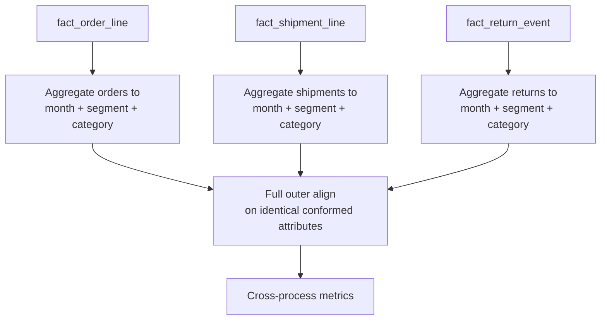
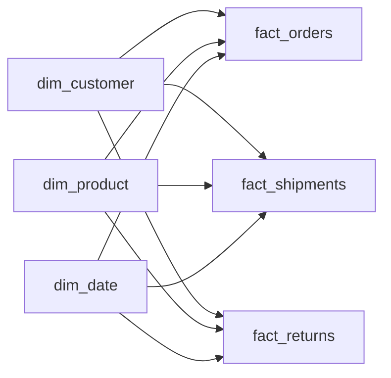
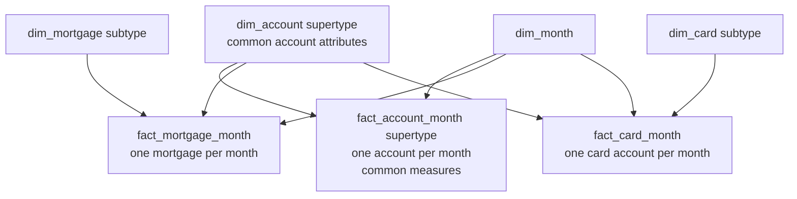

# Multi-Process and Heterogeneous Models

An enterprise does not have one universal measurement grain. Orders, shipments, payments, feature events, inventory balances, learning completions, and forecasts occur at different times and dimensionalities. Good enterprise modeling integrates them without pretending they are one process.

This chapter covers two related problems:

1. combining metrics from several fact tables safely; and
2. modeling product or process families whose facts and attributes differ substantially.

## The problem

A team wants one report containing orders, shipments, returns, and payments by customer and month. The tempting query joins all four fact tables on customer and date. Each table contains several rows for the same customer-month, so the join multiplies rows and inflates every measure.

Elsewhere, a bank tries to place mortgages, checking accounts, credit cards, and investments in one “universal account” table. Hundreds of columns are null or mean different things by product type.

Both failures come from ignoring business-process and grain boundaries.

## Mental model

**One process and one grain per atomic fact table. Integrate across facts only after each has been summarized to the same conformed row headers.**

For heterogeneity:

**Share the true intersection; specialize the rest.**

## Grain

Example grains:

- Order fact: one row per order line.
- Shipment fact: one row per shipment line.
- Return fact: one row per returned item event.
- Payment fact: one row per payment transaction.
- Monthly account snapshot: one row per account per month end.
- Mortgage subtype snapshot: one row per mortgage account per month end.

None becomes compatible merely because all contain customer, product, and date keys.

## Why direct fact-to-fact joins fail

Suppose one customer-product-month has:

- 3 order lines;
- 2 shipment lines;
- 2 return events.

Joining the facts on customer, product, and month produces up to 3 × 2 × 2 = 12 combinations before aggregation. Order amounts repeat for each shipment and return; shipment amounts repeat for each order and return.

This query is uncontrolled and prohibited in a dimensional presentation model:

```sql
-- Wrong: many-to-many multiplication between facts
select ...
from fact_order_line o
join fact_shipment_line s
  on o.customer_key = s.customer_key
 and o.product_key = s.product_key
join fact_return_event r
  on o.customer_key = r.customer_key
 and o.product_key = r.product_key;
```

A declared relationship between two facts does not make the row multiplication valid. Even a database that executes the join quickly returns the wrong totals.

## Multipass drill-across

### The problem it solves

Users need measures from different processes in one report without combining their atomic rows.

### Mental model

**Aggregate first, align second.**

### Result grain

Before writing SQL, declare the common report grain:

> One result row represents one calendar month, customer segment, and product category.

Every pass must return at most one row at that exact grain.

### Model



### SQL pattern

```sql
with orders as (
    select
        d.calendar_year_month,
        c.customer_segment,
        p.product_category,
        sum(o.net_order_amount) as ordered_amount
    from fact_order_line o
    join dim_date d     on d.date_key = o.order_date_key
    join dim_customer c on c.customer_key = o.customer_key
    join dim_product p  on p.product_key = o.product_key
    group by 1, 2, 3
),
shipments as (
    select
        d.calendar_year_month,
        c.customer_segment,
        p.product_category,
        sum(s.shipped_amount) as shipped_amount
    from fact_shipment_line s
    join dim_date d     on d.date_key = s.ship_date_key
    join dim_customer c on c.customer_key = s.customer_key
    join dim_product p  on p.product_key = s.product_key
    group by 1, 2, 3
),
returns as (
    select
        d.calendar_year_month,
        c.customer_segment,
        p.product_category,
        sum(r.return_amount) as return_amount
    from fact_return_event r
    join dim_date d     on d.date_key = r.return_date_key
    join dim_customer c on c.customer_key = r.customer_key
    join dim_product p  on p.product_key = r.product_key
    group by 1, 2, 3
)
select
    coalesce(o.calendar_year_month, s.calendar_year_month, r.calendar_year_month)
        as calendar_year_month,
    coalesce(o.customer_segment, s.customer_segment, r.customer_segment)
        as customer_segment,
    coalesce(o.product_category, s.product_category, r.product_category)
        as product_category,
    o.ordered_amount,
    s.shipped_amount,
    r.return_amount
from orders o
full outer join shipments s
  on s.calendar_year_month = o.calendar_year_month
 and s.customer_segment = o.customer_segment
 and s.product_category = o.product_category
full outer join returns r
  on r.calendar_year_month = coalesce(o.calendar_year_month, s.calendar_year_month)
 and r.customer_segment = coalesce(o.customer_segment, s.customer_segment)
 and r.product_category = coalesce(o.product_category, s.product_category);
```

The exact syntax can be simplified by a semantic engine or a generated conformed scaffold. The invariant is more important than the syntax: each fact is aggregated independently, then result sets are aligned on identical conformed attributes.

### Why full outer alignment matters

One process may have activity when another does not. An inner join would hide categories with returns but no new orders, or orders not yet shipped. A full outer alignment preserves every process result; metric definitions then decide whether missing values display as zero, null, or not applicable.

### Date roles must be explicit

The example compares order month, ship month, and return month. That is a valid operational flow view, but it is not a cohort view of the same original orders. If the question is “How much of January's orders eventually shipped or returned?”, the model needs an order lineage key or accumulating process model. Conformed calendar labels alone do not establish causal identity.

## Preconditions for drill-across

Drill-across is safe only when:

- row headers come from conformed dimensions or shrunken conformed rollups;
- every pass uses identical attribute definitions and domain values;
- facts are aggregated to the same result grain;
- measures retain their own additivity rules;
- currency, units, status filters, and date roles are compatible;
- missing-process rows have a governed interpretation.

If customer segment is Type 1 in one process and event-time Type 2 in another, it is not a conformed row header until the historical perspective is reconciled.

## Cross-process calculations

Compute ratios only after safe alignment:

- return rate = returned quantity / shipped quantity;
- fulfillment rate = shipped quantity / ordered quantity;
- learning completion per active user = completions / active-user count.

Preserve numerators and denominators. Do not sum precomputed process ratios or join atomic facts to calculate them.

Different date roles or lags can make a ratio analytically misleading even if SQL is correct. Document whether the numerator and denominator are activity-period, cohort, or lifecycle aligned.

## Fact constellations

A set of process-specific stars sharing conformed dimensions is sometimes called a fact constellation. It is not a single giant schema:



Each star remains understandable and independently scalable. Shared dimensions make the constellation coherent.

## Consolidated fact tables

### When consolidation can work

A consolidated fact combines measurements from different sources or process variants only when they can be expressed at the same declared grain and dimensional context.

Example:

> One row represents one legal entity, account, cost center, and fiscal month.

Actual, budget, and forecast amounts may share that grain if a scenario dimension distinguishes them and all measures use the same accounting definitions. A consolidated table can simplify variance analysis.

### Conditions

- identical or deliberately compatible grain;
- common conformed dimensions;
- compatible units, currencies, and sign conventions;
- a clear scenario/source/process dimension;
- no loss of process-specific detail;
- reconciliable lineage to atomic facts.

### When not to consolidate

Do not combine order lines, shipment lines, and payment transactions merely because all have amounts. Do not fill a wide table with measures that are valid only for some row types while presenting them as one process. Keep atomic facts and drill across.

A consolidated performance table is often a derived serving optimization, not the system of record. Rebuild it from governed atomic facts.

## Different fact granularities

Actual sales may be daily by SKU and store, while forecast is monthly by brand and region. Drill-across at SKU-day is impossible because forecast has no such detail.

Safe approach:

1. Aggregate actuals to brand-region-month.
2. Use shrunken brand, region, and month dimensions for forecast.
3. Align results at brand-region-month.
4. Make the loss of atomic detail visible.

Never allocate a high-level forecast to SKU-day unless the business approves an allocation model. An allocation creates modeled facts, which need a method/version dimension and reconciliation to the original total.

## Heterogeneous products and processes

### The problem

Products may share an enterprise identity but have incompatible attributes and measures:

- checking accounts: overdraft limit, debit transactions, average balance;
- mortgages: interest rate, remaining principal, loan-to-value;
- credit cards: credit limit, utilization, delinquency status;
- investment accounts: market value, holdings, realized gain.

A universal table containing the union of every attribute and measure becomes sparse, confusing, and vulnerable to invalid comparisons.

### Mental model

**Model the intersection once; model each subtype at its natural grain.**

### Supertype and subtype pattern



Supertype fact grain:

> One row represents one account at one month end, with measures meaningful for every account type.

Subtype fact grain:

> One row represents one mortgage account at one month end, with mortgage-specific measures.

The supertype supports portfolio-wide balance and account counts. Subtype facts support specialized analysis without hundreds of meaningless null columns.

### Shared identity

`dim_account` holds common attributes such as account identifier, customer relationship, open date, branch, and account family. A subtype dimension extends only the relevant population. Keys and joins must make subtype membership unambiguous and one-to-one at the subtype entity grain.

### Alternatives

| Situation | Reasonable approach |
|---|---|
| Few subtype attributes, most rows populated | One wide dimension with a clear type discriminator |
| Many stable subtype-specific attributes | Supertype plus subtype dimensions/facts |
| Open-ended sparse attributes used by specialists | Name-value or sparse-attribute bridge, hidden behind curated interfaces |
| Metrics share grain but not applicability | Separate facts or a carefully governed long measure model |
| Completely unrelated populations | Separate dimensions; do not force a generic supertype |

### The generic entity trap

A generic `dim_party` containing employees, vendors, customers, instructors, and contacts may look elegant in an integration layer. In an analytical presentation model it often produces mostly null columns, vague labels, complex security, and incorrect assumptions about shared attributes.

Use domain-specific dimensions unless a shared analytical identity and attribute contract provide concrete value. A raw or Data Vault integration layer can remain more abstract while dimensional marts present business-specific views.

### The generic measure trap

A long fact with columns `measure_type`, `measure_value`, and `unit` can handle hundreds of sparse measures, but it makes simple calculations, validation, and aggregation harder. Use it only when the measure set is genuinely extreme and open-ended. Prefer named fact columns or subtype facts for stable, important measures.

## Multiple source systems for one process

Heterogeneity can also be technical rather than product-driven. Several countries may run different order systems while representing the same order-line process.

Consolidate into one conformed atomic fact when:

- grain is identical;
- source keys are namespaced;
- dimensions resolve to shared enterprise keys;
- measures and statuses are mapped to common definitions;
- a source-system dimension or lineage column preserves provenance;
- reconciliation remains possible by source.

If source semantics cannot be reconciled, keep separate facts and drill across only on the subset that conforms.

## When to use multipass drill-across

- Measures come from different business processes or fact types.
- Atomic grains differ.
- Conformed dimensions provide common result headers.
- Users need comparison, not row-level causal matching.

## When not to use it

- The requirement is to follow one lifecycle instance; use a durable transaction identifier, event lineage, or accumulating snapshot.
- One process is simply a header and line representation of the same event; model the atomic line grain and allocate header facts where appropriate.
- Result headers are not conformed.
- The requested comparison implies detail that one process does not possess.

## Common mistakes

- Directly joining fact tables across shared foreign keys.
- Aggregating after the fact-to-fact join rather than before it.
- Aligning results on labels whose definitions or SCD perspectives differ.
- Using an inner join and losing activity present in only one process.
- Comparing order month with shipment month without explaining the time basis.
- Combining several processes in one sparse fact table with mixed grain.
- Allocating forecasts or header facts without a governed allocation rule.
- Building a universal product or person dimension whose attributes are mostly inapplicable.
- Calling measures conformed because they share a name.
- Publishing a generic measure-value table for a small, stable metric set.
- Treating a consolidated fact as the only auditable source and losing lineage to atomic facts.

## Tradeoffs

| Approach | Strength | Cost |
|---|---|---|
| Separate stars plus drill-across | Correct atomic detail and modular delivery | Multipass queries and semantic coordination |
| Consolidated fact | Simple common-grain comparison | Extra pipeline, possible loss of detail, reconciliation burden |
| Universal sparse fact/dimension | One apparent structure | Ambiguous semantics, nulls, invalid comparisons |
| Supertype plus subtypes | Shared portfolio view plus rich specialty models | More tables and navigation choices |

## Modern implementation notes

- **Semantic layers:** multi-fact planners can generate multipass queries, but only if relationships, grains, and conformed entities are declared correctly. Review generated SQL for atomic fact joins.
- **dbt-style projects:** build one model per atomic process, then explicit aggregate models at a named common grain. Test uniqueness of every aggregate's row headers before joining them.
- **Lakehouses:** storage formats make wide sparse tables technically possible; they do not make measures semantically compatible. Separate process contracts remain valuable.
- **SAP HANA:** calculation views can combine multiple fact sources, but aggregation must occur within each fact branch before union or join at a compatible grain. Cardinality hints cannot repair a many-to-many fact join.
- **SAP Datasphere:** analytical models and associations should expose shared dimensions while retaining process-specific facts. A combined analytical model needs explicit measure exception aggregation and compatible dimensionality.
- **Performance:** materialize frequent cross-process aggregates after validating drill-across logic. Treat them as caches of governed computations, not a replacement for atomic models.

## Architectural consequences

- **Scalability:** each process can load, partition, and evolve independently.
- **Maintainability:** process ownership is clear, and shared contracts isolate change.
- **Correctness:** atomic measures cannot multiply through uncontrolled joins.
- **Usability:** users receive either a focused star or a governed cross-process semantic view.
- **Source independence:** heterogeneous systems map into common process contracts without exposing source schemas.
- **Governance:** incompatible facts and attributes remain visibly distinct instead of being hidden behind generic names.

## What to remember

1. Shared dimensions do not make atomic fact rows join-compatible.
2. Never perform an uncontrolled fact-to-fact join.
3. Drill across by aggregating each fact separately to identical conformed row headers, then aligning the results.
4. State the common result grain before writing the multipass query.
5. Consolidate facts only when grain, dimensionality, units, and definitions are compatible.
6. For heterogeneous products, share the true intersection and specialize subtype attributes and measures.
7. Modern query engines can automate multipass execution, but they cannot infer missing business semantics.

## Related patterns

- [Grain](../01-foundations/grain.md)
- [Measures and additivity](../01-foundations/measures.md)
- [Advanced fact designs](../02-fact-tables/advanced-fact-designs.md)
- [Conformance and bus architecture](conformance-and-bus-architecture.md)
- [Dimension patterns](../03-dimensions/dimension-patterns.md)
- [Semantic layers and governed metrics](../07-modern-architecture/semantic-layer-and-metrics.md)
