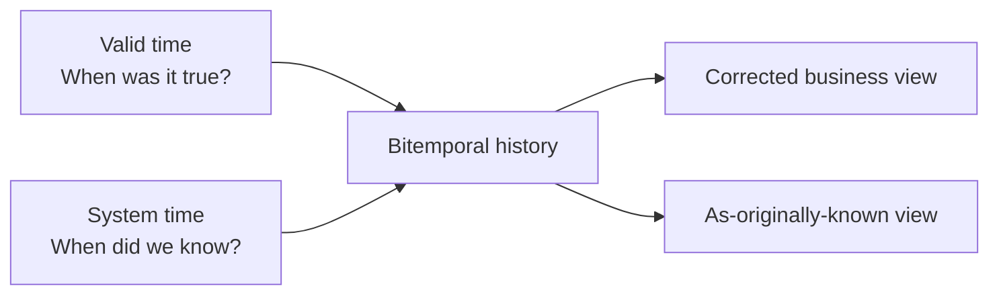

# Event, State, and Temporal Modeling

## Start with a support ticket

Imagine ticket `T-17`:

```text
09:00  ticket opened
09:15  assigned to Ana
11:30  status changed to resolved
```

The same ticket can be represented in several useful ways:

| Question | Useful row design |
|---|---|
| What happened, and in what order? | One row per ticket event |
| What is the ticket's status now? | One current row for the ticket |
| How many tickets were open at each day end? | One snapshot row per ticket per day |
| What status was valid at 10:00? | One row per continuous status interval |

The ticket example illustrates events and state. A third question appears when late corrections arrive: what did the warehouse believe before it received the correction? This chapter therefore distinguishes three kinds of time-related question:

1. **What happened?** — events.
2. **What was the state at a point or period?** — snapshots or intervals.
3. **What did we believe at the time?** — system-time history.

These questions sound similar, but they need different rows. None of the designs is universally “best.” Each answers a different question.

> Events say what changed. State says what was true at a moment. Temporal metadata says when a statement was true and when the platform knew it.

The formal terms in this chapter build on Kimball's transaction facts, periodic snapshots, accumulating snapshots, Type 2 dimensions, and timespan facts. The later bitemporal section adds a more advanced modern framework.

## Event modeling

An **event** records something that happened at a particular business time.

### Grain

> **One row represents one occurrence of one defined event type.**

Examples:

- one user started one course enrollment;
- one payment was authorized;
- one employee changed position;
- one subscription quantity was amended.

```text
fact_subscription_event
  subscription_event_id
  account_key
  subscription_key
  event_date_key
  event_timestamp_utc
  event_type_key
  quantity_delta
  amount_delta
```

Events are usually appended rather than overwritten. They preserve sequence and provide a strong audit trail. The tradeoff is that “what is true now?” must be calculated by ordering and interpreting the events, including corrections.

### Use events when

- sequence, funnels, cohorts, or behavior matters;
- auditability and replay matter;
- changes occur irregularly;
- future analyses may require detail that a snapshot would discard.

### Important cautions

Do not assume that:

- an arrival timestamp is the business event timestamp;
- events arrive in order;
- every event is unique because the transport assigned a message ID;
- summing deltas always yields state when events can be corrected or deleted.

## Current-state modeling

A **current-state table** keeps only the latest accepted version of an entity.

### Grain

> **One row represents the current known state of one entity.**

Examples: one row per active subscription, one row per current employee assignment, or one row per support ticket.

Current-state models are simple and fast for questions such as “which accounts are active now?” After a value is overwritten, however, the table cannot say what it was last quarter.

A Type 1 dimension is a current-state pattern for descriptive attributes. An accumulating snapshot is current pipeline state for a lifecycle. Neither preserves every prior state by itself.

## Derived state

Current or historical state can sometimes be calculated by applying all events up to a chosen time:

```text
state(entity, t) = initial_state + ordered_effect(events where event_time <= t)
```

This works when the event history and its rules are complete and stable. It becomes difficult when:

- the source omits events or changes their meaning;
- corrections cancel or replace prior events;
- ordering ties are ambiguous;
- derivation logic evolves;
- replaying years of events is expensive.

A common design keeps events as the durable history and builds current-state and periodic-snapshot tables for easier, faster reporting.

## Snapshot state

### Periodic snapshot

> **One row represents one entity's state at one standard period boundary.**

It takes regular “photos” of the state: daily balances, monthly headcount, or weekly active subscriptions. It writes a row at every scheduled boundary even when nothing changed.

### Timespan state

> **One row represents one state that remained valid for one continuous interval.**

```text
account_status_history
  account_key
  status_key
  valid_from
  valid_to
  is_current
```

This design avoids copying the same unchanged state every day. To find the state at one time, a query must check which interval contains that time. The intervals must not overlap accidentally.

### Accumulating snapshot

> **One row represents one lifecycle instance in its latest known milestone state.**

Milestone dates sit side by side, which makes lifecycle analysis convenient. Because later updates overwrite the same row, it is not a complete history. Pair it with events or historical snapshots when users need to reconstruct what the pipeline looked like in the past.

## Choosing event, state, or both

| Requirement | Primary model | Why |
|---|---|---|
| Count and sequence individual interactions | Transaction event fact | Retains each occurrence |
| Show today's active subscription attributes | Current-state table or Type 1 view | Direct lookup |
| Trend month-end active seats | Periodic snapshot | Stable, comparable observation points |
| Show current order fulfillment milestones | Accumulating snapshot | Milestones side by side |
| Reproduce order status at any instant | Events or timespan state | Preserves transitions/intervals |
| Explain both activity and resulting state | Event fact plus snapshot/state model | Different questions require different grains |

Do not force one table to answer all of these questions. A ticket event and a daily ticket-state row have different grains even though both contain the same ticket ID.

## Valid time and system time

Suppose an employee moved departments on March 15, but HR sent the correction to the warehouse on March 20:

| Time | Meaning |
|---|---|
| March 15 | The transfer became true in the business |
| March 20 | The warehouse learned about the transfer |

March 15 belongs to **valid time**. March 20 belongs to **system time**.

### Valid time

**Valid time** answers:

> When was this statement true in the business domain?

Examples:

- an employee belonged to Department A from January 1 until March 15;
- a product price applied from 09:00 until 17:00;
- an account balance is the closing state for June 30.

Common columns are `valid_from` and `valid_to`. A common rule includes the start but excludes the end: `[valid_from, valid_to)`. This lets one version end exactly when the next one begins.

### System time

**System time** answers:

> When did this platform store or believe this version?

Examples:

- the March 15 transfer was first loaded on March 20;
- a correction was accepted on April 3;
- a row was superseded during pipeline run 8142.

Common columns are `recorded_from` and `recorded_to`, or unchangeable ingestion and replacement timestamps.

### Advanced: bitemporal modeling

**Bitemporal** data keeps both timelines. It can answer “what is our best current understanding of March 15?” and “what did the March 18 report show?”

```text
employee_department_history
  employee_durable_key
  department_key
  valid_from       -- business truth begins
  valid_to         -- business truth ends
  recorded_from    -- warehouse knew this version from
  recorded_to      -- warehouse stopped believing this version
```

One correction can create several rows because the platform retains both the corrected business history and the earlier version it once believed.



Bitemporal modeling is valuable when users need both corrected history and an exact reproduction of an earlier publication. It is unnecessary when the subject needs only current attributes or ordinary Type 2 history.

## Advanced: why SCD Type 2 is not automatically bitemporal

A typical Type 2 dimension stores business-effective intervals. If a late correction rebuilds those rows and discards the versions that the warehouse previously believed, users can query only one timeline.

To claim bitemporal support, the design must preserve:

- the business-valid interval;
- the system-recorded interval;
- prior assertions after correction;
- query semantics for both “as valid” and “as known.”

Two timestamp columns do not make a table bitemporal. If overwritten rows cannot be reconstructed, it does not preserve system-time history.

## Point-in-time joins

A point-in-time join asks: “which version was valid when this event happened?” For example, an event at 10:30 should join the employee version whose interval contains 10:30:

```sql
select ...
from fact_event f
join dim_employee_version d
  on d.employee_durable_key = f.employee_durable_key
 and f.event_ts >= d.valid_from
 and f.event_ts <  d.valid_to;
```

In a conventional star, perform this lookup in the data pipeline and store the selected `employee_sk` on the fact. Query-time range joins make sense when users intentionally explore interval history, but they are easier to get wrong and can cost more to run.

For the advanced bitemporal case, add a second condition for what the warehouse knew at the requested time:

```sql
and :as_known_at >= d.recorded_from
and :as_known_at <  d.recorded_to
```

Test every interval table for overlaps, exact boundaries, and any unexpected gaps.

## Example: learning enrollment

Suppose an enrollment produces events:

```text
2026-01-03 enrolled
2026-01-05 first_activity
2026-01-20 completed
```

Useful projections are:

- `fact_learning_event`: one row per event — sequence and audit;
- `fact_enrollment_pipeline`: one row per enrollment attempt — current milestones and elapsed days;
- `fact_enrollment_daily_snapshot`: one row per open enrollment per day — historical backlog and aging;
- `dim_user` Type 2: one row per user profile version — department/region history.

These tables contain related data, but they are not duplicates. Each row means something different and answers a different question.

If the completion arrives late, resolve the user's dimension version at completion event time and apply the published restatement policy. See [Late-arriving data](late-arriving-data.md).

## Common mistakes

- Keeping only current state, then promising historical reporting.
- Treating a periodic snapshot as an event log.
- Reconstructing state from incomplete events without reconciliation.
- Storing both events and state but giving them the same table name and undocumented semantics.
- Using load time for business validity.
- Allowing valid-time intervals to overlap for the same durable entity.
- Calling a table bitemporal because it has two timestamp columns.
- Joining interval history at query time without a single as-of parameter.
- Summing state snapshots across time.

## Tradeoffs

| Model | Storage | Write pattern | Query simplicity | Historical power |
|---|---:|---|---|---|
| Current state | Low | Update | Very high for “now” | None unless source retains it |
| Events | Proportional to changes | Append/correct | State queries require logic | Full sequence when events are complete |
| Periodic snapshots | Proportional to entities × periods | Append each period | Excellent for trends | Sampled state only |
| Timespan state | Proportional to changes | Close/open intervals | Range joins | Continuous valid-state history |
| Bitemporal | Highest | Version both axes | Most complex | Valid and known-at-the-time reconstruction |

## Optional: modern implementation notes

- Event streaming does not remove the need for dimensional models; it changes arrival mechanics. Consumers still need stable business grain, dimensions, and metric definitions.
- Lakehouse table versions provide storage-level time travel, not automatically business valid time. Retention limits and table rewrites may also make them unsuitable as the only audit design.
- CDC describes row changes in a source database. Those changes are not necessarily business events and may need interpretation before entering a transaction fact.
- A semantic layer can expose safe “as of” parameters or current views, but it should not conceal which temporal question a metric answers.
- SAP Datasphere time-dependent dimensions and HANA validity logic can implement interval semantics; document whether the model returns current, event-time, or as-known attributes.

## Beginner review checklist

- [ ] Am I answering “what happened?”, “what was the state?”, or “what did we know?”
- [ ] Can I explain exactly what one row represents?
- [ ] Are business event time and processing time stored separately?
- [ ] If I need trends, have I chosen a suitable snapshot boundary?
- [ ] Do time intervals avoid overlaps and handle exact boundaries consistently?
- [ ] Do I genuinely need both valid-time and system-time history?
- [ ] Are state measures protected from accidental summing across time?

## Related patterns

- [Fact-table patterns](../02-fact-tables/fact-table-patterns.md)
- [Slowly changing dimensions](../03-dimensions/slowly-changing-dimensions.md)
- [Late-arriving data](late-arriving-data.md)
- [Reliable implementation](../07-modern-architecture/reliable-implementation.md)

## What to remember

1. Events, current state, sampled state, and interval state answer different questions and require different grains.
2. Event time says when something happened; processing time says when the platform handled it.
3. Valid time models business truth; system time models what the platform knew and when.
4. Type 2 history is not automatically bitemporal.
5. Keep events as a durable foundation when audit and replay matter; materialize state for usability where justified.
6. Choose the least complex temporal model that satisfies the actual reconstruction requirement.
