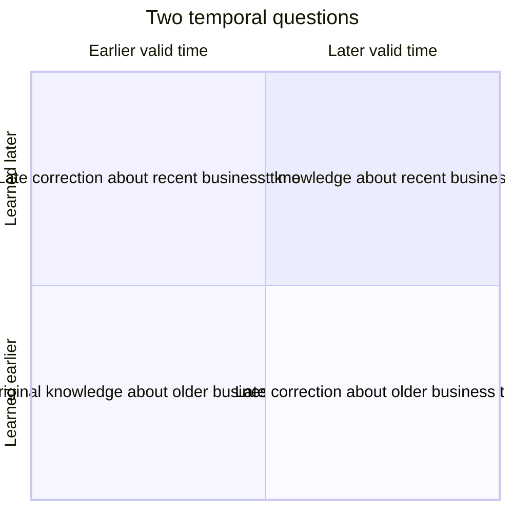

# Event, State, and Temporal Modeling

Analytical systems answer three different kinds of question:

1. **What happened?** — events.
2. **What was the state at a point or period?** — snapshots or intervals.
3. **What did we believe at the time?** — system-time history.

Confusing these questions is a common cause of tables that are technically queryable but semantically unreliable.

> Events explain change. State describes a moment. Temporal metadata says when each statement was valid or known.

The formal terms in this chapter are a modern synthesis. Kimball's transaction facts, periodic snapshots, accumulating snapshots, Type 2 dimensions, and timespan facts provide many of the underlying structures, but the book does not present a complete formal bitemporal framework.

## Event modeling

An event is an occurrence with business identity and time.

### Grain

> **One row represents one occurrence of one defined event type.**

Examples:

- one user started one course enrollment;
- one payment was authorized;
- one employee changed position;
- one subscription quantity was amended.

```text
fact_subscription_event
  subscription_event_id
  account_key
  subscription_key
  event_date_key
  event_timestamp_utc
  event_type_key
  quantity_delta
  amount_delta
```

Events are naturally append-oriented and auditable. They preserve sequence and causality better than a current-state table. They also make current state a computation: the platform must order and interpret events, handle corrections, and know which transitions supersede others.

### Use events when

- sequence, funnels, cohorts, or behavior matters;
- auditability and replay matter;
- changes occur irregularly;
- future analyses may require detail that a snapshot would discard.

### Do not assume

- an arrival timestamp is the business event timestamp;
- events arrive in order;
- every event is unique because the transport assigned a message ID;
- summing deltas always yields state when events can be corrected or deleted.

## Current-state modeling

A current-state table keeps only the latest accepted representation of an entity.

### Grain

> **One row represents the current known state of one entity.**

Examples: one row per active subscription, one row per current employee assignment, or one row per support ticket.

Current-state models are simple and fast for operational questions such as “which accounts are active now?” They cannot answer what the state was last quarter after values are overwritten.

A Type 1 dimension is a current-state pattern for descriptive attributes. An accumulating snapshot is current pipeline state for a lifecycle. Neither preserves every prior state by itself.

## Derived state

State can be derived by folding events up to a cutoff:

```text
state(entity, t) = initial_state + ordered_effect(events where event_time <= t)
```

This is attractive when event semantics are complete and stable. It becomes difficult when:

- the source omits events or changes their meaning;
- corrections cancel or replace prior events;
- ordering ties are ambiguous;
- derivation logic evolves;
- replaying years of events is expensive.

A common architecture retains events as the durable base and materializes current state plus periodic snapshots for usability and performance.

## Snapshot state

### Periodic snapshot

> **One row represents one entity's state at one standard period boundary.**

It preserves sampled history — daily balances, monthly headcount, weekly active subscriptions — whether or not anything changed.

### Timespan state

> **One row represents one state that remained valid for one continuous interval.**

```text
account_status_history
  account_key
  status_key
  valid_from
  valid_to
  is_current
```

An interval representation avoids repeating unchanged daily states, but point-in-time queries require a range predicate and interval integrity. It resembles Type 2 treatment applied to state or facts.

### Accumulating snapshot

> **One row represents one lifecycle instance in its latest known milestone state.**

It is not a complete history of intermediate states because updates overwrite the row. Pair it with events, periodic snapshots, or timespan versions when users need historical pipeline reconstruction.

## Choosing event, state, or both

| Requirement | Primary model | Why |
|---|---|---|
| Count and sequence individual interactions | Transaction event fact | Retains each occurrence |
| Show today's active subscription attributes | Current-state table or Type 1 view | Direct lookup |
| Trend month-end active seats | Periodic snapshot | Stable, comparable observation points |
| Show current order fulfillment milestones | Accumulating snapshot | Milestones side by side |
| Reproduce order status at any instant | Events or timespan state | Preserves transitions/intervals |
| Explain both activity and resulting state | Event fact plus snapshot/state model | Different questions require different grains |

Avoid forcing one table to serve all of these. A transaction event and a daily state row are different business processes even when they share an entity identifier.

## Valid time and system time

### Valid time

Valid time answers:

> When was this statement true in the business domain?

Examples:

- an employee belonged to Department A from January 1 until March 15;
- a product price applied from 09:00 until 17:00;
- an account balance is the closing state for June 30.

Common columns are `valid_from` and `valid_to`, ideally using half-open intervals `[from, to)`.

### System time

System time answers:

> When did this platform store or believe this version?

Examples:

- the March 15 transfer was first loaded on March 20;
- a correction was accepted on April 3;
- a row was superseded during pipeline run 8142.

Common columns are `recorded_from` and `recorded_to`, or immutable ingestion and supersession timestamps.

### Bitemporal modeling

Bitemporal data carries both axes:

```text
employee_department_history
  employee_durable_key
  department_key
  valid_from       -- business truth begins
  valid_to         -- business truth ends
  recorded_from    -- warehouse knew this version from
  recorded_to      -- warehouse stopped believing this version
```

One correction can create several rows because the platform must retain both the corrected valid-time interval and the history of what it previously believed.



Bitemporal modeling is valuable when users must reproduce an earlier publication and also see corrected business history. It is unnecessary complexity when a subject only needs current attributes or ordinary Type 2 valid history.

## SCD Type 2 is not automatically bitemporal

A typical Type 2 dimension stores business-effective intervals and the current version. If a retroactive correction edits or rebuilds those rows without retaining the superseded warehouse belief, only one time axis remains queryable.

To claim bitemporal support, the design must preserve:

- the business-valid interval;
- the system-recorded interval;
- prior assertions after correction;
- query semantics for both “as valid” and “as known.”

Do not rename `created_at` and `updated_at` as system-time history if overwritten rows cannot be reconstructed.

## Point-in-time joins

For valid-time history, a point-in-time join looks like:

```sql
select ...
from fact_event f
join dim_employee_version d
  on d.employee_durable_key = f.employee_durable_key
 and f.event_ts >= d.valid_from
 and f.event_ts <  d.valid_to;
```

In a conventional star, perform this lookup during loading and store `employee_sk` in the fact. Query-time range joins are appropriate when the model intentionally exposes interval history, but they are easier to get wrong and can be more expensive.

For bitemporal reconstruction, add a system-time cutoff:

```sql
and :as_known_at >= d.recorded_from
and :as_known_at <  d.recorded_to
```

Every interval table needs tests for overlap, boundaries, and the treatment of gaps.

## Example: learning enrollment

Suppose an enrollment produces events:

```text
2026-01-03 enrolled
2026-01-05 first_activity
2026-01-20 completed
```

Useful projections are:

- `fact_learning_event`: one row per event — sequence and audit;
- `fact_enrollment_pipeline`: one row per enrollment attempt — current milestones and elapsed days;
- `fact_enrollment_daily_snapshot`: one row per open enrollment per day — historical backlog and aging;
- `dim_user` Type 2: one row per user profile version — department/region history.

The tables are not redundant. Each has a distinct grain and query purpose.

If the completion arrives late, resolve the user's dimension version at completion event time and apply the published restatement policy. See [Late-arriving data](late-arriving-data.md).

## Common mistakes

- Keeping only current state, then promising historical reporting.
- Treating a periodic snapshot as an event log.
- Reconstructing state from incomplete events without reconciliation.
- Storing both events and state but giving them the same table name and undocumented semantics.
- Using load time for business validity.
- Allowing valid-time intervals to overlap for the same durable entity.
- Calling a table bitemporal because it has two timestamp columns.
- Joining interval history at query time without a single as-of parameter.
- Summing state snapshots across time.

## Tradeoffs

| Model | Storage | Write pattern | Query simplicity | Historical power |
|---|---:|---|---|---|
| Current state | Low | Update | Very high for “now” | None unless source retains it |
| Events | Proportional to changes | Append/correct | State queries require logic | Full sequence when events are complete |
| Periodic snapshots | Proportional to entities × periods | Append each period | Excellent for trends | Sampled state only |
| Timespan state | Proportional to changes | Close/open intervals | Range joins | Continuous valid-state history |
| Bitemporal | Highest | Version both axes | Most complex | Valid and known-at-the-time reconstruction |

## Modern implementation notes

- Event streaming does not remove the need for dimensional models; it changes arrival mechanics. Consumers still need stable business grain, dimensions, and metric definitions.
- Lakehouse table versions provide storage-level time travel, not automatically business valid time. Retention limits and table rewrites may also make them unsuitable as the only audit design.
- CDC describes row changes in a source database. Those changes are not necessarily business events and may need interpretation before entering a transaction fact.
- A semantic layer can expose safe “as of” parameters or current views, but it should not conceal which temporal question a metric answers.
- SAP Datasphere time-dependent dimensions and HANA validity logic can implement interval semantics; document whether the model returns current, event-time, or as-known attributes.

## Related patterns

- [Fact-table patterns](../02-fact-tables/fact-table-patterns.md)
- [Slowly changing dimensions](../03-dimensions/slowly-changing-dimensions.md)
- [Late-arriving data](late-arriving-data.md)
- [Reliable implementation](../07-modern-architecture/reliable-implementation.md)

## What to remember

1. Events, current state, sampled state, and interval state answer different questions and require different grains.
2. Event time says when something happened; processing time says when the platform handled it.
3. Valid time models business truth; system time models what the platform knew and when.
4. Type 2 history is not automatically bitemporal.
5. Keep events as a durable foundation when audit and replay matter; materialize state for usability where justified.
6. Choose the least complex temporal model that satisfies the actual reconstruction requirement.
