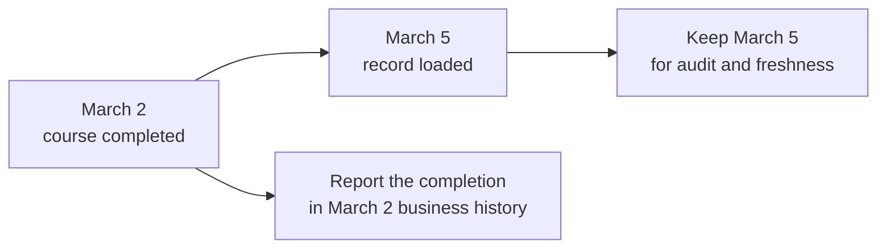
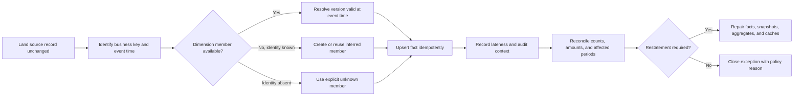

# Late-Arriving Data

Data is **late arriving** when the warehouse receives it after processing the business time it belongs to. The difficult part is not only that the pipeline was slow. The warehouse must place the record back into the correct history.

The governing rule is:

> Keep when the event happened separate from when the platform learned about it.

## Start with one late completion

Ana completed a course on Monday, March 2, but the learning system sent the record on Thursday, March 5.

| Field | Correct value | Why |
|---|---|---|
| `completion_date` | March 2 | That is when the business event happened |
| `loaded_at` | March 5 | That is when the warehouse processed it |
| `user_key` | User version valid on March 2 | The fact should use the historical profile from event time |

Using March 5 as the completion date would move the event into the wrong reporting period. Using Ana's current profile could also assign it to a department she joined after completing the course.



## The problem

A customer event can arrive before the customer's profile. A bank can post a back-valued transaction after publishing the daily balance. HR can report today that an employee actually moved departments last month.

Using today's date and current dimension values is convenient but creates false history. Silently rewriting old outputs creates a different problem: users cannot reproduce a previously published report. The model therefore needs explicit rules for lateness, corrections, and restatement.

## Two clocks: event time and processing time

At minimum, distinguish:

| Clock | Meaning | Example |
|---|---|---|
| Event time | When the business event or state was valid | Course completed at 2026-03-02 14:12 UTC |
| Processing time | When this pipeline handled it | Loaded on 2026-03-05 01:00 UTC |

The pipeline may also track source commit, extraction, ingestion, transformation, and publication times. These fields help with audit and monitoring, but none replaces the business event time.

```text
business event      source commits       platform ingests      mart publishes
     t0 ---------------- t1 ------------------- t2 ------------------ t3
     |<-------------------------- observed lateness ----------------->|
```

Use event time to choose the reporting period and historical dimension version. Use processing time to monitor delays, replay loads, and audit the pipeline.

## Late-arriving facts

A **late-arriving fact** records an event whose business time is earlier than its arrival time.

### Grain

> **One row represents one business event at its original event time, regardless of when it was loaded.**

Example: one row in `fact_course_completion` represents one user's completion attempt for one course enrollment.

### Resolve dimensions as of event time

Suppose user `U-42` moved from Retail to Enterprise on March 1. A February 27 completion arrives on March 4. The fact should normally point to the Retail version of the Type 2 user dimension because that was the version valid on February 27.

```sql
select user_sk
from dim_user
where source_system = :source_system
  and user_bk = :user_bk
  and :event_ts >= valid_from
  and :event_ts < valid_to;
```

Use intervals that include `valid_from` and exclude `valid_to`. One version can then end exactly when the next begins without overlapping. Store the surrogate key returned by this lookup on the fact so ordinary reports can use a simple equality join.

### Choose the business date deliberately

For a late completion, `completion_date_key` comes from the completion timestamp, not the load date. Store `loaded_at` separately for monitoring and audit.

```text
fact_course_completion
  completion_id
  completion_date_key  -> 20260302
  user_key             -> version valid on 2026-03-02
  loaded_at            -> 2026-03-05T01:00:00Z
  pipeline_run_key     -> audit context
```

### Effects on snapshots

Late events can change state that was already published. A back-valued bank transaction may affect:

- the transaction fact for its original posting date;
- the account's closing balance on that date;
- every later balance if the source supplies deltas rather than authoritative closings;
- monthly averages and downstream aggregates.

The business must choose what published snapshots do when this happens:

1. restate every affected closed period;
2. post an adjustment in the current period;
3. publish both originally reported and restated values;
4. defer to a source-provided authoritative balance.

There is no universally correct choice. Finance, regulatory, and operational users may need different views, but each view should have a clear name and owner.

### Load pattern

An incremental job needs a change feed or a window that looks back into already processed time. Reading only records newer than the last load can miss a record that arrives late with an old source timestamp.

```sql
-- Pseudocode: deduplicate by stable event identity before merging.
merge into fact_course_completion as target
using staged_latest_event as source
  on target.source_system = source.source_system
 and target.completion_id = source.completion_id
when matched and source.revision > target.source_revision then
  update set ...
when not matched then
  insert (...);
```

`MERGE` is only the database operation. Correctness depends on a stable event identity, an unambiguous revision order, the historical dimension lookup, and rules for deletes and reversals.

## Late-arriving dimensions

A **late-arriving dimension** happens when a fact names an entity before its descriptive row arrives, or when corrected dimension history arrives after facts already received their keys.

### Unknown member versus inferred member

The following rows solve different problems:

| Pattern | Meaning | Key behavior | Later action |
|---|---|---|---|
| Unknown member | The identity is genuinely absent or cannot be resolved | Many unrelated facts may share one sentinel surrogate key | Investigate or leave unknown |
| Not applicable member | This dimension does not apply to the fact | Shared, explicit sentinel key | No reconciliation expected |
| Inferred member | The natural key is known, but attributes have not arrived | Create a unique surrogate key for that natural key | Fill attributes later, usually as Type 1 |

If a completion contains user ID `U-99` but the user feed has not arrived, the identity is known even though the description is missing. Do not map it to the generic unknown user shared by unrelated facts. Create a temporary **inferred member** specifically for `U-99`:

```text
user_sk        78123
user_bk        U-99
user_name      Unknown pending source
department     Unknown pending source
is_inferred    true
valid_from     earliest defensible time
valid_to       9999-12-31
is_current     true
```

The fact can immediately point to key `78123`. When the user feed arrives, fill in that same row if no earlier history is required. The fact key does not need to change.

### Grain of an inferred row

> **One inferred dimension row represents one specifically identified business entity whose descriptive attributes are pending.**

It is not one row for every missing event, and it is not one shared row for every unknown entity.

### When the arriving row reveals history

Suppose the eventual payload says `U-99` belonged to Department A until February 15 and Department B afterward. A single inferred current row is insufficient for facts on both sides of that date.

Possible repair:

1. construct non-overlapping Type 2 versions;
2. resolve affected facts by their event time;
3. update their surrogate foreign keys when the business requires corrected historical truth;
4. rebuild affected aggregates and semantic caches;
5. retain lineage showing the restatement run.

This is a controlled repair of history, not a routine update of missing labels.

## Advanced: retroactive dimension changes

A source may report today that an attribute became valid last month. The warehouse must then distinguish:

- **valid time:** when the statement was true in the business;
- **system time:** when the warehouse learned and recorded it.

Three common policies are:

### Option 1: corrected business history

Insert or split Type 2 versions at the retroactive boundary and rekey affected facts. Use this when reports are meant to reflect the best current understanding of what was true then.

### Option 2: as-originally-known history

Do not rekey old facts; retain what the warehouse knew when it published them. Use this when reproducing prior regulatory or operational reports matters more than retrospective correction.

### Option 3: both views

Keep both the corrected history and what earlier publications showed. This approaches bitemporal modeling and costs more in storage, processing, and user education. See [Event, state, and temporal modeling](event-state-and-temporal-modeling.md).

Document the policy for each subject area. “Historical truth” can mean corrected business truth or what the warehouse knew at the time; the organization must choose.

## Reconciliation workflow

Late-data handling should leave a visible trail and produce the same result when replayed.



Maintain an exception queue or reconciliation table with:

- source system and business identifier;
- event time and first-seen time;
- reason: late fact, missing dimension, retroactive correction, delete, or reversal;
- chosen remediation;
- affected partitions and downstream models;
- reconciliation status and audit run.

## Tests that catch late-data problems

### Referential completeness

Every fact foreign key should resolve, including special members. Null foreign keys make joins silently drop rows.

### Inferred-member aging

Alert when inferred members remain incomplete beyond the expected source delay. Track their facts and business impact.

### Effective-period integrity

For each durable entity, Type 2 ranges should not overlap. Decide whether gaps are allowed.

### Event-to-version consistency

For sampled facts, verify that the stored dimension surrogate key was valid at the fact's event time. Exceptions may be legitimate only when an “as originally known” policy applies.

### Closed-period drift

Compare period totals before and after late processing. Require an explained reconciliation rather than allowing silent changes.

### Idempotent replay

Reprocessing the same landed records should produce the same facts, dimensions, and totals. Test this explicitly.

## Common mistakes

| Mistake | Consequence | Better response |
|---|---|---|
| Use load date as business date | Events move into the wrong reporting period | Keep event and processing clocks separately |
| Resolve every late fact to the current dimension row | Historical facts acquire future attributes | Look up the Type 2 version valid at event time |
| Send every missing natural key to one unknown member | Entity identity is lost and facts require mass rekeying | Create an inferred member when identity is known |
| Create a new inferred member for every retry | Duplicate dimension rows and inconsistent fact keys | Enforce uniqueness on source namespace plus natural key |
| Treat all late changes as Type 1 | Historical meaning silently changes | Apply the subject area's Type 1/2 and restatement policy |
| Refresh only the atomic fact | Snapshots, aggregates, and metric caches disagree | Trace and rebuild every affected derivative |
| Use a fixed lookback without reconciliation | Records later than the window disappear | Combine CDC/watermarks with exception and completeness checks |
| Hide lateness | Consumers cannot reproduce published results | Expose audit timestamps and publication/restatement status |

## Tradeoffs

| Choice | Benefit | Cost |
|---|---|---|
| Larger incremental lookback | Captures more delayed data | More scanning and repeated work |
| Inferred members | Facts load immediately without losing identity | Temporary incomplete descriptions and reconciliation state |
| Historical fact rekeying | Corrected event-time truth | Expensive updates and changed prior outputs |
| Immutable facts plus adjustments | Strong audit trail | More complex consumer logic |
| Bitemporal history | Reproduce both valid and known-at-the-time views | More rows, keys, tests, and semantic complexity |

## Optional: modern implementation notes

- Keep an immutable or replayable landing layer so historical repairs do not depend on the current source state.
- CDC reduces extraction delay but does not eliminate out-of-order arrival, missing parents, or retroactive corrections.
- dbt snapshots can preserve mutable source history, but a snapshot does not choose the fact's business grain or restatement policy for you.
- In lakehouse tables, partition replacement can make historical repair efficient; always derive the affected partition set from business dates, not only load dates.
- In SAP HANA or Datasphere, time-dependent dimensions and validity associations can express effective dating, but the pipeline still needs deterministic event-time key resolution.
- Publish data freshness and restatement metadata alongside metrics when users make operational decisions from incomplete periods.

## Beginner review checklist

- [ ] Are event time and processing time stored separately?
- [ ] Does the fact use the business date rather than the load date?
- [ ] Is the dimension version selected using the event time?
- [ ] When identity is known but attributes are missing, is there one inferred member for that entity?
- [ ] Is the policy for changing old snapshots and reports written down?
- [ ] Can the pipeline replay the same input without creating duplicates?
- [ ] Are affected facts, snapshots, aggregates, and caches reconciled together?

## Related patterns

- [Keys](../01-foundations/keys.md)
- [Slowly changing dimensions](../03-dimensions/slowly-changing-dimensions.md)
- [Fact-table patterns](../02-fact-tables/fact-table-patterns.md)
- [Reliable implementation](../07-modern-architecture/reliable-implementation.md)
- [Event, state, and temporal modeling](event-state-and-temporal-modeling.md)

## What to remember

1. Preserve event time and processing time as different facts about the record.
2. Resolve a late fact to the dimension version valid when the event occurred.
3. Use a unique inferred member when identity is known but attributes are late; use a shared unknown member only when identity truly is not known.
4. Late events can require snapshot, aggregate, and cache restatement — not just one atomic insert.
5. Decide whether history means corrected business truth, originally published truth, or both.
6. Make replay idempotent and reconciliation visible.
