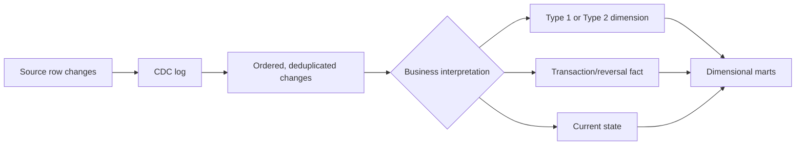

# Reliable Dimensional Implementation

A correct model can still fail if its pipeline duplicates events, loses deletes, assigns the wrong historical key, or cannot replay a backfill. Reliability means that repeated processing produces explainable results and that every published row can be traced to source evidence and transformation logic.

Kimball's ETL chapters emphasize profiling, CDC, cleansing, deduplication, surrogate-key management, late-data handling, restart/recovery, lineage, and version control. Modern ELT tools change where this work runs; they do not remove the responsibilities.

## The reliability contract

For each model, document:

```text
business process        What is measured?
grain                   What does one row represent?
business identity       How is the same event/entity recognized on replay?
source ordering         Which change wins?
history rule            Type 1, Type 2, event, snapshot, or interval?
incremental boundary    Which records are reconsidered?
delete/correction rule  How are reversals and removals represented?
reconciliation          Which counts and amounts must balance?
restart unit            What can be safely rerun?
publication rule        When is output complete enough for consumers?
```

Without this contract, an “incremental model” is merely a fast query with undefined failure behavior.

## Idempotency

An operation is idempotent when applying the same accepted input again produces the same target state.

### Mental model

> Retry must be safe.

Idempotency does not mean every job is insert-only. It means stable input identity and deterministic transformation prevent duplicate or conflicting results.

### Transaction fact example

For payment events, a source namespace plus payment event ID may be the business identity:

```sql
unique_key = (source_system, payment_event_id)
```

Before loading:

1. deduplicate transport copies;
2. order revisions using a source sequence or commit timestamp;
3. choose one deterministic winner;
4. resolve dimensional keys;
5. insert or update according to correction policy.

Do not use ingestion timestamp alone as identity. A replay has a new ingestion timestamp but is still the same business event.

### Snapshot example

For account-day balances:

```sql
unique_key = (account_durable_key, snapshot_date_key, balance_type, currency_key)
```

Rebuilding one date partition should replace or merge exactly that declared population, then reconcile expected accounts and totals.

## Change data capture

CDC reports inserts, updates, and deletes from source storage. It is an extraction mechanism, not automatically a business-event model.



An update to an order row might mean:

- correction of a typo;
- a business status transition;
- accumulation of a milestone;
- physical maintenance with no analytical meaning.

Translate source changes into business semantics before choosing a target pattern.

### CDC completeness questions

- Does the feed include deletes and before-images?
- Is ordering guaranteed within a key or partition?
- Can records arrive more than once or out of order?
- How long are logs retained?
- What happens when the consumer checkpoint is lost?
- How is initial history aligned with ongoing changes?
- Can schema changes alter the payload silently?

Retain a restart checkpoint only after the target transaction and reconciliation succeed.

## Incremental loading patterns

### High-water mark

Read rows beyond the last successfully processed source position. Prefer a monotonically increasing source commit sequence over a mutable business timestamp.

Risk: late or backdated records may fall behind the watermark. Add an overlap window and deterministic deduplication, or use CDC with reconciliation.

### Sliding lookback

Reprocess recent business dates or update timestamps.

Risk: a fixed window silently misses anything later than the window. Monitor lateness distribution and maintain an exception/backfill path.

### Partition replacement

Rebuild complete affected date partitions from replayable input.

Benefit: deterministic and often simpler than row-level mutation. Risk: the partition date must match business impact; one late event may affect later balance partitions too.

### Key-based `MERGE`

Upsert rows by stable identity.

```sql
merge into dim_customer as d
using staged_customer as s
  on d.source_system = s.source_system
 and d.customer_bk = s.customer_bk
 and d.is_current = true
when matched and d.type1_hash <> s.type1_hash then
  update set ...
when not matched then
  insert (...);
```

This simplified example is not a complete Type 2 implementation. A single `MERGE` statement does not by itself guarantee correct close-and-insert ordering, non-overlapping effective periods, or concurrency safety.

### Append plus latest view

Retain every source revision and expose the latest accepted version through a view or compaction job.

Benefit: excellent traceability. Cost: consumers must not accidentally query all revisions, and storage/compaction rules must be governed.

## Deduplication

Deduplication begins by classifying what looks like a duplicate:

| Case | Same business event? | Response |
|---|---|---|
| Message retry with same event ID | Yes | Keep one deterministically |
| Updated revision of same source row | Same row, new assertion | Apply history/correction policy |
| Two legitimate purchases with identical values | No | Preserve both; identity is incomplete |
| Join fanout | Source rows may be unique | Fix relationship or pre-aggregate |
| Reversal | Separate business event | Preserve with signed/linked semantics |

A common staging pattern is:

```sql
select *
from (
  select
    s.*,
    row_number() over (
      partition by source_system, event_id
      order by source_revision desc, source_commit_ts desc, ingestion_id desc
    ) as rn
  from staged_events s
) ranked
where rn = 1;
```

Every ordering column needs a defined meaning. If ties remain possible, quarantine them rather than allowing nondeterministic winners.

## Dimension loading

### Type 1

1. resolve source and durable identity;
2. compare Type 1 attributes or a deterministic hash;
3. overwrite changed values;
4. record audit metadata;
5. invalidate downstream aggregates/caches whose labels or grouping changed.

Type 1 changes reinterpret all facts joined to the row. That is the intended behavior only when history has no analytical value or a correction should apply everywhere.

### Type 2

1. resolve the current version by durable/business identity;
2. compare Type 2 attributes;
3. close the old interval at the new version's valid start;
4. insert a new row with a new surrogate key;
5. guarantee one current row and non-overlapping intervals;
6. resolve facts by event time.

If a change arrives retroactively, the pipeline may need to split an existing interval and rekey affected facts. See [Late-arriving data](../06-time-and-change/late-arriving-data.md).

### Unknown and inferred members

Create stable special rows before facts load. Use non-null foreign keys:

```text
-1 Unknown identity
-2 Not applicable
-3 Source key missing
-4 Invalid or rejected key
```

Use a unique inferred member rather than a shared sentinel when the natural key is known but its descriptive data is late.

### Surrogate-key lookup service

Whether implemented as SQL joins, cached mappings, or managed transforms, key resolution should have one governed contract:

```text
(source namespace, natural key, event time) -> dimension surrogate key
```

Do not generate independent surrogate keys for the same conformed dimension in each mart.

## Fact loading

### Validate dimensions before measures

For every fact row:

- confirm its business process and grain;
- resolve every mandatory dimension to a real or special member;
- reject or quarantine impossible relationships;
- classify measures and units;
- enforce event identity;
- attach audit lineage.

### Reversals and corrections

Choose one policy per process:

- **update in place** for a source-authoritative correction;
- **append reversal and replacement** for an accounting-style audit trail;
- **soft delete** with explicit status when consumers need exclusion plus traceability;
- **partition rebuild** when deterministic replay is the operational standard.

Never treat a missing record in a partial extract as a delete without proof that the extract is complete.

### Fact-table surrogate keys

An optional fact surrogate key can simplify ETL row identification, restart, or decomposing an update into delete/insert. It is not the business grain and should not be used to hide duplicate business events.

## Backfills

A backfill deliberately reprocesses historical scope. Treat it as a production migration.

### Backfill plan

1. state the reason and affected business dates/entities;
2. pin source snapshot and transformation-code version;
3. estimate downstream partitions and semantic caches affected;
4. run in an isolated target or shadow tables when risk is high;
5. reconcile rows, additive totals, distinct entities, and exception counts;
6. atomically publish or swap validated output;
7. retain the run manifest and rollback path.

### Reproducibility manifest

```text
pipeline_run_id
code_commit
configuration_version
source_extract_ids / table versions
watermark range
business-date range
schema version
row counts and control totals
quality-test results
published_at
```

A full refresh is not inherently more correct than incremental loading. It can reproduce today's source state while erasing historical states the source no longer holds. Replayability depends on retained evidence and deterministic rules.

## Schema evolution

Classify a source change before propagating it:

| Change | Typical response |
|---|---|
| New nullable descriptive attribute | Add to dimension or staging after semantic review |
| New measure at existing grain | Add only if valid for every relevant row; backfill/null policy required |
| Identifier meaning changes | New mapping/version; do not silently reuse old key |
| One source row becomes many | Grain change; create/version the model and backfill deliberately |
| Enum gains a value | Preserve unknown code, update decode and tests |
| Column removed | Keep contract temporarily or version consumers |
| Timestamp precision/time zone changes | Normalize explicitly and reassess uniqueness/windows |

Schema-on-read does not remove schema contracts. It postpones the moment at which incompatible assumptions fail.

## Source-system changes

Migrations create special key and history risks:

- natural keys may be renumbered or reused;
- old and new systems may run in parallel;
- attribute definitions may change;
- history may be truncated during conversion;
- the new source may emit different grain.

Namespace natural keys with source identity, maintain durable crosswalks for the same business entity, and define a cutover boundary. Do not join facts from two systems merely because their IDs look alike.

## Data-quality and audit models

An audit dimension can attach reusable load context to facts:

```text
dim_audit
  audit_key
  pipeline_run_id
  code_version
  source_extract_id
  quality_status
  inferred_member_count
  loaded_at
```

An error-event fact can record rejected or suspicious rows by source, rule, field, severity, and time. This turns pipeline quality into analyzable data rather than lost log messages.

Monitor:

- source-to-staging and staging-to-target row counts;
- control totals for money and quantities;
- duplicate business identities;
- null/special-key rates;
- Type 2 overlap and current-row uniqueness;
- inferred-member age;
- lateness distribution;
- referential integrity;
- closed-period drift;
- pipeline duration and freshness.

## Deployment, restart, and atomic publication

A pipeline should restart from a known checkpoint without double-applying work. Common approaches:

- write into staging then transact target changes;
- build new partitions/tables and swap only after validation;
- checkpoint source positions after successful target commit;
- record task-level state and dependencies;
- make cleanup safe for abandoned runs;
- separate “processed” from “published.”

Partial publication is often worse than a delayed publication because facts, dimensions, and aggregates can temporarily disagree.

## Platform notes

### dbt-style transformations

- Encode grain tests with `unique` or custom composite-key tests.
- Test relationships and accepted special members.
- Use incremental predicates as performance choices, not correctness definitions.
- Treat `unique_key` and late-arrival windows as explicit contracts.
- [dbt snapshots](https://docs.getdbt.com/docs/build/snapshots) provide Type 2-like source history, but downstream dimensions still need conformed keys and event-time fact lookup.

### Lakehouse tables

- Use ACID table formats for atomic merge/replace behavior.
- Compact small files and cluster by real access patterns after semantic correctness.
- Retain source versions long enough for the required replay window.
- Do not mistake storage time travel for a complete business temporal model.

### SAP HANA Cloud and Datasphere

- Push heavy transformations when it improves operations, but keep business rules versioned and testable.
- In calculation views, declare cardinality only when data actually satisfies it; an optimistic cardinality hint can yield wrong results.
- Keep semantic measure aggregation aligned with the fact's grain.
- For replication flows and remote sources, document latency, delete propagation, and snapshot consistency.
- Separate technical source IDs from conformed/durable entity identity.

## Common mistakes

- Increment only on maximum event timestamp.
- Use `MERGE` without a unique, stable business identity.
- Deduplicate by every column and accidentally delete legitimate repeated events.
- Generate surrogate keys independently in parallel marts.
- Apply Type 1 to every source update because it is easier.
- Advance a CDC checkpoint before targets and controls commit.
- Backfill facts without rebuilding snapshots, aggregates, or metric caches.
- Assume a full refresh can reconstruct history not retained by the source.
- Let schema drift silently change grain or units.
- Publish partially updated facts and dimensions.

## Related patterns

- [Grain](../01-foundations/grain.md)
- [Keys](../01-foundations/keys.md)
- [Slowly changing dimensions](../03-dimensions/slowly-changing-dimensions.md)
- [Late-arriving data](../06-time-and-change/late-arriving-data.md)
- [Layered architectures](layered-architectures.md)

## What to remember

1. Idempotency depends on stable business identity and deterministic ordering, not a particular command.
2. CDC captures physical changes; the model must interpret their business meaning.
3. Incremental boundaries need late-data and delete strategies plus reconciliation.
4. Preserve replayable source evidence and the exact code/configuration used for publication.
5. Backfills are governed migrations that include every affected derivative.
6. Schema evolution can be a grain change in disguise.
7. Restart, lineage, and quality controls are part of the analytical architecture.
