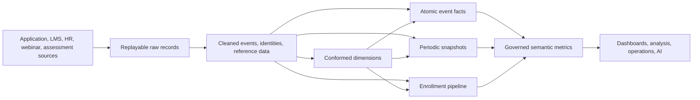

# Learning Analytics: An End-to-End Dimensional Design

This case study models a learning platform used by employees, customers, or students. It is intentionally broader than a single dashboard: it supports engagement analysis, assessment performance, live attendance, course progression, compliance, and historical organizational reporting.

The design illustrates how several fact tables cooperate without mixing grains.

## Business questions

The model should answer questions such as:

- How many learners started and completed each course?
- How much learning activity occurred by day, device, region, and organization?
- Which learning objects create engagement or abandonment?
- What are assessment pass rates and weighted scores?
- Who attended a live session, and for how long?
- How many required assignments were overdue at each month end?
- How long does enrollment-to-start and start-to-completion take?
- What department was a learner in when activity occurred, and what department are they in now?
- Which skills received learning investment without double counting multi-skill courses?
- How do late attendance and retroactive HR changes affect published metrics?

No single row type answers all of these safely. The architecture therefore starts by separating business processes.

## Architecture at a glance



The raw/cleaned layers are modern implementation choices. The dimensional rules begin with business process, grain, dimensions, and facts. A Bronze/Silver/Gold implementation, dbt project, lakehouse, HANA model, or Datasphere space can all host this logical design.

## Bus matrix

The bus matrix shows which conformed dimensions apply to each process. A filled circle means the dimension participates at that row's declared grain.

| Business process / fact | Date | Time | User | Organization | Course | Learning object | Assessment | Live session | Status | Event type | Device | Geography | Skill group |
|---|:---:|:---:|:---:|:---:|:---:|:---:|:---:|:---:|:---:|:---:|:---:|:---:|:---:|
| Learning-object event | ● | ● | ● | ● | ● | ● |  |  |  | ● | ● | ● | ● |
| Assessment attempt | ● | ● | ● | ● | ● |  | ● |  | ● |  | ● | ● | ● |
| Live-session attendance | ● |  | ● | ● | ● |  |  | ● | ● |  |  | ● | ● |
| Enrollment pipeline | ●¹ |  | ● | ● | ● |  |  |  | ● |  |  | ● | ● |
| Enrollment daily snapshot | ● |  | ● | ● | ● |  |  |  | ● |  |  | ● | ● |
| Required-learning monthly snapshot | ● |  | ● | ● | ● |  |  |  | ● |  |  | ● | ● |

¹ The enrollment pipeline has several date roles: assigned, enrolled, started, first activity, completed, withdrawn, and due date.

The matrix is not a license to join fact tables directly. It says the facts can be grouped independently by common conformed attributes and then drilled across.

## Conformed dimensions

### User

`dim_user` represents the analytics identity of a learner. It should not expose unnecessary personal data.

```text
dim_user
  user_key                  PK  -- surrogate version key
  durable_user_key              -- stable warehouse entity identity
  source_system
  source_user_id                -- natural key in that source
  display_name_or_pseudonym
  user_type                     -- employee, customer, student, contractor
  organization_business_id
  department_name
  manager_durable_user_key
  employment_type
  geography_key
  valid_from_timestamp
  valid_to_timestamp
  is_current
```

Department, organization, manager, employment type, and geography may be Type 2 attributes when the business needs activity reported under the context valid at event time. The facts also carry the conformed `organization_key` directly, avoiding a required fact-to-user-to-organization snowflake for routine analysis.

Use the key meanings precisely:

- `source_user_id` identifies the record in one source and may be reused or changed;
- `durable_user_key` identifies the person/account across sources and historical versions;
- `user_key` identifies one dimensional version used by facts.

If analysts also need “all historical learning under today's department,” expose a governed current-state view or Type 6/7-style perspective. Do not silently replace the historical join.

### Course and learning object

`dim_course` contains course code, title, delivery mode, subject, language, provider, difficulty, estimated duration, and catalog hierarchy. `dim_learning_object` contains the component type and position, such as video, article, lab, or quiz.

Content version is a business decision:

- If a revision is analytically the same course with corrected wording, overwrite selected attributes.
- If the learning experience materially changes, use a new course version or a Type 2 course row.
- Preserve a durable course identifier so versions can still be grouped as one course family.

### Other shared dimensions

- `dim_date`: calendar, fiscal, academic, holiday, and reporting attributes.
- `dim_time`: time of day, hour, shift, and day-part attributes when those groupings matter.
- `dim_organization`: governed organizational rollups; Type 2 when historical structure matters.
- `dim_assessment`: assessment type, maximum score policy, pass rule, and version.
- `dim_live_session`: scheduled session, delivery channel, instructor, location, and capacity.
- `dim_status`: process-specific textual status values; do not force unrelated status vocabularies into one generic dimension.
- `dim_event_type`: started, viewed, paused, resumed, completed, downloaded, and other governed event meanings.
- `dim_device`: platform, application, browser family, and form factor.
- `dim_geography`: privacy-appropriate location and reporting regions.
- `dim_skill`: skill taxonomy and hierarchy.

## Fact 1: Learning-object events

### Grain

> **One row represents one user performing one recorded event on one learning object at one event timestamp.**

```text
fact_learning_object_event
  event_date_key       FK
  event_time_key       FK
  user_key             FK
  organization_key     FK
  course_key           FK
  learning_object_key  FK
  event_type_key       FK
  device_key           FK
  geography_key        FK
  skill_group_key      FK
  event_id             DD
  event_timestamp_utc
  event_count               -- additive: all dimensions
  engagement_seconds        -- additive with sessionization caveats
  content_position_seconds  -- descriptive numeric; usually not additive
```

### Load behavior

Insert one row per deduplicated source event. `event_id` or a documented composite identity must make retries idempotent. Retain both event time and processing metadata outside or alongside the analytical columns so late events are visible.

### Design cautions

- “Heartbeat” events can inflate engagement. Define whether duration comes from source intervals, bounded gaps, or sessions.
- Do not put course start, assessment completion, webinar attendance, and billing events in one generic event fact just because they share a timestamp.
- `content_position_seconds` describes where playback was, not elapsed learning time; summing it is invalid.
- Anonymous activity needs a governed anonymous-user member, not a null foreign key.

## Fact 2: Assessment attempts

### Grain

> **One row represents one submitted attempt by one user for one assessment.**

```text
fact_assessment_attempt
  submitted_date_key   FK
  submitted_time_key   FK
  user_key             FK
  organization_key     FK
  course_key           FK
  assessment_key       FK
  status_key           FK
  device_key           FK
  geography_key        FK
  skill_group_key      FK
  attempt_id           DD
  attempt_number
  attempt_count             -- additive
  submitted_count           -- additive
  passed_count              -- additive
  score_points              -- additive when point scales are compatible
  possible_points           -- additive component
  duration_seconds          -- additive, though averages are usually more useful
```

`score_percentage` is derived as `SUM(score_points) / SUM(possible_points)` when a points-weighted result is intended. Average of row percentages answers a different question and should be named accordingly.

Distinct learners are non-additive across courses and periods. Calculate them at the requested query grain or use a governed approximate-distinct implementation.

## Fact 3: Live-session attendance

### Grain

> **One row represents one user's attendance record for one scheduled live session.**

```text
fact_live_session_attendance
  session_date_key       FK
  user_key               FK
  organization_key       FK
  course_key             FK
  live_session_key       FK
  attendance_status_key  FK
  geography_key          FK
  skill_group_key        FK
  attendance_id          DD
  attendance_count            -- additive
  attended_seconds            -- additive
  join_count                  -- additive
  late_join_count             -- additive
```

This can be factless if the source records only presence. Adding `attendance_count = 1` and duration measures makes reporting easier without changing the grain.

Registration, attendance, and session capacity are different processes. To measure no-shows, compare a registration/coverage fact with attendance. Do not infer “not attended” merely from absence unless the eligible population is defined.

## Fact 4: Enrollment pipeline

### Grain

> **One row represents one user's one enrollment attempt in one course.**

```text
fact_enrollment_pipeline
  user_key                 FK
  organization_key         FK
  course_key               FK
  skill_group_key          FK
  current_status_key       FK
  assigned_date_key        FK  -- role-playing date
  enrolled_date_key        FK
  started_date_key         FK
  first_activity_date_key  FK
  completed_date_key       FK
  withdrawn_date_key       FK
  due_date_key             FK
  enrollment_id            DD
  enrollment_count              -- additive
  completion_count              -- additive
  withdrawal_count              -- additive
  assignment_to_start_days      -- additive; average usually consumed
  start_to_complete_days        -- additive; average/percentiles usually consumed
  current_progress_ratio        -- non-additive current state
```

### Lifecycle

Insert when the lifecycle begins, then update the same row as milestones occur. Future milestone foreign keys point to a “not yet occurred” date member rather than null.

This table optimizes current pipeline questions. It does not preserve every intermediate status. The atomic events remain the rebuild and audit trail.

If reenrollment is allowed, `enrollment_id` must distinguish attempts. A user-course grain would merge separate lifecycles and corrupt durations.

## Fact 5: Enrollment daily snapshot

### Grain

> **One row represents one active enrollment attempt at the close of one calendar day.**

```text
fact_enrollment_daily_snapshot
  snapshot_date_key      FK
  user_key               FK
  organization_key       FK
  course_key             FK
  status_key             FK
  skill_group_key        FK
  enrollment_id          DD
  active_enrollment_count     -- additive across non-time dimensions
  learning_seconds_today      -- additive across all dimensions
  objects_completed_today     -- additive across all dimensions
  cumulative_learning_seconds -- semi-additive; do not sum over dates
  cumulative_objects_complete -- semi-additive; do not sum over dates
  current_progress_ratio      -- non-additive
  days_since_last_activity    -- non-additive descriptive measurement
```

The snapshot is intentionally dense for in-scope active enrollments, including days with zero new activity. That makes inactivity and backlog visible.

The daily flow facts can be summed over time. Cumulative and current-state facts cannot. Semantic metadata should prevent a default `SUM(current_progress_ratio)`.

## Fact 6: Required-learning monthly snapshot

### Grain

> **One row represents one employee-course requirement at the close of one reporting month.**

```text
fact_required_learning_monthly_snapshot
  month_end_date_key     FK
  user_key               FK
  organization_key       FK
  course_key             FK
  requirement_status_key FK
  skill_group_key        FK
  policy_id              DD
  requirement_count          -- additive across non-time dimensions
  completed_requirement_count -- additive across non-time dimensions
  overdue_requirement_count   -- additive across non-time dimensions
  days_overdue               -- non-additive; average/max are meaningful
```

This is a state/coverage snapshot, not a completion event table. It supplies the denominator for monthly compliance rates:

```text
SUM(completed_requirement_count) / SUM(requirement_count)
```

Do not sum requirement counts over several month ends and call the result “employees required to train.” The same obligation appears in multiple snapshots.

## Measures and aggregation contract

| Measure | Home fact | Behavior | Safe default | Warning |
|---|---|---|---|---|
| `event_count` | Learning-object event | Additive | Sum | Bot/heartbeat filtering must be governed |
| `engagement_seconds` | Learning-object event | Additive with rules | Sum | Prevent overlapping or synthetic events from inflating time |
| `attempt_count` | Assessment attempt | Additive | Sum | A user may have several attempts |
| `score_points` + `possible_points` | Assessment attempt | Additive components | Sum components, then divide | Do not average percentages accidentally |
| `passed_count` | Assessment attempt | Additive | Sum | Pass rule is assessment-version context |
| `attended_seconds` | Attendance | Additive | Sum | Concurrent sessions can overlap |
| `completion_count` | Enrollment pipeline | Additive | Sum | One enrollment attempt may be completed once |
| `current_progress_ratio` | Pipeline/daily snapshot | Non-additive | Weighted average or latest state | Never sum |
| `cumulative_learning_seconds` | Daily snapshot | Semi-additive | Latest/period-end | Do not sum over snapshot dates |
| `overdue_requirement_count` | Monthly snapshot | Semi-additive across time | Sum within one month; compare month ends | Repeated obligation across months |
| Distinct learners | Derived | Non-additive | Recompute at query grain | Cannot sum across overlapping groups |

## Multivalued skills bridge

A course can teach several skills. Adding one `skill_key` to a fact loses skills; copying the fact once per skill double counts learning time.

Stamp a `skill_group_key` on each fact row and resolve it through a bridge:

```text
bridge_skill_group
  skill_group_key       FK
  skill_key             FK
  allocation_weight
  valid_from_date_key
  valid_to_date_key
```

### Bridge grain

> **One row represents one skill's membership in one skill group during one validity interval.**

Weights for a group sum to `1.0` when allocated reporting is required. If a course teaches Data Modeling and SQL equally, each may receive `0.5` of the learning duration. Without weighting, a report is an impact analysis: the full duration is associated with every skill and totals can exceed overall learning time.

Use effective dates or immutable group versions when course-to-skill mappings change. Historical learning should not silently move to today's taxonomy mapping.

If no defensible allocation exists, expose skill impact counts with a visible warning rather than inventing false precision.

## SCD history and fact-key resolution

For every incoming fact:

1. identify the durable user/entity;
2. use the fact's event timestamp to find the non-overlapping `dim_user` version valid then;
3. write that `user_key` to the fact;
4. retain load time separately for operations and latency analysis.

```sql
select u.user_key
from dim_user u
where u.durable_user_key = :durable_user_key
  and :event_ts >= u.valid_from_timestamp
  and :event_ts <  u.valid_to_timestamp;
```

The half-open interval prevents two versions from matching at a boundary. Current reporting can join through a separately governed current-user perspective; it must not overwrite the historical fact key.

## Late and out-of-order data

### Late learning event

An event that occurred on Monday but arrived Thursday uses Monday's user, organization, course, and skill-group context. Incremental loading needs a replay window or CDC rule that does not assume arrival order equals event order.

### Fact before user profile

When a plausible new `source_user_id` appears before its profile:

1. create an inferred `dim_user` row with its own surrogate key and known natural identifier;
2. use explicit values such as `Pending profile` for unknown attributes;
3. load the fact against that key;
4. fill the inferred row with Type 1 updates when the profile arrives.

This is different from mapping every unseen identity to one generic unknown member, which loses identity and forces later fact rekeying.

### Retroactive HR correction

If HR later says a department transfer became valid two weeks earlier:

- insert or adjust the correct Type 2 user versions;
- find facts in the corrected interval;
- rekey only affected facts when historical-as-was reporting requires it;
- rebuild affected daily/monthly snapshots and semantic aggregates;
- publish the restatement and retain audit evidence.

### Late attendance

Webinar attendance may arrive hours after the session. Upsert by stable attendance identity, then recalculate any affected session, day, month, and compliance outputs. Do not add the same attendance again on each retry.

### Late milestone

Apply enrollment milestones by event time, not ingestion order. A completion received before a delayed start event should not make the start date later than completion. Retain raw events and rebuild the accumulating row deterministically.

## Sample metric SQL

### Weighted assessment score and pass rate

```sql
select
    d.calendar_month,
    c.course_title,
    sum(f.score_points) / nullif(sum(f.possible_points), 0) as weighted_score_ratio,
    sum(f.passed_count) / nullif(sum(f.submitted_count), 0) as pass_rate,
    sum(f.attempt_count) as attempts,
    count(distinct u.durable_user_key) as distinct_learners
from fact_assessment_attempt f
join dim_date d       on d.date_key = f.submitted_date_key
join dim_course c     on c.course_key = f.course_key
join dim_user u       on u.user_key = f.user_key
group by d.calendar_month, c.course_title;
```

This query intentionally counts durable users rather than Type 2 version keys.

### Learning hours allocated to skills

```sql
select
    d.calendar_month,
    s.skill_name,
    sum(e.engagement_seconds * b.allocation_weight) / 3600.0 as allocated_learning_hours
from fact_learning_object_event e
join bridge_skill_group b
  on b.skill_group_key = e.skill_group_key
 and e.event_date_key >= b.valid_from_date_key
 and e.event_date_key <  b.valid_to_date_key
join dim_skill s on s.skill_key = b.skill_key
join dim_date d  on d.date_key = e.event_date_key
group by d.calendar_month, s.skill_name;
```

The bridge interval can be avoided if every change creates an immutable new skill group; either approach must prevent ambiguous historical membership.

### Monthly compliance

```sql
select
    snapshot_date.calendar_month,
    org.organization_name,
    sum(f.completed_requirement_count)
      / nullif(sum(f.requirement_count), 0) as compliance_rate,
    sum(f.overdue_requirement_count) as overdue_requirements
from fact_required_learning_monthly_snapshot f
join dim_date snapshot_date
  on snapshot_date.date_key = f.month_end_date_key
join dim_organization org
  on org.organization_key = f.organization_key
group by snapshot_date.calendar_month, org.organization_name;
```

Filter to one month for a point-in-time compliance population; do not sum the same requirements across successive snapshots.

## Physical and semantic delivery

### SQL/dbt-style workflow

- Stage source events without changing their identity.
- Deduplicate using a stable event key and deterministic winner rule.
- Build dimensions before facts so surrogate keys can be resolved.
- Test Type 2 intervals for overlap and exactly one current row per durable entity.
- Treat each fact model as a grain contract with unique/not-null/relationship tests.
- Rebuild affected snapshot partitions when late facts alter derived state.

### HANA and Datasphere

- Use associations/star joins that preserve many-to-one dimension joins from each fact.
- Expose historical and current organization perspectives as clearly named analytical models.
- Set default aggregation only for measures that are actually additive.
- Keep ratios as calculated measures over additive components.
- Do not combine facts of different grains in one calculation view before separately aggregating them to conformed attributes.

### Semantic layer

Govern at least these definitions centrally:

- active learner;
- enrolled, started, and completed enrollment;
- completion rate and its denominator;
- passed attempt versus passed learner;
- learning hour/sessionization rule;
- required-learning compliance;
- historical versus current organization;
- allocated versus impact learning by skill.

Physical correctness cannot prevent two dashboards from choosing different denominators. Metric governance completes the architecture.

## Design review

### Grain and identity

- [ ] Every fact has a one-sentence row definition.
- [ ] Enrollment retries create new attempts only when the business considers them new lifecycles.
- [ ] Event, attendance, and attempt IDs survive pipeline retries.
- [ ] Daily and monthly snapshot dates are part of their grains.

### Measures

- [ ] Every measure is labeled additive, semi-additive, or non-additive.
- [ ] Score, pass, completion, and compliance ratios retain their components.
- [ ] Snapshot balances/state are not summed across dates.
- [ ] Distinct user counts are computed at the requested grain.

### History and relationships

- [ ] Facts resolve Type 2 user context by event time.
- [ ] Current-organization reporting is an explicit alternative perspective.
- [ ] Skill bridge weights reconcile to `1.0` where allocation is claimed.
- [ ] Unweighted skill reports are labeled impact analysis.

### Late data and operations

- [ ] Inferred members preserve previously unseen natural identities.
- [ ] Late events can reopen affected partitions and aggregates.
- [ ] Retroactive changes have an approved restatement policy.
- [ ] Pipeline snapshots can be rebuilt from retained events.

### Usability and governance

- [ ] Fact tables are combined through conformed attributes, not raw fact joins.
- [ ] Unknown, not applicable, and not yet occurred have distinct members.
- [ ] Sensitive learner attributes are minimized and access-controlled.
- [ ] Metric definitions state population, time role, history perspective, and aggregation behavior.

## Red flags

| Red flag | Consequence | Better design |
|---|---|---|
| One “learning fact” contains events, enrollments, attendance, and monthly compliance | Mixed grain and unexplained duplicates | Separate facts by business process |
| `user_id` joins directly to every source and dimension | Collisions and incorrect history | Durable identity plus version surrogate keys |
| Completion percentage is summed or averaged blindly | Wrong rates | Sum governed numerator and denominator |
| Current department overwrites all historical learning | History changes silently | Type 2 historical key plus explicit current view |
| Course hours are copied to every skill | Inflated totals | Weighted bridge or labeled impact analysis |
| Missing attendance means “absent” | False no-show counts | Define registration/coverage population |
| Late events are ignored after daily close | Understated trends and pipeline milestones | Replay window and snapshot restatement policy |
| Facts are joined directly on user and course | Many-to-many multiplication | Aggregate each fact, then drill across |

## Related chapters

- [Grain](../01-foundations/grain.md)
- [Keys](../01-foundations/keys.md)
- [Measures and additivity](../01-foundations/measures.md)
- [Fact table patterns](../02-fact-tables/fact-table-patterns.md)
- [Slowly changing dimensions](../03-dimensions/slowly-changing-dimensions.md)
- [Bridges and many-to-many relationships](../04-relationships/bridges-and-many-to-many.md)
- [Conformance and bus architecture](../05-enterprise-modeling/conformance-and-bus-architecture.md)
- [Late-arriving data](../06-time-and-change/late-arriving-data.md)
- [Semantic layer and metrics](../07-modern-architecture/semantic-layer-and-metrics.md)
- [Reliable implementation](../07-modern-architecture/reliable-implementation.md)

## What to remember

1. Learning analytics is several business processes, not one universal fact table.
2. Conformed User, Organization, Course, Date, and Skill context make separate grains work together.
3. Events preserve behavior, periodic snapshots preserve state, and the accumulating snapshot exposes enrollment progress.
4. Ratios need additive components; snapshot state and distinct learners need controlled aggregation.
5. Historical user context is resolved by event time, while current-organization reporting is an explicit alternate perspective.
6. Multivalued skills require a bridge and an honest allocation or impact interpretation.
7. Late data, inferred identities, restatement, and governed metrics are part of the design, not cleanup after deployment.

## Source basis

The dimensional techniques come from Kimball and Ross, *The Data Warehouse Toolkit*, 3rd ed., especially Chapters 2, 4, 5, 8-10, 13, and 19-20. Chapter 13 supplies education examples such as applicant pipelines, registration, utilization, and attendance; the integrated learning-platform design, SQL, platform mappings, and metric-governance details here are original modern synthesis. See [Sources](../SOURCES.md).
