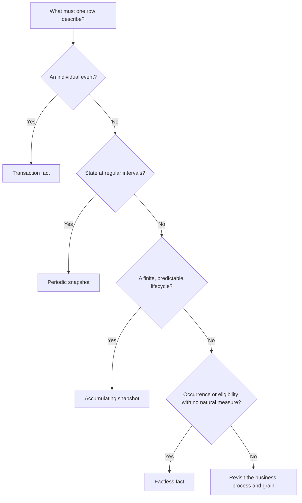
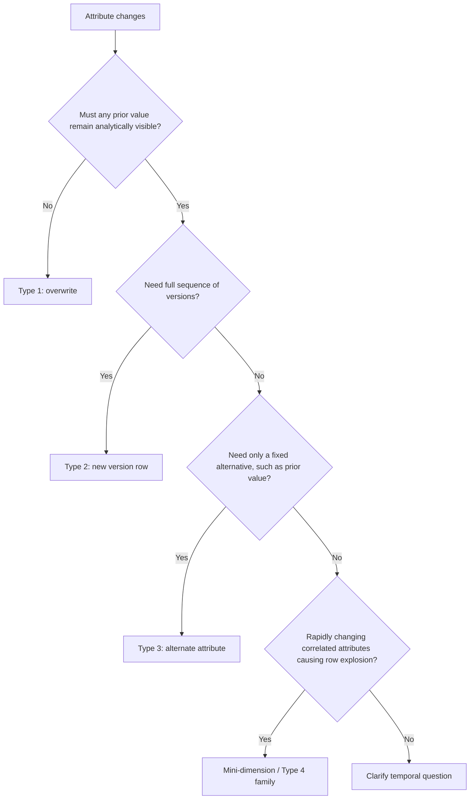
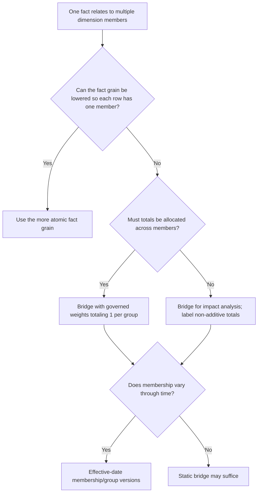

# Modeling Workflow and Decision Trees

This chapter is the field procedure. Start here when you have a requirement, a source schema, and a blank page.

The goal is not to find a fashionable table shape. It is to create an explicit analytical contract whose rows, joins, history, and measures remain correct under real data.

## The four-step dimensional design process

### 1. Select the business process

A business process is a measurable activity or state in the organization's value chain, not a department or report.

Good process names:

- order line sale;
- payment transaction;
- shipment movement;
- course assessment attempt;
- daily account balance;
- employee monthly assignment state.

Weak process names:

- sales dashboard;
- finance data;
- customer 360;
- executive reporting.

Reports combine processes. Model each process at a coherent grain first.

### 2. Declare the grain

Write:

> **One row represents ...**

Include the observed entity/event, distinguishing identifiers, and time or lifecycle qualifier.

```text
One row represents one submitted attempt by one learner for one assessment.
One row represents one account's closing balance on one business date in one currency.
One row represents one enrollment attempt moving through the learning lifecycle.
```

List what makes two valid rows different. Test that candidate key against real data. If duplicates remain, explain them before changing the key or applying `DISTINCT`.

### 3. Identify dimensions

Ask who, what, where, when, why, how, and under which business conditions the measurement occurred. Each dimension must be single-valued at the declared grain or deliberately resolved with a bridge.

For every candidate dimension, ask:

- Is this value known at the event/state time?
- Can one fact relate to several members?
- Does historical attribution matter?
- Is the key source-specific or conformed?
- Is it actually another business process?

### 4. Identify facts

Include numeric observations true at exactly the declared grain. Classify each one:

- additive;
- semi-additive and across which dimensions;
- non-additive;
- derived from which stored components;
- currency/unit basis;
- null and zero meaning.

If a measure is header-level while the table is line-level, allocate it with a governed rule or keep it in a separate fact. Do not repeat it silently.

## Before the workshop

Bring evidence, not only requirements:

- source data profiles and candidate keys;
- row counts and duplicate examples;
- timestamp semantics and time zones;
- code/value distributions;
- update, delete, and late-arrival behavior;
- sample business documents and reconciliation totals;
- known reports and decisions, without treating a report layout as the model;
- domain owners who can resolve semantic questions.

Create a vocabulary list. If “customer,” “active,” “revenue,” or “completion” has several meanings, record each meaning rather than selecting one silently.

## Decision tree: choose a fact-table pattern



### Confirmation questions

| Candidate | Confirm | Reject when |
|---|---|---|
| Transaction | Each row is an event that occurred | The requirement is only periodic state |
| Periodic snapshot | One row is required for every in-scope entity/combination per period | Users need exact transitions but no sampled state |
| Accumulating snapshot | The lifecycle has stable milestones and a terminal outcome | States loop or vary unpredictably, or full transition history is mandatory |
| Event factless | Row occurrence itself is the measure | A natural numeric measure exists and is being omitted accidentally |
| Coverage factless | Rows enumerate what could/should happen | Eligibility can be represented more simply and is not queried analytically |

Several patterns can coexist for one value chain. That is a design strength, not duplication, when their grains answer different questions.

## Decision tree: choose dimension history



Then ask:

- Should old facts retain event-time attribution? Type 2 is likely.
- Should all history reflect the newest correction? Type 1 may be intended.
- Do users need both historical and current perspectives? Consider Type 6/7-style views at recognition depth.
- Is the “attribute” actually a new event or periodic state? Use a fact table instead of forcing it into a dimension.

Do not choose Type 2 merely because a value changes. History must have analytical value sufficient to justify more rows, key resolution, and user education.

## Decision tree: resolve keys

```text
Does the source ID uniquely and permanently identify the entity across all sources?
├─ No or uncertain -> namespace source keys and create a durable warehouse identity.
└─ Yes -> still keep warehouse control if history or source migration matters.

Can one entity have multiple historical dimension versions?
├─ Yes -> each version gets a surrogate key; durable key remains stable.
└─ No -> a surrogate key may still isolate facts from source-key change.

Is the fact's referenced identity known but attributes are late?
├─ Yes -> create/reuse a unique inferred member.
└─ No -> use a governed unknown/not-applicable sentinel as appropriate.
```

Remember:

```text
source natural key      = identity in one source namespace
durable warehouse key  = business entity across source/time changes
dimension surrogate key = one dimension row or historical version
```

## Decision tree: many-to-many relationships



State both grains:

```text
fact grain:   one account balance per account per month
bridge grain: one account-holder-group membership per customer
```

Hide bridge complexity behind a tested semantic model or view where possible. Never allow consumers to assume a many-to-many join is additive without an allocation policy.

## Decision tree: event, state, and time

```text
Need the sequence of changes?                   -> event fact
Need current state only?                        -> current table / Type 1 view
Need comparable state at fixed intervals?       -> periodic snapshot
Need latest progress through fixed milestones?  -> accumulating snapshot
Need state for arbitrary continuous intervals?  -> timespan model
Need both business-valid and known-at-the-time?  -> bitemporal model
```

Choose the simplest model that satisfies the temporal question. Preserve raw events when audit/replay is important even if consumers mainly use snapshots.

## Decision tree: combine or separate processes

Before putting records in one fact table, require “yes” to all:

1. Do rows describe the same business process?
2. Can every row obey one grain sentence?
3. Are dimensions valid at the same level?
4. Do shared facts have the same technical definition and units?
5. Can a consumer aggregate the rows without event-type-specific hidden rules?

If any answer is no, use separate fact tables. Integrate results through conformed dimensions and drill-across.

Use a consolidated fact only when processes can be expressed at exactly the same grain and consolidation materially simplifies a frequent use case.

## Decision tree: normalize or dimensionalize

```text
Primary workload writes small current-state transactions with integrity constraints?
-> normalized operational model

Primary workload scans, groups, filters, and aggregates business history?
-> dimensional presentation model

Need auditable source-oriented enterprise integration before marts?
-> normalized/Data Vault/other integration layer feeding dimensional consumption
```

These choices can coexist in layers. Do not expose normalized atomic integration tables to business users and expect every tool to recreate correct analytical joins.

## Decision tree: physical star, wide mart, or semantic graph

Ask:

- Are dimensions reused across several facts? A star makes conformance visible.
- Does the BI engine work best with one-to-many stars? Prefer a star or star-like semantic model.
- Is one governed entity mart the dominant use case? A wide mart can be appropriate at a documented grain.
- Can the semantic engine safely resolve joins and fanout? A semantic graph can reduce physical denormalization.
- Does Type 2 history or many-to-many behavior become ambiguous when flattened? Preserve explicit keys/relationships.

Physical shape is an implementation decision. Grain, identity, history, relationship cardinality, and metric behavior are semantic decisions.

## Decision tree: metric storage

```text
Can the value be summed across every dimension?        -> store additive component
Can it sum across some dimensions but not time?        -> semi-additive; encode time rule
Is it a ratio/percentage/average?                       -> store numerator and denominator
Is it a distinct count?                                -> define durable entity key and grain
Is it derived from stable additive facts?              -> usually calculate in semantic layer
Is it expensive but repeatable?                        -> consider governed aggregate/materialization
```

Never choose a storage optimization before the metric's mathematical behavior is known.

## Decision tree: architecture layer

| Question | Architectural response |
|---|---|
| Need replayable source evidence? | Immutable or versioned landing/Bronze |
| Need parsing, dedupe, CDC, identity integration? | Silver/integration layer |
| Need auditable enterprise source history at scale? | Consider Raw/Business Vault |
| Need understandable analytical consumption? | Dimensional Gold/information marts |
| Need one KPI definition across tools? | Governed semantic/metric layer |

Layer names do not replace model contracts. Every output still needs process, grain, keys, history, and quality expectations.

## Worked requirement: learning performance

Stakeholder request:

> Show course engagement, completions, learning hours, assessment pass rate, and monthly active learners by department. Preserve the department at the time of activity and let us compare it with the learner's current department.

### Step 1: decompose processes

- learning activity event;
- course enrollment lifecycle;
- assessment attempt;
- live-session attendance;
- learner profile history.

“Learning performance” is not one fact-table process.

### Step 2: declare grains

```text
fact_learning_activity:    one user interaction with one learning object
fact_enrollment_pipeline:  one user's one enrollment attempt in one course
fact_assessment_attempt:    one submitted attempt by one user for one assessment
fact_session_attendance:   one user attendance occurrence for one live session
dim_user:                   one version of one durable user profile
```

### Step 3: dimensions and relationships

Conform User, Course, Date, Organization, Geography, and Learning Object where relevant. Resolve `user_key` to the version valid at event time. Expose a current-user view for current department analysis. Model instructors or skills through bridges only if the event legitimately relates to multiple members.

### Step 4: measures

```text
learning_seconds       additive across event rows
completion_count       additive event counter
score_points           additive component
possible_points        additive component
pass_rate              SUM(passed_count) / SUM(graded_attempt_count)
monthly_active_users   distinct durable user key, not Type 2 version key
```

### Publication design

- atomic facts and conformed dimensions in the dimensional layer;
- semantic measures for pass/completion rates and active learners;
- optional monthly aggregate only after atomic validation;
- explicit event-time and current-department perspectives;
- late-event restatement policy and audit timestamps.

See the complete [learning analytics design](../08-practical-designs/learning-analytics.md).

## Design document template

```markdown
# Business process

## Business questions and decisions

## Grain
One row represents ...

Candidate business identity: (...)

## Dimensions
| Dimension | Role | History | Cardinality | Conformed owner |

## Facts
| Fact | Definition | Additivity | Unit/currency | Null/zero rule |

## Relationships
One-to-many, bridges, hierarchy behavior, role-playing dates.

## Load behavior
Insert/update pattern, CDC, late data, deletes, deduplication, restart.

## Reconciliation
Source counts/totals, uniqueness, referential integrity, period-close tests.

## Security and retention

## Tradeoffs and rejected alternatives
```

Recording rejected alternatives prevents the same unresolved debate from returning during implementation.

## Workshop exit criteria

Do not call a model ready until the team can answer:

- Can every fact table be described with one unambiguous grain sentence?
- Does every proposed fact exist at that grain?
- Is every dimension single-valued or deliberately bridged?
- Are process boundaries and cross-process queries explicit?
- Are historical attributes classified by analytical need?
- Are key namespaces, unknown members, and late data handled?
- Are measure additivity, units, and ratio components documented?
- Can the load be replayed without duplicates?
- Can business owners reconcile at least one real example?
- Are semantic metric definitions owned outside individual dashboards?

## What to remember

1. Model a business process, not a report or department.
2. Declare grain before dimensions and facts.
3. Use fact patterns according to event, periodic state, or lifecycle meaning.
4. Add Type 2 history only when past values matter analytically.
5. Prefer a lower fact grain over a bridge when it naturally resolves one member.
6. Keep different processes separate and integrate them through conformed dimensions and drill-across.
7. Treat model, pipeline, and metric contracts as one architecture decision.
